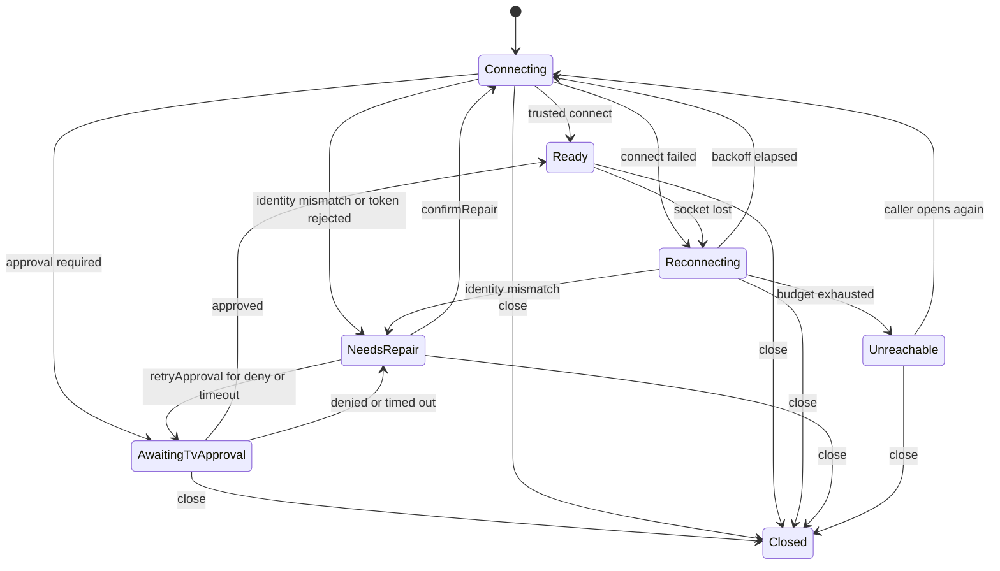

# Pairing, security identity, and connection

Caller-facing operations are `open`, `retryApproval`, `confirmRepair`, `wake`, and `command` in [samsung-interface.md](samsung-interface.md). This file is the session machine behind them.

Local control after pairing does not call Firebase, does not check App Check, and does not wait for licensing or account checks. A cloud outage leaves this machine unchanged.

## Session

While the remote is active, one WebSocket session stays up so a command write does not handshake again. The module releases that socket when `close` runs or the caller's scope cancels. `app` calls `close` 15 seconds after the remote surface stops.

There is no background session and no listening server. The phone is a client.

## Security identity

Where a persistent security identity can be established, an unexpected change fails closed. The user must explicitly re-pair. The module never offers a trust-all switch, and `app` never offers "ignore security errors."

| Path | Identity | When it is saved | Mismatch |
|---|---|---|---|
| TLS on port 8002 | SHA-256 of the certificate SubjectPublicKeyInfo | With the token, only after approval succeeds | `NeedsRepair` / `IdentityChanged`. Token is not sent. |
| Plaintext on port 8001 | Protocol UUID, if the television has one | With the pairing record, after the session is accepted | `NeedsRepair` / `IdentityChanged`. |
| No TLS pin and no UUID | None. Fail-closed cannot be claimed. | Pairing may still proceed on the adopted plaintext path. | A later swap cannot be detected. Residual LAN risk. |

Prefer TLS when the television demonstrates port 8002 or `TokenAuthSupport`. Fall back to plaintext 8001 only when 8002 does not speak the remote channel. Do not send a saved token over plaintext if that television has previously completed TLS pairing.

Pin the public key, not the whole certificate, so a reissue with the same key still matches. A factory reset that rotates the key fails closed. That is the intended outcome.

First contact has no pin. The module may accept one certificate as a candidate in order to speak the handshake. The candidate stays in memory. It is persisted only together with a successful approval. A second, different certificate on that connection is rejected. Hostname mismatch against the IP is ignored only after the pin check passes. This is not a trust-all `TrustManager`: an already saved pin is compared before the token is placed on the wire, and a mismatch closes the socket.

If physical evidence later shows a television rotates this key on ordinary reboot, that evidence updates the identity rule inside `samsung`. It does not add a user-facing bypass. The physical matrix in [testing.md](testing.md) records whether the pin survived reboot.

`SecretsUnavailable` (Keystore key invalidated, device lock, undecryptable file) does not fall back to plaintext storage and does not send a token. The user can pair again. Ordinary language: saved television connections need to be paired again. No silent new empty key that pretends the television was never paired.

## Approval and token

The television shows an Allow/Deny prompt for the client name `AppT`. The cleartext name is exactly `AppT`, so the television's device list has one stable entry. The module encodes it. Callers do not.

Token handling:

- First connection presents no token.
- `ms.channel.unauthorized` before a token was sent means the prompt is in progress, not failure. Stay in `AwaitingTvApproval`.
- Approval success persists token and pin in one atomic secret write.
- Later connections present the token only after the pin matches.
- If the television issues a new token on a trusted connection, replace the stored token atomically.
- `ms.channel.unauthorized` after a token was sent is `TokenRejected`. Stop. Do not loop; a loop re-prompts the television.
- User denial is `ApprovalDenied`. Timeout is 45 seconds, then `ApprovalTimedOut`.
- `retryApproval` may prompt again for denial or timeout. It does not clear a pin.
- `confirmRepair` is required for `TokenRejected` and `IdentityChanged`. It discards the saved secret first, then pairs as new. `app` calls it only after explicit confirmation.

Some televisions are configured to ask on every connection. The module cannot change that setting. After the second approval prompt in one session, `app` may show one non-modal hint whose meaning is: the television is asking to allow AppT again; it can be set to remember this phone. A secondary disclosure may name Device Connection Manager. Do not auto-retry the prompt.

Leaving `AwaitingTvApproval` by `close` discards the candidate pin and does not persist a token.

## State machine

Caller-visible states are the `SessionState` values. Internal waits (TLS, backoff sleep, rediscovery) are not extra caller-facing states.

### Transition table

| From | Event | To | Rule |
|---|---|---|---|
| `Connecting` | Trusted channel connect | `Ready` | Persist secret on first approval. Update token if rotated. |
| `Connecting` | Unauthorized, no token sent | `AwaitingTvApproval` | Prompt expected. |
| `Connecting` | Unauthorized, token sent | `NeedsRepair` `TokenRejected` | Do not reconnect automatically. |
| `Connecting` | Pin or UUID mismatch | `NeedsRepair` `IdentityChanged` | Close before sending the token. |
| `Connecting` | Timeout or refused, wake window still open | `Connecting` | Keep waiting until the window ends. |
| `Connecting` | Timeout or refused, no wake window | `Reconnecting` | Start supervised reconnect. |
| `AwaitingTvApproval` | Channel connect | `Ready` | Persist token and pin together. |
| `AwaitingTvApproval` | 45s elapsed, or timeout event while waiting | `NeedsRepair` `ApprovalTimedOut` | User may `retryApproval`. |
| `AwaitingTvApproval` | Denial | `NeedsRepair` `ApprovalDenied` | User may `retryApproval`. |
| `Ready` | Socket closed, or timeout event while ready | `Reconnecting` | Quiet. Not an approval failure. |
| `Reconnecting` | Backoff elapsed | `Connecting` | Counts as an attempt. |
| `Reconnecting` | Budget exhausted | `Unreachable` | Stop. User action starts a new cycle. |
| `Reconnecting` | Identity mismatch | `NeedsRepair` | Stop. |
| `NeedsRepair` | `retryApproval` for deny or timeout | `AwaitingTvApproval` | Same identity. |
| `NeedsRepair` | `retryApproval` for token or identity | `NeedsRepair` | Ignored. |
| `NeedsRepair` | `confirmRepair` | `Connecting` | Old secret already discarded. |
| `Unreachable` | Caller `open` again | `Connecting` | New budget. Not automatic. |
| any except a committed `Ready` secret write | `close` or scope cancel | `Closed` | Secrets kept. Candidate pin dropped. |

`retryApproval` and `confirmRepair` from the wrong state are ignored.

Commands are accepted only in `Ready`. Elsewhere `command` returns `Rejected(Unavailable)` and does not enqueue work.

## Supervised reconnect

Reconnect runs only while the session is open. It is bounded. It is not a scan UI and it does not call `discover()`.

| Parameter | Value |
|---|---|
| Connect timeout | 5 seconds |
| Backoff | 0.5s, 1s, 2s, 4s, then 8s cap |
| Budget | 6 attempts or 45 seconds, whichever ends first |
| Approval wait | 45 seconds |
| Command write timeout | 2 seconds |
| Wake window | 30 seconds from `wake` returning `Sent` |
| Session-release grace | 15 seconds, owned by `app` |
| Hold cap | 10 seconds |
| Unsent frame cap | 32 |

When the last address refuses or times out, run one internal rediscovery (5 seconds, saved UUID only) before spending the rest of the budget on a dead address. If rediscovery finds a new address for the same UUID, connect there and still enforce the pin. If the pin fails, `NeedsRepair` and stop. Do not try the saved token against other televisions found nearby.

If rediscovery finds nothing, continue backoff against the last address until the budget ends, then `Unreachable`.

After `Unreachable`, automatic reconnect stops. A later user action calls `open` again, which starts a new budget. The UI treatment is a lightweight status plus a way to try again, not a dialog on every attempt.

Malformed frames do not throw across the seam. One malformed frame is dropped and recorded in the redacted diagnostic log. Repeated malformed frames that desynchronize the socket move to `Reconnecting`.

## Wake

`wake(id)` sends a small burst of magic packets (3) to the stored MAC, directed at the local subnet broadcast, on UDP port 9. It uses the stored MAC only. It does not ARP-scan the LAN and does not invent a MAC from a vendor table.

`Sent` means the burst was transmitted. `open` of that id within 30 seconds uses the remaining window as connect patience so a slow panel boot is not declared `Unreachable` at 5 seconds.

Wake requires the television's own "power on with mobile" / network-standby setting. The app cannot read that setting reliably. Failure handling and when the power control disappears are in [commands.md](commands.md).

If no MAC is stored, `wake` returns `Unavailable` and sends nothing.

## Subnet limit

These televisions commonly refuse a WebSocket that originates on another subnet or VLAN. That failure is `Unreachable`. Primary copy: the phone cannot reach the television; check that they are on the same home Wi-Fi. Do not build a NAT proxy or a cloud relay. Diagnostics may record a reachability class. They do not record the addresses compared.

## Ordering relative to secrets

1. Read the secret. If it cannot be decrypted, `SecretsUnavailable`. Stop.
2. Connect.
3. Compare identity.
4. Only then present the token.
5. On first approval, encrypt and atomically replace the secret file (write temporary file in `noBackupFilesDir`, fsync, rename).
6. Never write a plaintext token to `cacheDir`, `filesDir`, Room, or DataStore.

Secret file layout is in [data.md](data.md).

## Cloud independence

This machine has no edge to Firebase. Tests that fail every Firebase call, or omit Firebase from the `samsung` graph, must still observe `Accepted` for a `command` on a `Ready` fixture session. Sync may retry beside an open session. It must not close, pause, or gate it.
