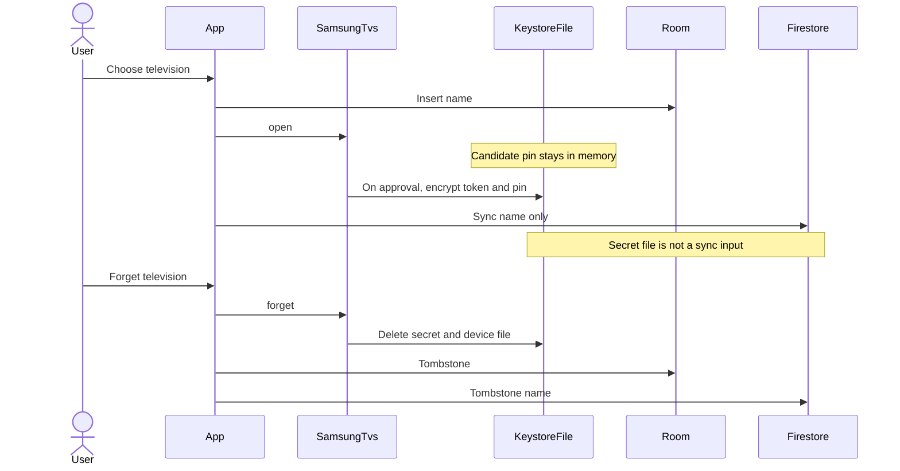

# Local data and secrets

Three storage classes. They are different types so a pairing secret cannot be inserted into a sync record by accident.

| Class | Store | Examples | Sync |
|---|---|---|---|
| Secret | Keystore-backed file under `noBackupFilesDir` | Token, SPKI pin | Never |
| Samsung-private | File under `noBackupFilesDir`, not Room | UUID cache, MAC, last address, capability evidence, model, firmware | Never |
| Application | Room and DataStore | Friendly names, favourites, preferences, last-opened id | Explicit whitelist only |

Room is the local source of truth for structured application data. Screens read Room and DataStore. They do not read Firestore.

## Secret record

Location: `noBackupFilesDir/samsung-secrets/v1/<tvId>`.

`app` does not build this path and has no API that accepts the ciphertext type. The directory exists only under `noBackupFilesDir`. A debug assertion fails if a secret file is created under `filesDir`, `databases/`, or `cacheDir`.

One Android Keystore AES-256-GCM key, alias `appt.samsung.v1`, non-exportable. `setUserAuthenticationRequired(false)` so reopen does not demand a biometric prompt. Biometric gating is not a product requirement and is not added. StrongBox when the device has it, otherwise TEE. Randomized encryption required.

File layout:

```text
magic     4 bytes  APS1
version   uint16   1
iv        12 bytes
gcm body  ciphertext and tag
```

Write by encrypting, writing a temporary file in the same directory, fsync, and rename. A crash mid-write leaves the previous secret. Never stage plaintext in `cacheDir`.

Payload is the token and the SPKI pin only. MAC, address, and UUID do not share this type, so a serializer for "device record" cannot sweep the token along with them.

`forget` deletes the file. Deletion is idempotent. Undecryptable files are not replaced with an empty pairing. `open` surfaces `SecretsUnavailable` until the user pairs again, which writes a new file after approval.

Backup and device-to-device transfer: `noBackupFilesDir` is already excluded. Also exclude `samsung-secrets/` and `samsung-device/` in both `data_extraction_rules.xml` and `backup_rules.xml`, so a later move into `filesDir` still fails closed. `allowBackup` may stay true for non-secret application data.

Clear-data and uninstall remove secrets. They are not recoverable from AppT cloud, because they were never uploaded. The user pairs again. Synced names can return after sign-in. That split is the product rule.

## Samsung-private device record

Location: `noBackupFilesDir/samsung-device/v1/<tvId>.json`.

Contains protocol UUID, MAC, last address, capability evidence (including rejected keys and wake-failure count), model, firmware, and the candidate display name. No token and no pin. Same backup exclusion. Diagnostics must not dump the directory. Export reads model and firmware through an allowlist function, not by copying the file.

This record is how address changes are remembered without putting addresses in Room.

## Room

Database file: `appt.db` in the application database directory. Version 1. Export the schema. `fallbackToDestructiveMigration` is forbidden. A migration test is required for every later version.

### `TvProfile`

| Column | Sync | Notes |
|---|---|---|
| `tvId` TEXT PK | yes, document id | Opaque correlation id |
| `friendlyName` TEXT | yes | 1..40 characters |
| `correlatable` INTEGER | yes | False records are not uploaded |
| `nameSource` TEXT | yes | `USER` or `TV` |
| `lastOpenedAt` INTEGER NULL | no | Device-local reopen |
| `updatedAt` INTEGER | yes | Client millis |
| `revision` INTEGER | yes | Incremented on each local mutation |
| `deletedAt` INTEGER NULL | yes | Tombstone |
| `originDeviceId` TEXT | yes | Install id tie-break |
| `pendingSync` INTEGER | no | Outbox flag |

No column for token, pin, MAC, address, SSID, or command text. A unit test loads the exported schema and fails if a forbidden name from [diagnostics.md](diagnostics.md) appears.

### `Favourite`

| Column | Notes |
|---|---|
| `id` TEXT PK | Stable id of `tvId`, `kind`, and `target`, so two phones do not create duplicate Netflix rows |
| `tvId` | |
| `kind` | `APP` or `CONTROL` |
| `target` | Opaque `AppId` value or `RemoteKey` name |
| `sortOrder` | |
| sync metadata | Same `updatedAt`, `revision`, `deletedAt`, `originDeviceId`, `pendingSync` pattern as `TvProfile` |

Favourite identity is the triple, not a random UUID. Reorder updates `sortOrder` and bumps `updatedAt` / `revision` on each changed row.

A television the user has not selected is not inserted. An `Unsupported` scan hit is not inserted.

`nameSource` starts as `TV` when the row is created from `DiscoveredTv.name`. A user edit sets `USER` and bumps sync metadata. A later television-reported name must not overwrite `USER`.

`lastOpenedAt` is written when the remote surface reaches `Ready`. It is not a sync field. Last-used reopen is device-local, so one phone does not steal another's last television.

## DataStore

Preferences DataStore. Keys are typed wrappers. Call sites do not use raw key strings.

Synced whitelist:

| Key | Type | Default |
|---|---|---|
| `hapticsEnabled` | Boolean | true |
| `volumeButtonsControlTv` | Boolean | true |
| `navigationMode` | `Directional` or `Pointer` | `Directional` |

Device-local, never built into a `SyncRecord`:

| Key | Purpose |
|---|---|
| `permissionExplanationAcknowledged` | Gate has been shown |
| `firstControlAchieved` | Account gate after first success |
| `lastOpenedTvId` | Quiet reopen |
| `lastSyncedUid` | Detect a different account. See [sync.md](sync.md) |
| `originDeviceId` | Random install id, created once |

Sync metadata for whitelist preferences lives in DataStore under a `prefmeta.` prefix (`updatedAt`, `revision`, `deletedAt`, `originDeviceId`, `pendingSync`). The sync worker is the only writer of `prefmeta.`. UI reads the preference values, not Firestore.

`lastSyncedUid` and `originDeviceId` are account-identifying. They stay out of Crashlytics and diagnostic export.

## Ownership rules

- `app` writes Room and DataStore first. UI collects those flows.
- `samsung` writes secrets and samsung-private files. `app` never reads them.
- Remember: user selects a controllable card → `app` inserts `TvProfile` → `open`. Secret appears only after approval.
- Forget: `app` calls `forget` first and retries on `Failed`, then tombstones the Room row. Startup calls `forget` for every tombstoned id still present in `rememberedIds()`.
- A tombstone that arrives from sync also calls `forget` for that `TvId`.
- Non-correlatable televisions can be named locally and must not be uploaded.

## Secret lifecycle



Cloud failure on the sync steps does not roll back the secret and does not close an open session. The name remains local and `pendingSync` stays set.

## Structural barriers

These are the implementation rules that make leakage difficult rather than merely discouraged:

1. `PairingSecret` is a type the Room DAO and `SyncRecord` do not reference.
2. `SyncRecord` is a sealed type. The worker serializes that type only. No reflection over "all entities."
3. Secret files live in a directory the sync worker does not list.
4. The diagnostic logger has no parameter of type `TvCommand` or secret payload. Text is not passed in.
5. Schema and `SyncRecord` tests fail on forbidden field names.
6. Firestore rules reject forbidden field names even if a buggy client sends them. See [sync.md](sync.md).
