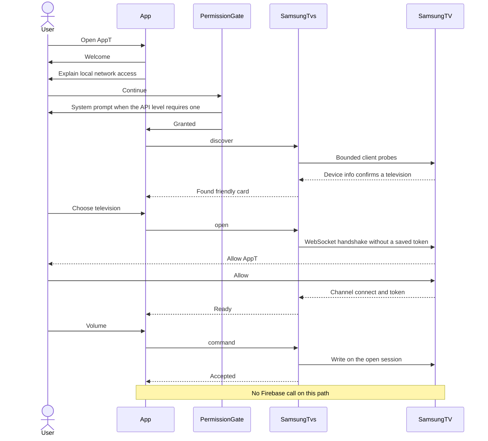
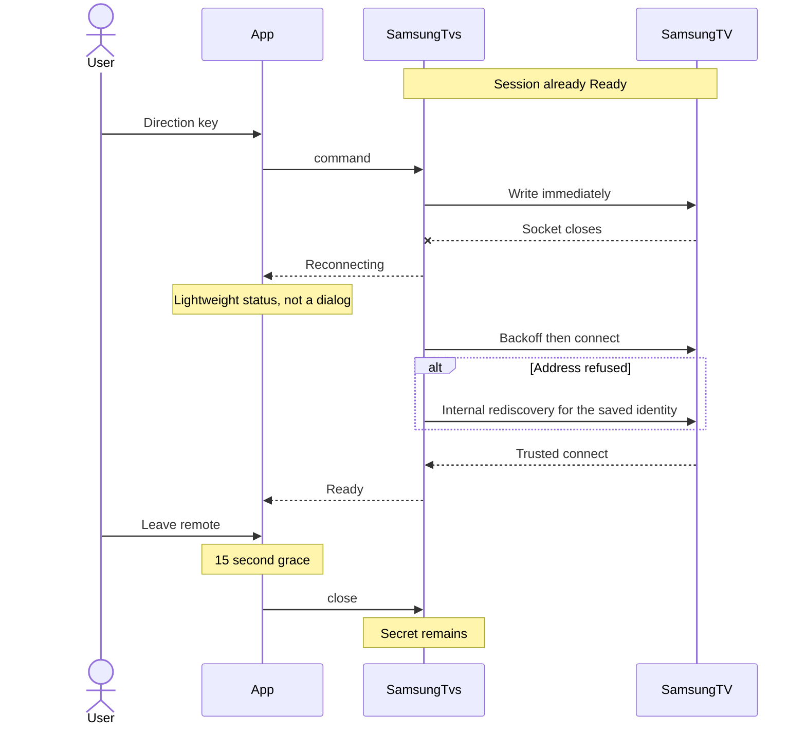
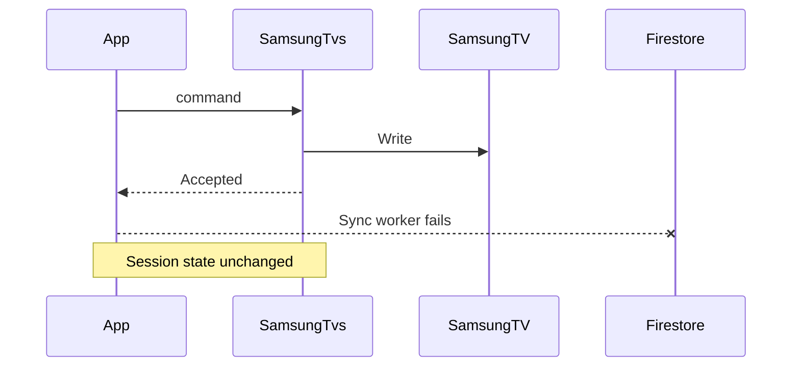

# Cross-module flows

State machines and field lists stay in their owning files. This file is the sequence that crosses modules.

Owning files: reconnect in [connection.md](connection.md), secrets in [data.md](data.md), account and sync in [sync.md](sync.md), modules in [modules.md](modules.md).

## First run to first control

Firebase is not a participant. Sign-in happens after the first accepted command, in [sync.md](sync.md).

The product list names discovery before the permission sentence. The baseline orders them as explanation, then local-network access, then automatic discovery. This sequence follows the baseline.

Failure branches on the same path:

- Permission denied: stay on the explanation. No probe loop.
- No card by the bound: `Finished`, offer rescan. No manual address form.
- `Unsupported`: explain that control is not available. No key is sent.
- Approval timeout: `NeedsRepair` with `ApprovalTimedOut`. User may retry. No automatic re-prompt loop.
- Identity mismatch on a later open: `NeedsRepair` with `IdentityChanged`. Token is not sent. User must confirm re-pair.

## Active control and quiet reconnect

If the budget ends, state is `Unreachable` and automatic attempts stop. The user may try again, or wake when `powerOn` is `Attemptable`.

## Cloud outage during control

The account gate treats a cached Firebase user as signed in when the cloud is down. It does not call the cloud to find that out.
