# Cross-module flows

State machines, field lists, and rules stay in their owning files. This file is the sequence that crosses modules.

Owning files: reconnect in [connection.md](connection.md), secrets and local data in [data.md](data.md), account/trial/entitlement in [sync.md](sync.md), modules and seams in [modules.md](modules.md), lifecycle transitions in [lifecycle.md](lifecycle.md), screens in [presentation.md](presentation.md).

## First run to first control

No Firebase component is a participant in this path. First success is observed as `Accepted`, which means the command was written to the open session, not that the television visibly acted.

The permission explanation precedes the system prompt and the first scan, in that order.

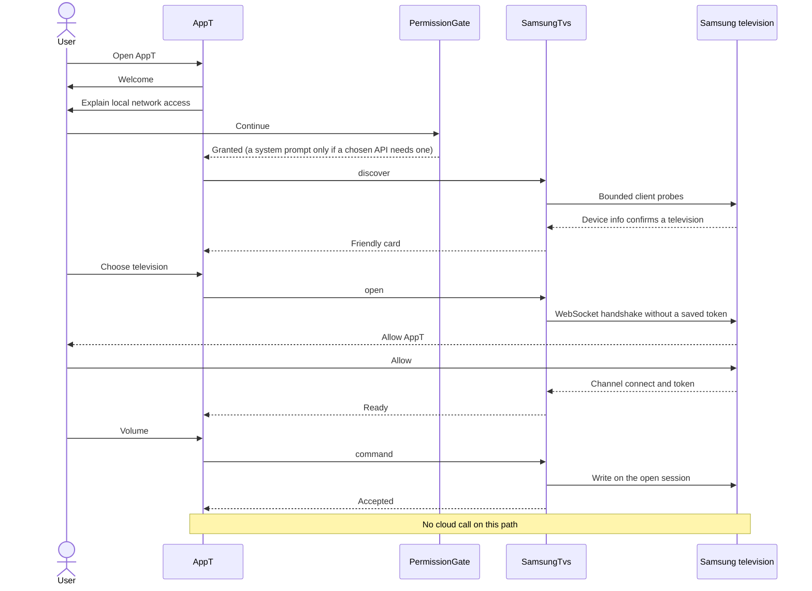

Failure branches on the same path:

- Permission denied: stay on the explanation. No probe loop.
- No card by the bound: `Finished`, offer rescan. No manual address form.
- `Unsupported`: explain that control is not available and never send a key.
- Approval timeout: `NeedsRepair` with `ApprovalTimedOut`. Retry is user-initiated.
- Identity mismatch on a later open: `NeedsRepair` with `IdentityChanged`. The token is not sent.

## First free control to the account requirement

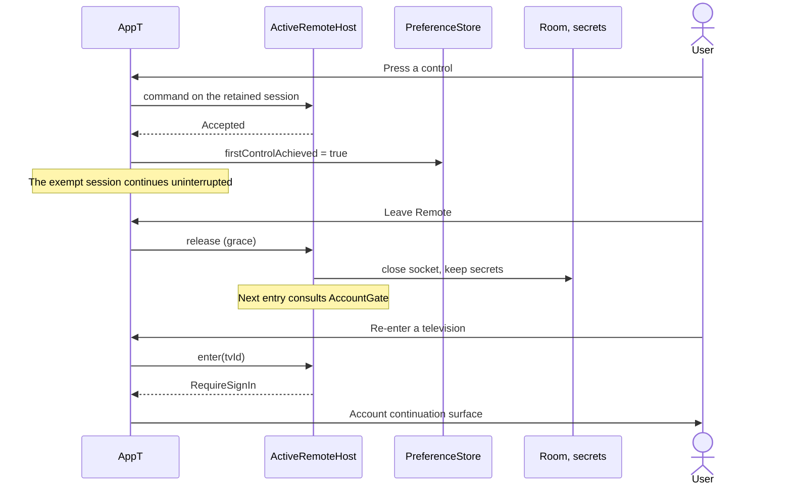

The exemption belongs to one `ActiveRemote` session. Rotation, a sheet, or a short absence inside the grace window does not create a new entry. Process death ends the exempt session even though the user did not leave.

## Account sign-in and trial activation

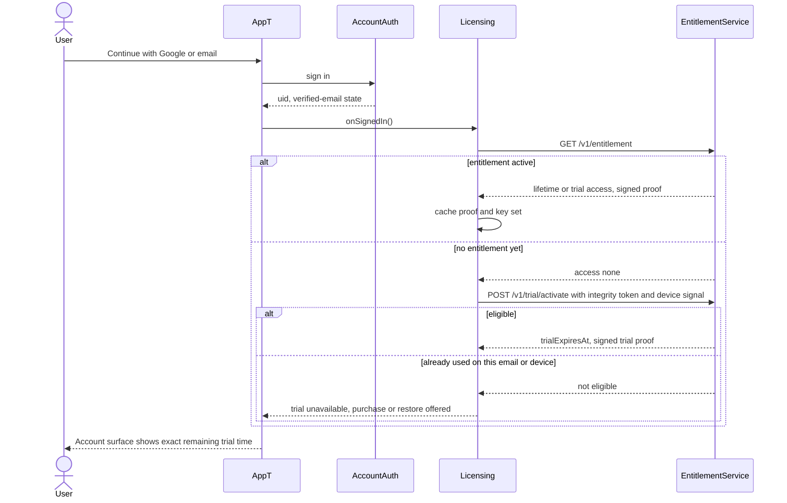

An unverified email/password account cannot activate a trial. Google identities are provider-verified. Nothing about the television is sent in either call.

## Trial expiry and the next remote entry

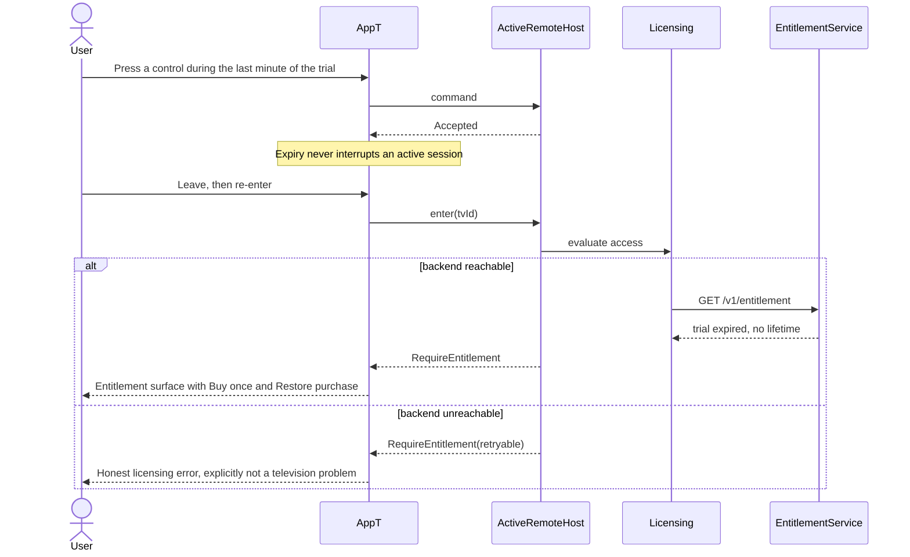

While a cached trial proof is unexpired, the app may run entirely offline: the local known expiry is the rule.

## Purchase

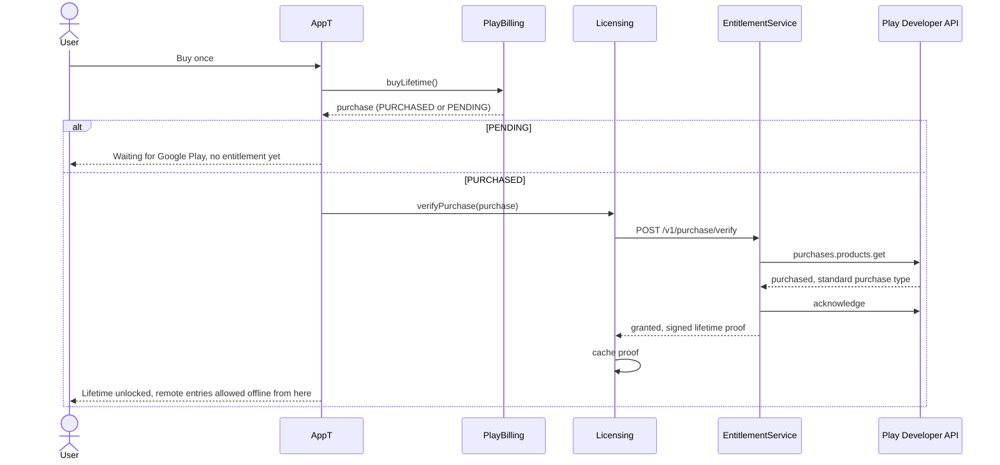

If the validator is unavailable while Play reports `PURCHASED`, the client writes a 24-hour non-renewable provisional record and shows it as temporary. A later authoritative answer replaces it.

## Restore purchase, including after account deletion

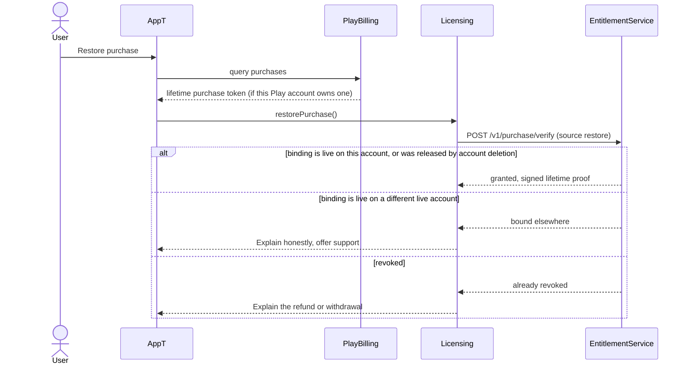

Deleting an AppT account does not destroy the Play purchase. After deletion the binding is released, so recreating an account and restoring by the legitimate Play owner works.

## Restore on a second phone

A second phone signed into the same account receives identity, Username, trial state, and Lifetime Entitlement. It receives no televisions, names, favourites, arrangement, preferences, last-used television, or pairing material, so it discovers and pairs independently. A trial that is already running keeps its original expiry.

## Refund or chargeback

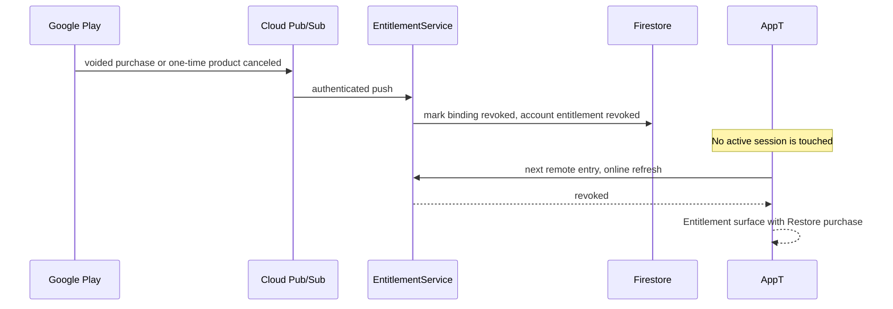

Revocation, like expiry, applies between sessions.

## Backend outage during control

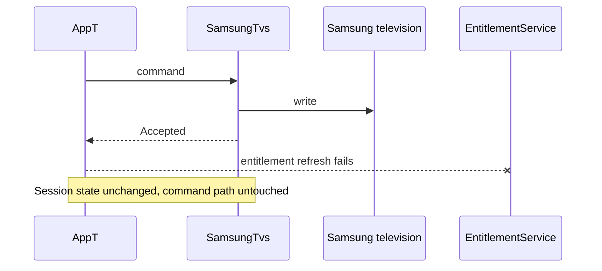

The account gate treats a cached identity and cached proof as valid offline. It never calls the backend to discover whether a signed-in user is signed in.

## Quiet reconnect and an address change

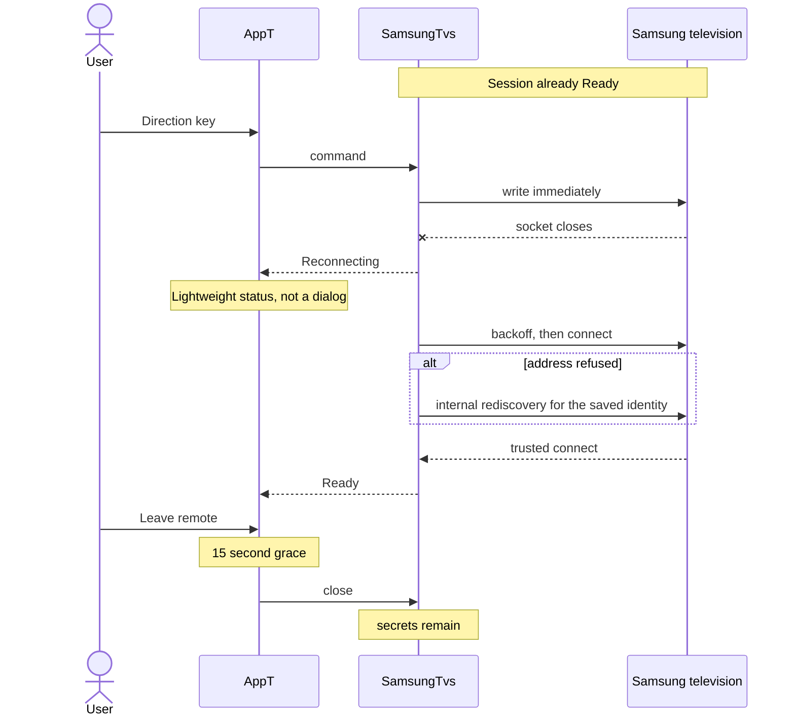

If the budget ends, the state is `Unreachable` and automatic attempts stop. The user may try again, or wake when `powerOn` is `Attemptable`.

## Process death and reopen

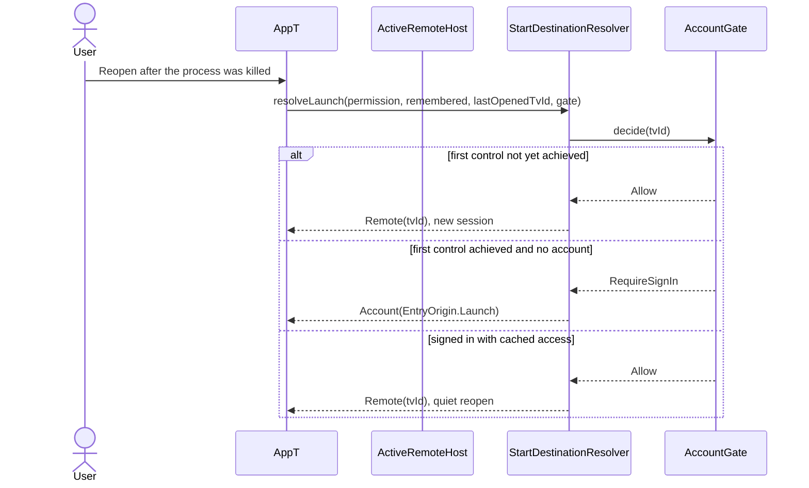

Process death is never treated as an identity change: no re-pair prompt appears, and saved secrets remain valid.

## Switching televisions

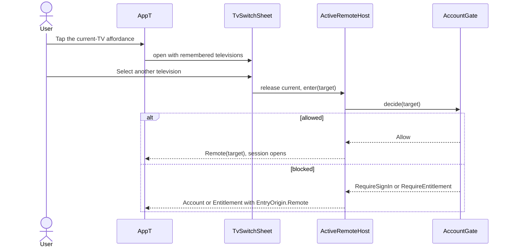

There is no horizontal swipe between televisions; the switch is always an explicit selection.

## Sign-out

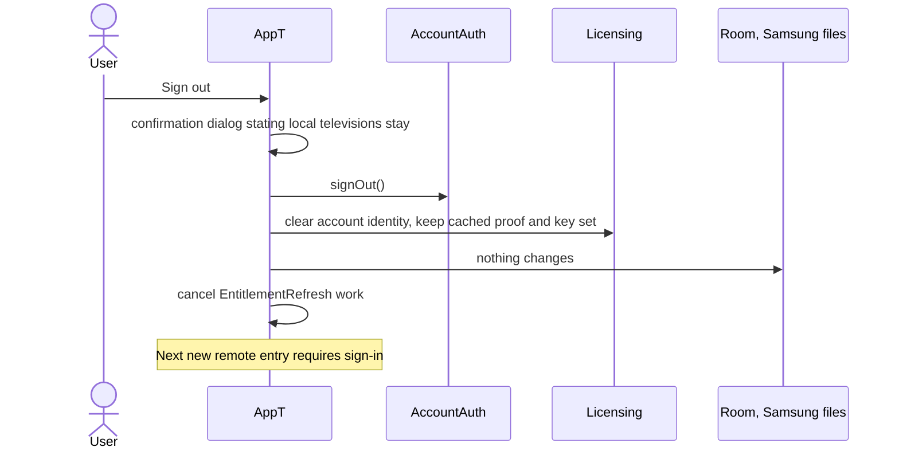

An active remote session is allowed to finish. Sign-out does not delete the cached entitlement proof, television rows, favourites, preferences, or pairing secrets.

## Account deletion

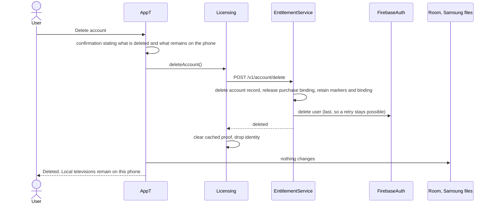

The account backend retains only pseudonymous trial markers and the released purchase binding. Television data was never there to delete.

## Diagnostics opt-in and export

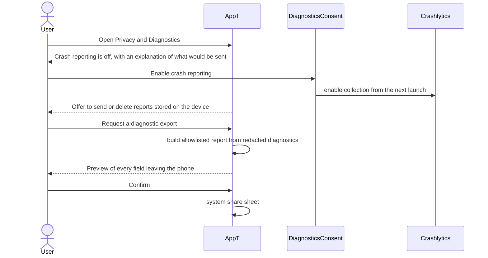

No AppT service receives a diagnostic report in V1.
