# Cross-module flows

State machines, field lists, and rules stay in their owning files. This file is the sequence that crosses modules.

Owning files: reconnect in [connection.md](connection.md), secrets and local data in [data.md](data.md), account/trial/entitlement in [account-entitlement.md](account-entitlement.md), modules and seams in [modules.md](modules.md), lifecycle transitions in [lifecycle.md](lifecycle.md), screens in [presentation.md](presentation.md).

## Whole-app lifecycle index

This is the traceability spine for V1. It does not duplicate state machines or schemas; each row points to the document that owns the behavior and the slice where it becomes real.

| Lifecycle stage | Required behavior | Owner(s) | Slice / proof |
|---|---|---|---|
| Fresh install | No fabricated TV/account/entitlement state; launch starts from Welcome/LocalNetwork | [lifecycle.md](lifecycle.md), [presentation.md](presentation.md) | S01/S02; first-use E2E |
| App upgrade | Migrate each local store before routing; never silently reinterpret failure as a fresh install | [data.md](data.md), [lifecycle.md](lifecycle.md), [release.md](release.md) | S16; `upgradeFromPreviousReleasePreservesLocalState` |
| Cold launch | Resolve permission state, remembered TV, last-used TV, first-control milestone, identity/cache, then gate before opening a session | [lifecycle.md](lifecycle.md), [account-entitlement.md](account-entitlement.md) | S08/S09; daily-control E2E |
| Local-network gate | Explain need before any prompt/scan; use target-SDK-appropriate permission contract | [discovery.md](discovery.md) | S02 |
| Discovery | Bounded foreground scan, canonicalized/deduped candidates, partial-probe failure tolerated, resources released | [discovery.md](discovery.md) | S02; `ipv4MappedIpv6DedupsSameCandidate` |
| TV selection | Friendly card only; unsupported devices never receive commands | [presentation.md](presentation.md), [samsung-interface.md](samsung-interface.md) | S02/S03 |
| First pairing | TV-side Allow/Deny, no saved token on first contact, candidate security identity retained only for approved pairing | [connection.md](connection.md), [protocol.md](protocol.md) | S03 |
| First control | Command writes on the already-open session; first `Accepted` marks the one exempt session | [samsung-interface.md](samsung-interface.md), [account-entitlement.md](account-entitlement.md) | S03 |
| Saved pairing | Persist token/security identity securely; restart resumes only after identity check | [data.md](data.md), [connection.md](connection.md) | S04 + physical checkpoint |
| Identity change / repair | Fail closed before token transmission; explicit user repair confirmation | [connection.md](connection.md), [security.md](security.md) | S04 |
| Daily Remote | Capability-driven commands, stable core layout, settings, early local diagnostics | [commands.md](commands.md), [presentation.md](presentation.md), [diagnostics.md](diagnostics.md) | S05 |
| Rotation / temporary absence | Retain or grace-release the active session; no second open/gate on configuration recreation | [lifecycle.md](lifecycle.md) | S06 |
| Network loss / address change | Supervised bounded reconnect; rediscover only saved identity; stale attempts cannot resurrect sessions | [connection.md](connection.md), [discovery.md](discovery.md) | S06 + physical checkpoint |
| Process death | Lose in-memory session; durable state decides next launch; first-session exemption does not survive process death after first control | [lifecycle.md](lifecycle.md), [presentation.md](presentation.md) | S06/S08 |
| Environment / signing | Artifact identity fixes backend/Firebase/Play environment; no cross-environment certificate trust | [release.md](release.md) | S07 |
| Account requirement | After exempt session ends, every new Remote entry passes the gate; active Remote is never interrupted | [account-entitlement.md](account-entitlement.md) | S08 |
| Trial | Server-authoritative start/expiry; valid cached trial works offline until known expiry | [account-entitlement.md](account-entitlement.md) | S08 |
| Remembered-TV daily launch | Last-used TV routes Remote-first only after gate; list/switch/rename/forget are device-local | [data.md](data.md), [presentation.md](presentation.md) | S09 |
| Forget / re-pair | Atomic UI removal + `PendingForget` retry; new pairing supersedes stale pending deletion | [data.md](data.md), [samsung-interface.md](samsung-interface.md) | S09 |
| Purchase start | Play Billing launches one-time product; `PENDING` grants nothing | [account-entitlement.md](account-entitlement.md) | S10 |
| Purchase interrupted / app inactive | Listener/query/RTDN observations converge; foreground query recovers transactions completed while inactive | [account-entitlement.md](account-entitlement.md), [lifecycle.md](lifecycle.md) | S10; purchase-interruption E2E |
| Lifetime grant | Backend verifies authoritative Play state, binds once, acknowledges, returns signed proof | [account-entitlement.md](account-entitlement.md), [security.md](security.md) | S10 |
| Restore / second phone | Sign-in + current Play purchase revalidation restores entitlement; TV state remains independent per phone | [account-entitlement.md](account-entitlement.md) | S10 |
| Refund / chargeback | RTDN/backend revokes; next Remote entry blocks, active Remote stays live | [account-entitlement.md](account-entitlement.md) | S10 |
| Account deletion | Ordered/resumable account deletion; purchase binding freezes before Auth removal and releases only after proof of removal | [account-entitlement.md](account-entitlement.md) | S08 + S10 |
| Apps/text/favourites | Only live capabilities appear; favourites remain local and atomic | [commands.md](commands.md), [data.md](data.md) | S11 |
| Wake | Attempt only from observed MAC/interface evidence; failure is honest capability state | [connection.md](connection.md), [commands.md](commands.md) | S12 + physical checkpoint |
| Diagnostics/support | Bounded redacted record; explicit preview/share/clear; nothing uploads automatically | [diagnostics.md](diagnostics.md) | Recorder S05, UI/export S13 |
| Unexpected crash | Only captured local evidence may be offered for review next launch; no crash SDK/upload and no false crash label for ordinary process death | [diagnostics.md](diagnostics.md), [lifecycle.md](lifecycle.md) | S13 |
| Accessibility/window/locale | Every shipped route remains operable with assistive tech, 200% text, responsive windows and configuration recreation | [presentation.md](presentation.md), [ui-ux.md](ui-ux.md) | S14 |
| Reliability / E2E closure | Benchmarks plus journey-level tests prove cross-layer behavior and retain failure artifacts | [testing.md](testing.md), [reliability.md](reliability.md) | S15 |
| Candidate upgrade/release | Install-over-install proof, exact artifact identity, staged promotion machinery and halt criteria | [release.md](release.md) | S16 |
| Final physical/release gates | Release candidate repeats critical Samsung path; source-license and Samsung vendor-terms decisions close before public promotion | [testing.md](testing.md), [release.md](release.md) | S17 |

## First run to first control

No Firebase component is a participant in this path. First success is observed as `Accepted`, which means the command was written to the open session, not that the television visibly acted.

The permission explanation precedes the system prompt and the first scan, in that order.

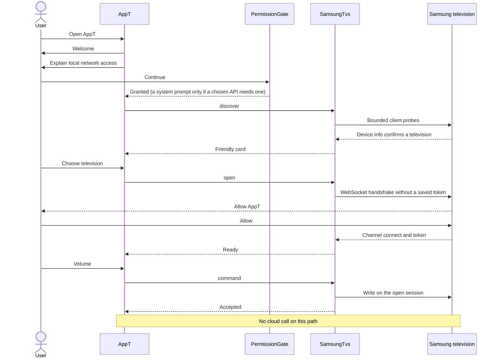
```mermaid
sequenceDiagram
  actor User
  participant App as AppT
  participant Gate as PermissionGate
  participant Samsung as SamsungTvs
  participant TV as Samsung television
  User->>App: Open AppT
  App->>User: Welcome
  App->>User: Explain local network access
  User->>Gate: Continue
  Gate-->>App: Granted (a system prompt only if a chosen API needs one)
  App->>Samsung: discover
  Samsung->>TV: Bounded client probes
  TV-->>Samsung: Device info confirms a television
  Samsung-->>App: Friendly card
  User->>App: Choose television
  App->>Samsung: open
  Samsung->>TV: WebSocket handshake without a saved token
  TV-->>User: Allow AppT
  User->>TV: Allow
  TV-->>Samsung: Channel connect and token
  Samsung-->>App: Ready
  User->>App: Volume
  App->>Samsung: command
  Samsung->>TV: Write on the open session
  Samsung-->>App: Accepted
  Note over App,TV: No cloud call on this path
```

Failure branches on the same path:

- Permission denied: stay on the explanation. No probe loop.
- No card by the bound: `Finished`, offer rescan. No manual address form.
- `Unsupported`: explain that control is not available and never send a key.
- Approval timeout: `NeedsRepair` with `ApprovalTimedOut`. Retry is user-initiated.
- Identity mismatch on a later open: `NeedsRepair` with `IdentityChanged`. The token is not sent.

## First free control to the account requirement

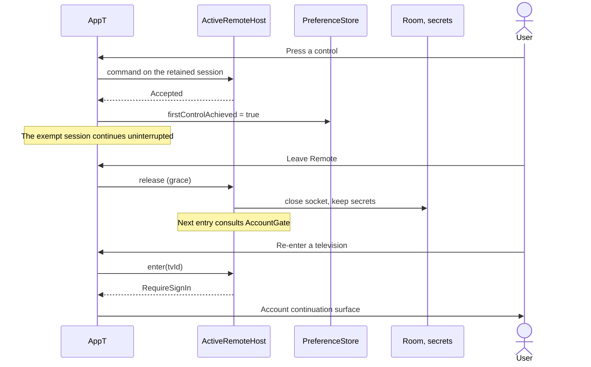
```mermaid
sequenceDiagram
  participant App as AppT
  participant Host as ActiveRemoteHost
  participant Prefs as PreferenceStore
  participant Storage as Room, secrets
  actor User
  User->>App: Press a control
  App->>Host: command on the retained session
  Host-->>App: Accepted
  App->>Prefs: firstControlAchieved = true
  Note over App: The exempt session continues uninterrupted
  User->>App: Leave Remote
  App->>Host: release (grace)
  Host->>Storage: close socket, keep secrets
  Note over Host: Next entry consults AccountGate
  User->>App: Re-enter a television
  App->>Host: enter(tvId)
  Host-->>App: RequireSignIn
  App->>User: Account continuation surface
```

The exemption belongs to one `ActiveRemote` session. Rotation, a sheet, or a short absence inside the grace window does not create a new entry. Process death ends the exempt session even though the user did not leave.

## Account sign-in and trial activation

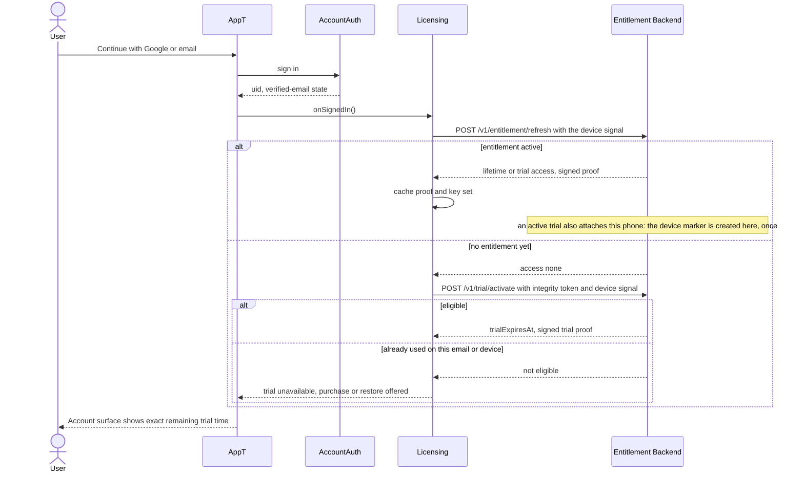
```mermaid
sequenceDiagram
  actor User
  participant App as AppT
  participant Auth as AccountAuth
  participant Lic as Licensing
  participant Fn as Entitlement Backend
  User->>App: Continue with Google or email
  App->>Auth: sign in
  Auth-->>App: uid, verified-email state
  App->>Lic: onSignedIn()
  Lic->>Fn: POST /v1/entitlement/refresh with the device signal
  alt entitlement active
    Fn-->>Lic: lifetime or trial access, signed proof
    Lic->>Lic: cache proof and key set
    Note over Fn: an active trial also attaches this phone: the device marker is created here, once
  else no entitlement yet
    Fn-->>Lic: access none
    Lic->>Fn: POST /v1/trial/activate with integrity token and device signal
    alt eligible
      Fn-->>Lic: trialExpiresAt, signed trial proof
    else already used on this email or device
      Fn-->>Lic: not eligible
      Lic-->>App: trial unavailable, purchase or restore offered
    end
  end
  App-->>User: Account surface shows exact remaining trial time
```

An unverified email/password account cannot activate a trial. Google identities are provider-verified. Nothing about the television is sent in either call.

This refresh is also the second-phone path: signing in on another phone returns the account's original trial expiry and marks that phone as trial-consumed through its device marker. Attaching never restarts or extends the window, and repeating it changes nothing.

## Trial expiry and the next remote entry

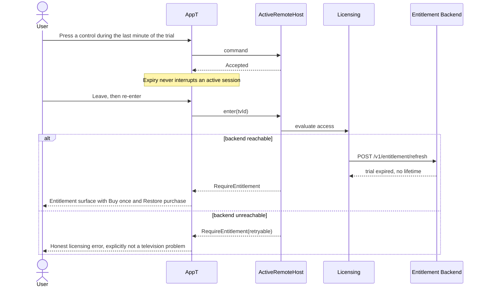
```mermaid
sequenceDiagram
  actor User
  participant App as AppT
  participant Host as ActiveRemoteHost
  participant Lic as Licensing
  participant Fn as Entitlement Backend
  User->>App: Press a control during the last minute of the trial
  App->>Host: command
  Host-->>App: Accepted
  Note over App: Expiry never interrupts an active session
  User->>App: Leave, then re-enter
  App->>Host: enter(tvId)
  Host->>Lic: evaluate access
  alt backend reachable
    Lic->>Fn: POST /v1/entitlement/refresh
    Fn-->>Lic: trial expired, no lifetime
    Host-->>App: RequireEntitlement
    App-->>User: Entitlement surface with Buy once and Restore purchase
  else backend unreachable
    Host-->>App: RequireEntitlement(retryable)
    App-->>User: Honest licensing error, explicitly not a television problem
  end
```

While a cached trial proof is unexpired, the app may run entirely offline: the local known expiry is the rule.

## Purchase

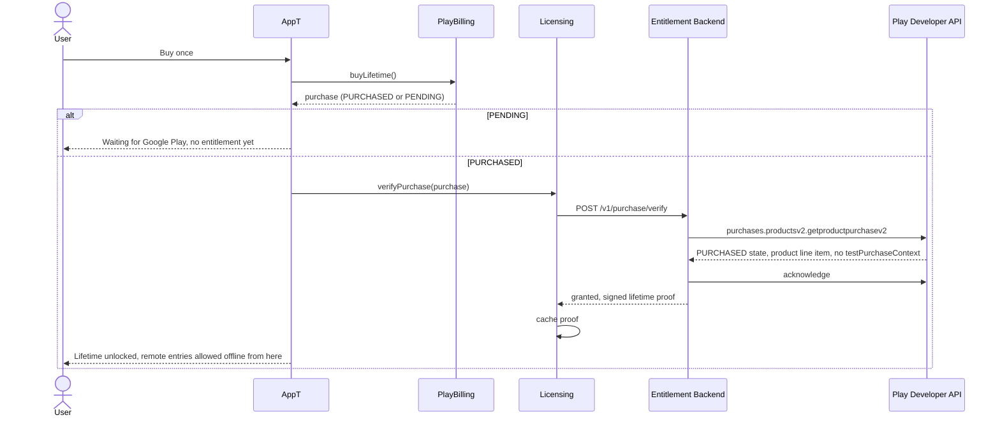
```mermaid
sequenceDiagram
  actor User
  participant App as AppT
  participant Play as PlayBilling
  participant Lic as Licensing
  participant Fn as Entitlement Backend
  participant Api as Play Developer API
  User->>App: Buy once
  App->>Play: buyLifetime()
  Play-->>App: purchase (PURCHASED or PENDING)
  alt PENDING
    App-->>User: Waiting for Google Play, no entitlement yet
  else PURCHASED
    App->>Lic: verifyPurchase(purchase)
    Lic->>Fn: POST /v1/purchase/verify
    Fn->>Api: purchases.productsv2.getproductpurchasev2
    Api-->>Fn: PURCHASED state, product line item, no testPurchaseContext
    Fn->>Api: acknowledge
    Fn-->>Lic: granted, signed lifetime proof
    Lic->>Lic: cache proof
    App-->>User: Lifetime unlocked, remote entries allowed offline from here
  end
```

If the validator is unavailable while Play reports `PURCHASED`, the client writes a 24-hour non-renewable provisional record and shows it as temporary. A later authoritative answer replaces it.

## Purchase completes while AppT is inactive

Provider behavior is owned by [account-entitlement.md](account-entitlement.md#provider-evidence-and-purchase-resume-lifecycle). The important lifecycle rule is that a Play UI callback is not the only source of truth.

```mermaid
sequenceDiagram
  actor User
  participant App as AppT
  participant Play as Play Billing
  participant Lic as Licensing
  participant Fn as Entitlement Backend

  User->>App: Buy once
  App->>Play: launchBillingFlow
  Play-->>App: PENDING or AppT backgrounds before final callback
  App-->>App: process may be killed; no purchase UI state persisted
  Note over Play: transaction later becomes PURCHASED
  User->>App: Return/reopen
  App->>Play: reconnect BillingClient + query current lifetime purchases
  Play-->>App: PURCHASED token
  App->>Lic: normalized purchase observation
  Lic->>Fn: idempotent verify/bind
  Fn-->>Lic: existing or new authoritative grant
  Lic-->>App: one Lifetime state
```

The listener, foreground query, Restore action, and RTDN/backend state all converge. `PENDING` never becomes entitlement merely because the process restarted.

## Restore purchase, including after account deletion

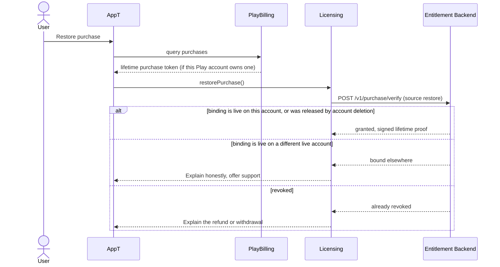
```mermaid
sequenceDiagram
  actor User
  participant App as AppT
  participant Play as PlayBilling
  participant Lic as Licensing
  participant Fn as Entitlement Backend
  User->>App: Restore purchase
  App->>Play: query purchases
  Play-->>App: lifetime purchase token (if this Play account owns one)
  App->>Lic: restorePurchase()
  Lic->>Fn: POST /v1/purchase/verify (source restore)
  alt binding is live on this account, or was released by account deletion
    Fn-->>Lic: granted, signed lifetime proof
  else binding is live on a different live account
    Fn-->>Lic: bound elsewhere
    Lic-->>App: Explain honestly, offer support
  else revoked
    Fn-->>Lic: already revoked
    Lic-->>App: Explain the refund or withdrawal
  end
```

Deleting an AppT account does not destroy the Play purchase. After deletion the binding is released, so recreating an account and restoring by the legitimate Play owner works.

## Restore on a second phone

A second phone signed into the same account receives identity, Username, trial state, and Lifetime Entitlement. It receives no televisions, names, favourites, arrangement, preferences, last-used television, or pairing material, so it discovers and pairs independently. A trial that is already running keeps its original expiry.

## Refund or chargeback

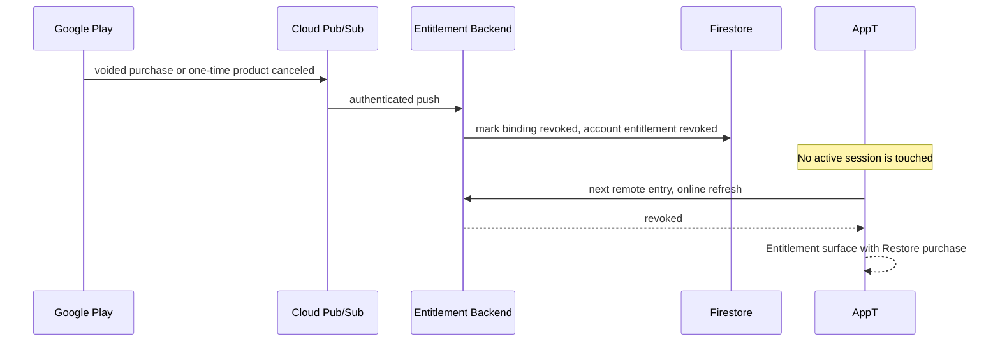
```mermaid
sequenceDiagram
  participant Play as Google Play
  participant PubSub as Cloud Pub/Sub
  participant Fn as Entitlement Backend
  participant Db as Firestore
  participant App as AppT
  Play->>PubSub: voided purchase or one-time product canceled
  PubSub->>Fn: authenticated push
  Fn->>Db: mark binding revoked, account entitlement revoked
  Note over App: No active session is touched
  App->>Fn: next remote entry, online refresh
  Fn-->>App: revoked
  App-->>App: Entitlement surface with Restore purchase
```

Revocation, like expiry, applies between sessions.

## Backend outage during control

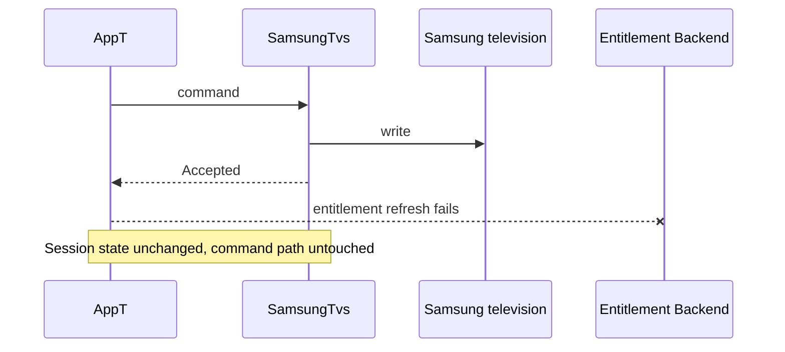
```mermaid
sequenceDiagram
  participant App as AppT
  participant Samsung as SamsungTvs
  participant TV as Samsung television
  participant Fn as Entitlement Backend
  App->>Samsung: command
  Samsung->>TV: write
  Samsung-->>App: Accepted
  App--xFn: entitlement refresh fails
  Note over App,Samsung: Session state unchanged, command path untouched
```

The account gate treats a cached identity and cached proof as valid offline. It never calls the backend to discover whether a signed-in user is signed in.

## Quiet reconnect and an address change

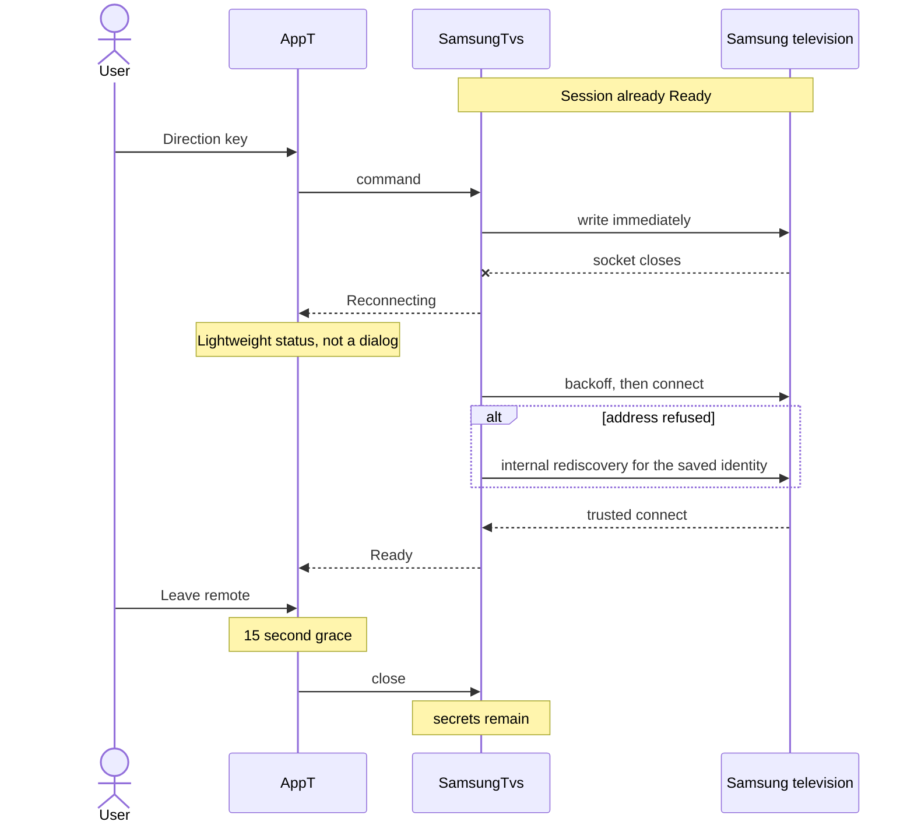
```mermaid
sequenceDiagram
  actor User
  participant App as AppT
  participant Sam as SamsungTvs
  participant TV as Samsung television
  Note over Sam,TV: Session already Ready
  User->>App: Direction key
  App->>Sam: command
  Sam->>TV: write immediately
  TV--xSam: socket closes
  Sam-->>App: Reconnecting
  Note over App: Lightweight status, not a dialog
  Sam->>TV: backoff, then connect
  alt address refused
    Sam->>TV: internal rediscovery for the saved identity
  end
  TV-->>Sam: trusted connect
  Sam-->>App: Ready
  User->>App: Leave remote
  Note over App: 15 second grace
  App->>Sam: close
  Note over Sam: secrets remain
```

If the budget ends, the state is `Unreachable` and automatic attempts stop. The user may try again, or wake when `powerOn` is `Attemptable`.

## Process death and reopen

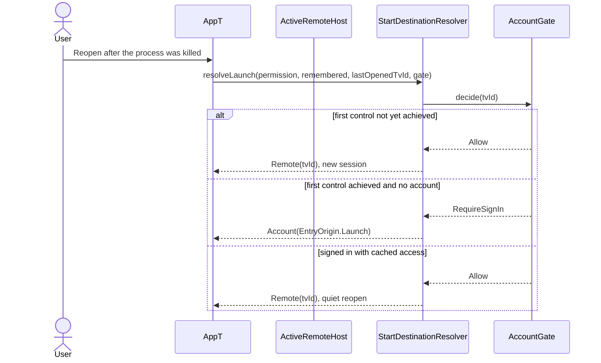
```mermaid
sequenceDiagram
  actor User
  participant App as AppT
  participant Host as ActiveRemoteHost
  participant Resolver as StartDestinationResolver
  participant Gate as AccountGate
  User->>App: Reopen after the process was killed
  App->>Resolver: resolveLaunch(permission, remembered, lastOpenedTvId, gate)
  Resolver->>Gate: decide(tvId)
  alt first control not yet achieved
    Gate-->>Resolver: Allow
    Resolver-->>App: Remote(tvId), new session
  else first control achieved and no account
    Gate-->>Resolver: RequireSignIn
    Resolver-->>App: Account(EntryOrigin.Launch)
  else signed in with cached access
    Gate-->>Resolver: Allow
    Resolver-->>App: Remote(tvId), quiet reopen
  end
```

Process death is never treated as an identity change: no re-pair prompt appears, and saved secrets remain valid.

## Switching televisions

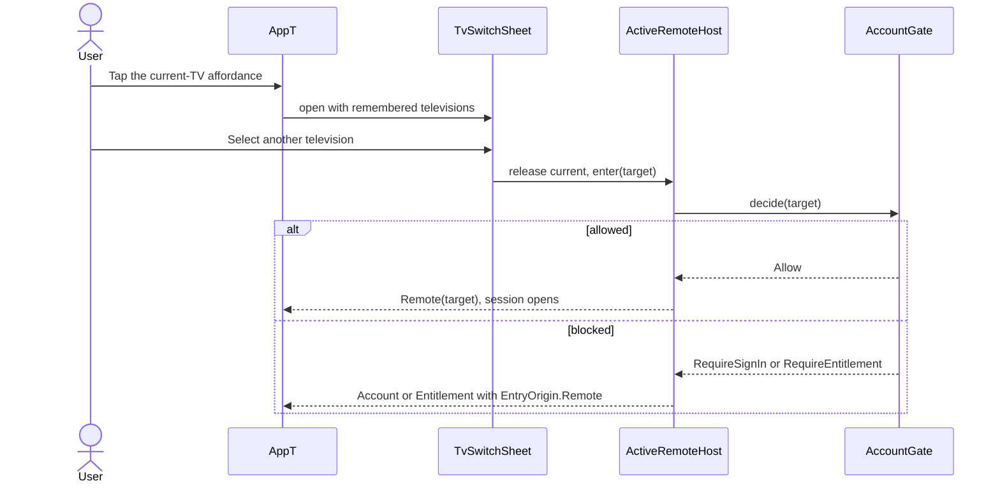
```mermaid
sequenceDiagram
  actor User
  participant App as AppT
  participant Sheet as TvSwitchSheet
  participant Host as ActiveRemoteHost
  participant Gate as AccountGate
  User->>App: Tap the current-TV affordance
  App->>Sheet: open with remembered televisions
  User->>Sheet: Select another television
  Sheet->>Host: release current, enter(target)
  Host->>Gate: decide(target)
  alt allowed
    Gate-->>Host: Allow
    Host-->>App: Remote(target), session opens
  else blocked
    Gate-->>Host: RequireSignIn or RequireEntitlement
    Host-->>App: Account or Entitlement with EntryOrigin.Remote
  end
```

There is no horizontal swipe between televisions; the switch is always an explicit selection.

## Forget this TV

```mermaid
sequenceDiagram
  actor User
  participant App as AppT
  participant Db as Room
  participant Sam as SamsungTvs
  User->>App: Forget this TV
  App-->>User: Confirm removal from this phone
  User->>App: Confirm
  App->>Db: delete TvProfile + favourites; add PendingForget atomically
  App-->>User: television disappears immediately
  App->>Sam: forget(tvId)
  alt Forgotten
    Sam-->>App: Forgotten
    App->>Db: delete PendingForget
  else temporarily unavailable
    Sam-->>App: Failed
    Note over App,Db: PendingForget remains for startup retry
  end
```

A later re-pair reaching `Ready` for the same `tvId` clears a stale
`PendingForget` before it can delete the new pairing. The low-level idempotent
secret deletion exists in S04; this user transaction becomes real in S09.
[data.md](data.md) owns the transaction and retry invariant.

## Wake and honest power

Wake is attempted only when the Samsung-private record contains a validated MAC
for the interface that identified the television and the capability is
`Attemptable`.

```mermaid
sequenceDiagram
  actor User
  participant App as AppT
  participant Sam as SamsungTvs
  User->>App: Power on
  App->>Sam: wake(tvId)
  alt wake evidence available
    Sam->>Sam: send bounded WoL attempts
    Sam-->>App: Sent
    App->>Sam: open(tvId) within wake patience window
  else evidence unavailable
    Sam-->>App: Unavailable
    App-->>User: honest limitation; no dead power control
  end
```

No SmartThings/cloud wake fallback is added. [connection.md](connection.md) owns
wake mechanics; [commands.md](commands.md) owns capability honesty. A physical
wake attempt is recorded in S12 and consolidated in S17.

## Sign-out

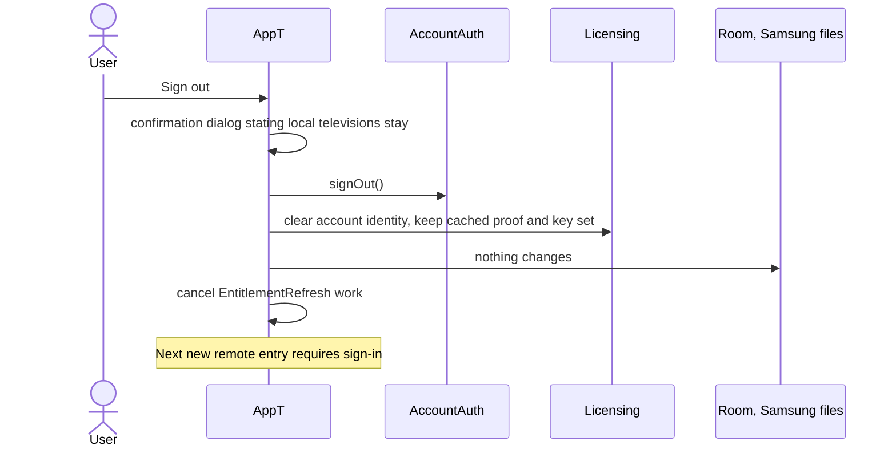
```mermaid
sequenceDiagram
  actor User
  participant App as AppT
  participant Auth as AccountAuth
  participant Lic as Licensing
  participant Storage as Room, Samsung files
  User->>App: Sign out
  App->>App: confirmation dialog stating local televisions stay
  App->>Auth: signOut()
  App->>Lic: clear account identity, keep cached proof and key set
  App->>Storage: nothing changes
  App->>App: cancel EntitlementRefresh work
  Note over App: Next new remote entry requires sign-in
```

An active remote session is allowed to finish. Sign-out does not delete the cached entitlement proof, television rows, favourites, preferences, or pairing secrets.

## Account deletion

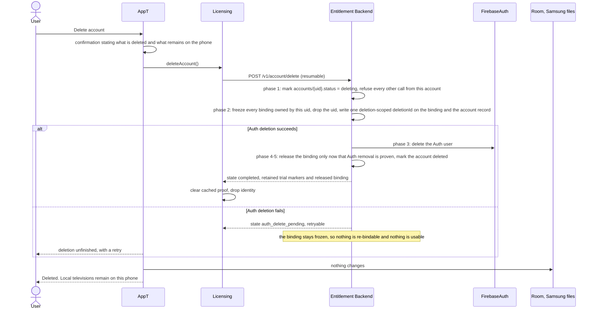
```mermaid
sequenceDiagram
  actor User
  participant App as AppT
  participant Lic as Licensing
  participant Fn as Entitlement Backend
  participant Auth as FirebaseAuth
  participant Storage as Room, Samsung files
  User->>App: Delete account
  App->>App: confirmation stating what is deleted and what remains on the phone
  App->>Lic: deleteAccount()
  Lic->>Fn: POST /v1/account/delete (resumable)
  Fn->>Fn: phase 1: mark accounts/{uid}.status = deleting, refuse every other call from this account
  Fn->>Fn: phase 2: freeze every binding owned by this uid, drop the uid, write one deletion-scoped deletionId on the binding and the account record
  alt Auth deletion succeeds
    Fn->>Auth: phase 3: delete the Auth user
    Fn->>Fn: phase 4-5: release the binding only now that Auth removal is proven, mark the account deleted
    Fn-->>Lic: state completed, retained trial markers and released binding
    Lic->>Lic: clear cached proof, drop identity
  else Auth deletion fails
    Fn-->>Lic: state auth_delete_pending, retryable
    Note over Fn: the binding stays frozen, so nothing is re-bindable and nothing is usable
    App-->>User: deletion unfinished, with a retry
  end
  App->>Storage: nothing changes
  App-->>User: Deleted. Local televisions remain on this phone
```

Freezing before deleting the Auth user is what makes the sequence safe: while the old identity can still authenticate, the purchase is bound to nobody and usable by nobody. The deletion-scoped `deletionId` written at freeze is what lets the daily reconciliation find the frozen bindings again, and it releases them only after an Auth read confirms the user is gone, recording `authRemovalConfirmedAt` as the proof; while the user still exists it leaves the binding frozen and raises an alert instead of releasing.

The account backend retains only pseudonymous trial markers and the released purchase binding. Television data was never there to delete.

## Upgrade in place

```mermaid
sequenceDiagram
  participant Old as Installed AppT N
  participant OS as Android package manager
  participant New as AppT N+1
  participant Data as Room/DataStore/private files
  participant Gate as Launch resolver

  Old->>Data: representative remembered TV, preferences, pairing/entitlement state
  OS->>New: install candidate over existing package without clearing data
  New->>Data: run supported migrations/rotations
  alt all stores usable
    Data-->>New: migrated state
    New->>Gate: resolve normal launch
  else one store corrupt/unavailable
    Data-->>New: documented per-store recovery
    New-->>Gate: preserve unaffected state; never pretend fresh install
  end
```

From the second public release onward, the source artifact is the immediately previous production artifact. [release.md](release.md#upgrade-in-place-release-proof) owns candidate/source identity and [testing.md](testing.md#whole-application-lifecycle-e2e) owns the journey evidence.

## Unexpected crash and next launch

The diagnostic recorder is local and already redacted before an uncaught crash.
A captured uncaught crash may leave a local marker plus events that were written
before failure. On the next launch AppT may offer one non-blocking **Review
diagnostics** affordance.

A force-stop, reboot, low-memory process kill, or OS termination without a
captured uncaught exception is **not** labelled as a crash. No report is sent
automatically; review and sharing still use the explicit diagnostics transaction
below. [diagnostics.md](diagnostics.md) owns the record/redaction contract and
[lifecycle.md](lifecycle.md) owns launch restoration.

## Diagnostics: local record and user-confirmed export

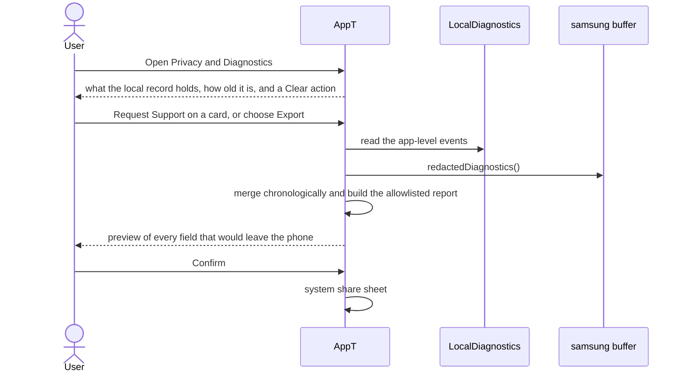
```mermaid
sequenceDiagram
  actor User
  participant App as AppT
  participant Record as LocalDiagnostics
  participant Samsung as samsung buffer
  User->>App: Open Privacy and Diagnostics
  App-->>User: what the local record holds, how old it is, and a Clear action
  User->>App: Request Support on a card, or choose Export
  App->>Record: read the app-level events
  App->>Samsung: redactedDiagnostics()
  App->>App: merge chronologically and build the allowlisted report
  App-->>User: preview of every field that would leave the phone
  User->>App: Confirm
  App->>App: system share sheet
```

Nothing is uploaded at any point, and no AppT service could receive a report: there is no crash-reporting or analytics SDK, no network client in the diagnostics package, and no backend endpoint for one. Clearing local history deletes the buffer and the rolling file.
