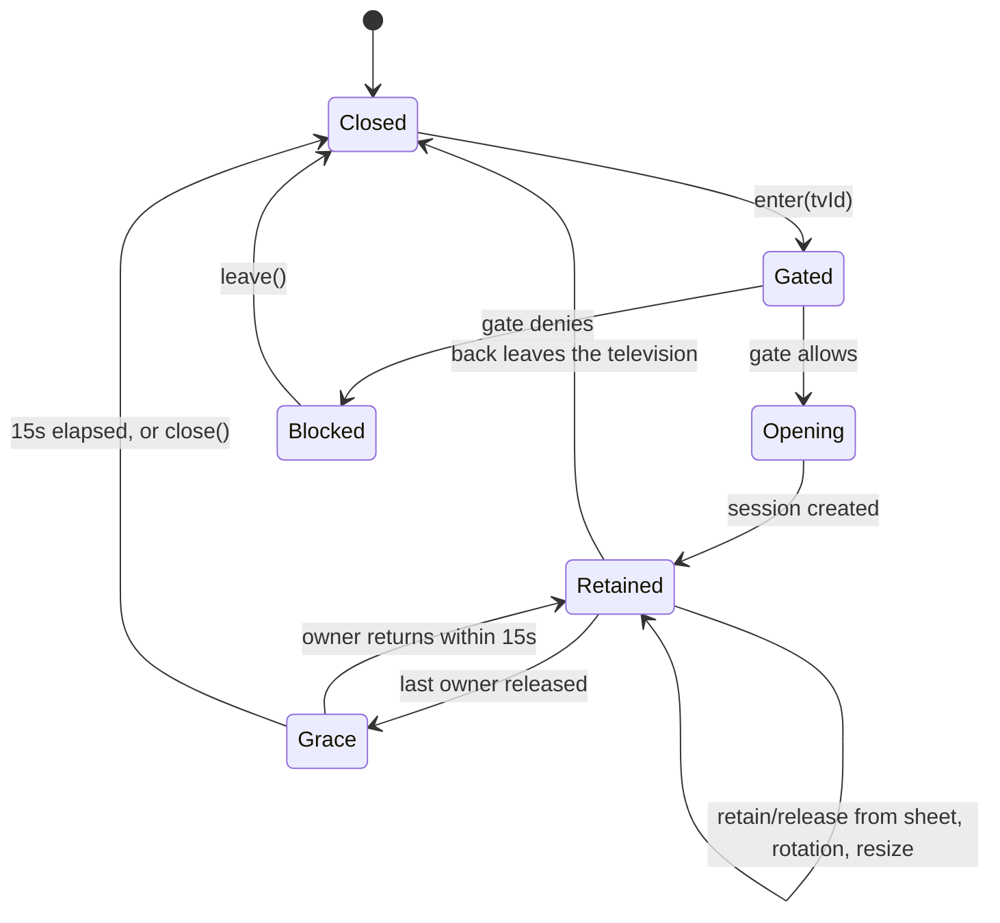

# Android lifecycle and network transitions

How AppT behaves from cold start to process death, across configuration changes, network changes, screen lock, backgrounding, and Doze. Local-first control is the constraint: no transition may turn a working remote into a failed one, and no transition may open a session that the licensing gate denies.

Owning files elsewhere: session state machine and reconnect budget in [connection.md](connection.md), secrets in [data.md](data.md), gate rules in [sync.md](sync.md), screen ownership in [presentation.md](presentation.md).

## Scope

V1 is one process, one activity, no foreground service, no boot receiver, no widget, no continuous background discovery or control. `WorkManager` is used for entitlement refresh only. Nothing in this file adds background TV control; changing that would be a new architecture decision.

## Ownership of state across transitions

| State | Owner | Survives configuration change | Survives process death |
|---|---|---|---|
| `RemoteSession` and socket | `ActiveRemoteHost` | Yes | No |
| Active Remote tvId | `ActiveRemoteHost` | Yes | No; recomputed from `lastOpenedTvId` |
| Selected television, navigation mode | `RemoteViewModel`, `PreferenceStore` | Yes | Navigation mode yes; selection via `lastOpenedTvId` |
| Edit mode, sheets, dialogs | Remote UI state | Yes | No |
| `firstControlAchieved` | `PreferenceStore` | Yes | Yes |
| Samsung secrets and device records | `samsung`, `noBackupFilesDir` | Yes | Yes |
| Room rows and favourites | Room | Yes | Yes |
| Local entitlement proof, key set, time offset | `Licensing` | Yes | Yes |
| Signed-in identity | Firebase Auth local cache | Yes | Yes |
| Scan in progress | Discovery ViewModel | Restarted on restoration | Restarted as a new bounded scan |

## Active Remote state machine

| Transition | Trigger | Rule |
|---|---|---|
| `Closed → Gated` | A screen, launch routing, or the switch sheet asks to enter a television | The gate runs here and only here. No screen may call `SamsungTvs.open` directly |
| `Gated → Blocked` | Gate denies | Route to Account or Entitlement with the entry origin. No session, no socket, no token |
| `Opening → Retained` | Session created | Session is persistent while retained so presses stay immediate |
| `Retained → Grace` | Last retain released (screen stopped, sheet dismissed, app backgrounded) | 15-second grace owned by `ActiveRemoteHost` |
| `Grace → Closed` | Grace elapses | Socket closes, reconnect stops, secrets remain. Closing is not forgetting |
| `Retained → Closed` | User leaves the television or backs out of `Remote` | Immediate close; the gate re-runs on the next entry |

`onStop` (backgrounding, screen lock, another app or the launcher in front) releases the Remote screen's retain. Grace keeps the session alive for a quick return. This is deliberate: V1 has no background control, so the session must not outlive app visibility beyond the grace window.

Configuration changes do **not** release any retain. The Activity is recreated, but retain interest is not an Activity-scoped resource: the `Remote` route re-retains in the new Activity's `onStart`, and `ActiveRemoteHost` keeps the session across the gap, so recreation never looks like backgrounding and never starts grace. Grace is driven by app visibility (`onStop`), not by Activity identity.

## Activity and Compose lifecycle

| Event | AppT behavior |
|---|---|
| Cold start | Launch routing resolves a start destination; at most one session opens; no scan runs unless Discovery is the destination |
| Warm start from recents within grace | The retained session is reused; no reconnect, no gate re-evaluation, no new socket |
| `onStart` after a longer absence | The Remote screen's retain is taken and the session reconnects through the existing supervised path |
| `onStop` | Remote retain released; session enters grace |
| `onDestroy` caused by a configuration change (rotation, resize, locale, density) | The Activity is destroyed **and recreated**. `ActiveRemoteHost` is application-scoped, so the retained session and its socket survive; the new Activity re-retains it in `onStart` and issues no `open` |
| `onDestroy` caused by process death | Everything in memory is gone; persisted state decides the next launch |
| Multi-window / split screen | Treated as a window-size change while visible. The Activity may or may not be recreated; the session behavior is identical either way. `onStop` still releases when the app is not visible |
| Picture-in-picture | Not used |

## Process death and cold restart

1. Launch routing runs: permission state, remembered televisions, `lastOpenedTvId`, and the gate.
2. If the gate blocks, the user lands on Account or Entitlement with `EntryOrigin.Launch`.
3. If the gate allows, the session opens normally. Process death is never treated as an identity change, so no re-pair prompt appears.
4. `firstControlAchieved` persists. A death after the first successful control ends the exempt session, so the next remote entry requires an account.

## Rotation, window changes, and foldables

V1 declares **no `android:configChanges`**. Rotation, resizing, locale change, density change, and font-scale change all take the platform default path: the Activity is destroyed and a new instance is created. Opting out of recreation would trade a well-tested platform behavior for hand-managed layout work, and would break the moment a configuration the app did not list changed. The architecture is therefore built so that recreation is harmless:

| State | Owner | Across Activity recreation |
|---|---|---|
| Session, socket, reconnect budget, gate decision | `ActiveRemoteHost` (application-scoped) | Survives untouched; the screen re-retains on start |
| Current route and arguments (`tvId`) | Navigation state in the saved instance state | Survives |
| Remote rename draft, Username draft, search text | `SavedStateHandle` | Survives, so typing is not lost |
| Scroll position on TvList and Settings | Compose saved state | Survives |
| Sheet visible, edit mode, an in-flight gesture | Screen-local | Dropped. The screen returns in its default state, which is cheaper than guessing |
| Interaction preferences, favourites, pairing | Room and DataStore | Untouched |

Consequences:

- Recreation never re-evaluates the gate, never re-pairs, never re-scans, and never opens a second socket. If a rotation did trigger `open`, the session state machine would reject it as already satisfied.
- Recreation is not a remote entry, so it cannot end an active session or a trial.
- Long-press reorder and other transient gestures are cancelled by a configuration change rather than resumed mid-gesture.
- The layout rules are in [presentation.md](presentation.md#rotation-window-size-foldables-and-tablets).

## Network transitions

AppT binds to the active non-VPN local network and never adds a VPN bypass. Network state is observed, not polled; an address change is handled inside `samsung` by unicast device-info plus a saved-identity rediscovery.

| Transition | Behavior | User-visible result |
|---|---|---|
| Wi-Fi → Wi-Fi, same network, address unchanged | Nothing observable | Control continues |
| Wi-Fi → Wi-Fi, television address changed | Internal rediscovery for the saved identity, then reconnect | Brief `Reconnecting`, then `Ready` |
| Wi-Fi → Wi-Fi, different network or AP isolation | Reconnect budget runs; rediscovery finds nothing | `Unreachable` with "check the same home network" |
| Wi-Fi → Ethernet (or the reverse) | Treated as a network change; reconnect runs against the last address and then rediscovery | Same as an address change |
| Network loss | Socket loss moves to `Reconnecting`; the reconnect budget runs | Quiet `Reconnecting`, then `Unreachable` |
| Network recovery after `Unreachable` | No automatic retry loop. The user's Try again, or re-entering the television, starts a new budget | Inline unavailable state until the user acts |
| VPN active | LAN traffic may not reach the television; discovery and reconnect fail honestly | `Unreachable` or `LocalNetworkDenied` copy, no bypass offered |
| IPv4-only television on a dual-stack network | Last address and rediscovery prefer the interface that answered before | Transparent |
| Address change while the session is `Ready` | Keepalive failure moves to `Reconnecting`, then rediscovery | Brief status change |
| Mobile data only | No local network; discovery and reconnect fail | `LocalNetworkDenied` or `Unreachable`, never a silent hang |

`Reconnecting` is always presented as a lightweight inline status, never a dialog loop. Repeated malformed frames that desynchronize the socket also move to `Reconnecting`; one malformed frame is dropped and recorded in redacted diagnostics.

## Screen lock, background, and Doze

- Screen lock is backgrounding: `onStop` releases the Remote retain, and grace closes the session.
- No wake lock, no job scheduled for control, no `WorkManager` discovery, no `AlarmManager` exact alarm.
- The 20-second WebSocket keepalive exists only while a session is retained; it stops at `Closed`.
- Doze and App Standby therefore only affect entitlement refresh, never local control.
- No foreground service is declared, so a session can never be kept alive behind the user's back. If a future product requirement needs background control, it requires a new decision and a Play policy review.

## WorkManager

`WorkManager` is the only deferred background mechanism, and it does exactly one job:

| Property | Value |
|---|---|
| Purpose | Refresh trial/Lifetime Entitlement state with the Entitlement Backend and, when a provisional entitlement is active, retry authoritative validation |
| Work name | `EntitlementRefresh`, unique with `ExistingWorkPolicy.KEEP` |
| Constraints | `NETWORK_CONNECTED` only |
| Frequency | At most once per 12 hours, best effort; never exact |
| Inputs | None that identify a television, account email, or username |
| Forbidden | Discovery, session open, command dispatch, diagnostics upload, purchase retries without user action |
| Cancellation | Cancelled on sign-out and on account deletion |
| Offline behavior | No work runs; cached proofs keep deciding |

A refresh never changes local control mid-session. It updates the cached proof and, on an authoritative revocation, the next remote entry is denied.

## Gate re-evaluation points

The licensing gate runs at exactly two moments:

1. **Remote entry** — `ActiveRemoteHost.enter()`. This covers launch routing, TvList, the switch sheet, and post-pairing entry.
2. **Post-refresh boundary** — a cached proof that changed as a result of a refresh is used by the next entry, not by the current session.

It never runs on rotation, resume, reconnect, sheet dismissal, or a command. That is what makes "an active remote is never interrupted" a structural property rather than a promise.

## Tests this file implies

| Test | Assertion |
|---|---|
| `rotationKeepsSession` | A rotation recreates the Activity; the retained session survives, no reconnect and no gate evaluation occur, and no second `open` is issued |
| `recreationRestoresRouteAndDrafts` | Route, `tvId`, TvList scroll, and a rename draft survive recreation |
| `recreationDropsTransientUiOnly` | An open sheet, edit mode, and an in-flight gesture reset on recreation, and nothing else does |
| `graceClosesAfterFifteenSeconds` | With a fake clock, the session closes at 15 seconds and not before |
| `backgroundReleasesRemote` | `onStop` starts grace; returning inside grace reuses the same session |
| `processDeathRequiresNewEntryWhenFirstControlDone` | After a first `Accepted`, a process death leads to the account gate on the next entry |
| `networkLossShowsReconnectingNotDialog` | Socket loss produces `Reconnecting` and no modal |
| `vpnDoesNotBypass` | With a VPN-only route, results are `Unreachable` or `LocalNetworkDenied` and no bypass path exists |
| `workManagerNeverTouchesSamsung` | The refresh worker has no reference to `SamsungTvs`, `RemoteSession`, or a discovery flow |
| `gateRunsOnlyOnEntry` | Gate decisions are counted in a unit test across rotation, resume, and reconnect |

Full contracts are in [testing.md](testing.md).
