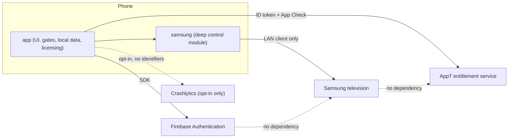
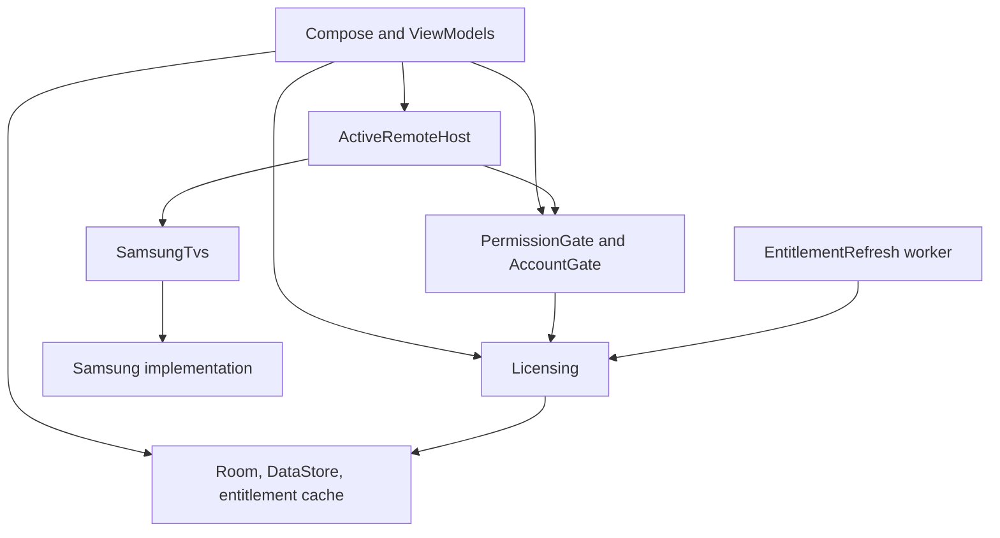

# Modules, dependencies, and composition

Vocabulary follows `.agents/skills/codebase-design/SKILL.md`: **module**, **interface**, **seam**, **adapter**, **depth**, **leverage**, **locality**.

## Shape

Two Gradle modules. No further split until a demonstrated pressure appears.

| Module | Owns | Does not own |
|---|---|---|
| `app` | Compose UI, navigation, permission explanation, account and licensing, Room, DataStore, entitlement cache, diagnostics wiring, Hilt application graph | WebSocket payloads, discovery packets, pairing tokens, TLS pins, retry loops, protocol generation selection |
| `samsung` | Discovery, identity correlation, pairing, security identity, session, reconnect, capability evidence, command translation, wake, secret storage | Permission dialogs, Firebase, account state, licensing, Crashlytics SDK, layout |

`app` depends on `samsung`. `samsung` does not depend on `app`.

There is no `domain`, `data`, `usecase`, or `repository` Gradle module. Packages inside `app` are not a Clean Architecture stack. A universal TV **interface** is not created; ecosystem #2 is the trigger for that seam.

Suggested namespaces, confirmable before the first Play upload: `dev.anthracite.appt` and `dev.anthracite.appt.samsung`. The application id default is `dev.anthracite.appt`. Changing it before the first Play upload is not an architecture change.

## System structure



Local control crosses only the `app` → `samsung` → television path. No Firebase, Play, or licensing component sits on it.

## External seams

Each seam below is a place where behaviour genuinely varies, so each seam has at least two **adapters**: a production adapter and a test adapter. Anything with only one adapter is not a seam; it is an implementation detail.

| Seam | Interface | Production adapter | Test adapter |
|---|---|---|---|
| Samsung control | `SamsungTvs`, `RemoteSession` | `SamsungTvsImpl` inside `samsung` | Fake installed with Hilt `@TestInstallIn` |
| Local-network access | `PermissionGate` | Android platform APIs and app preference state | Scripted states |
| Identity | `AccountAuth` | Firebase Auth plus Credential Manager | Scripted sign-in, verification, and failure states |
| Entitlement backend | `EntitlementBackend` | OkHttp HTTPS client against the entitlement service | Scripted responses, delays, and outages |
| Purchase | `PlayBilling` | Play Billing library | Scripted purchase, pending, revoked, and replayed tokens |
| Integrity | `IntegrityProvider` | Play Integrity plus App Check token acquisition | Scripted verdicts and unavailability |
| Diagnostics consent | `DiagnosticsConsent` | DataStore-backed preference plus Crashlytics calls | In-memory consent state |

### Samsung control (`samsung`)

`SamsungTvs` presents one interface, specified in [samsung-interface.md](samsung-interface.md).

**Depth:** callers learn discovery, open, command, wake, forget, and observable session state. Protocol generations, sockets, tokens, and backoff stay behind the seam.

**Leverage:** every screen, ViewModel test, and Compose test uses the same interface.

**Locality:** a protocol change is confined to `samsung`; callers change only when the observable contract changes.

Deletion test: deleting `samsung` would force WebSocket, discovery, pairing, and reconnect knowledge back into every caller. The module earns its keep and is not a pass-through.

### Licensing (`app`)

`Licensing` is the deep module for trial, purchase, and entitlement state. Its interface is in [sync.md](sync.md#client-seams).

**Depth:** callers learn one snapshot and six intents. Proof verification, key-set caching, the time model, provisional records, retry policy, App Check, Play verification round trips, and the account gate inputs stay behind the seam.

**Leverage:** account surfaces, the gate, Settings, and launch routing all read the same snapshot; none of them knows how a proof is verified.

**Locality:** a change in backend protocol, proof format, or revocation handling is one module's change.

Deletion test: deleting `Licensing` would push token handling, proof verification, time arithmetic, and purchase state into every account surface and into `ActiveRemoteHost`. It earns its keep.

`Licensing` is the only caller of `EntitlementBackend`, `PlayBilling`, and `IntegrityProvider`. `AccountAuth` is separate because identity and entitlement vary independently: sign-in can succeed while entitlement checks fail, and a signed-out app still evaluates the first-session exemption.

### Internal seams inside `samsung`

These stay inside the module. They are not parameters of `SamsungTvs` and are not types `app` can import. Each exists because production and test adapters both need it.

| Internal seam | Production adapter | Test adapter |
|---|---|---|
| Discovery transport | SSDP client, `NsdManager`, device-info HTTP | Scripted candidates |
| Session transport | OkHttp WebSocket and TLS | Scripted frames, delays, closes, certificate identities |
| Secret store | Android Keystore AES-GCM files | In-memory |
| Wake sender | UDP magic packet | Records sends, transmits nothing |
| Clock | System clock | Controllable |
| Diagnostic log | Redacting ring buffer | Captures events for assertions |

`SamsungTvsImpl` is `internal`. Tests in the `samsung` module construct it with fake internal adapters. `app` receives only `SamsungTvs`.

OkHttp is the HTTP and WebSocket stack inside `samsung`. Android networking primitives are used where multicast, NSD, or Wake-on-LAN require them. No second HTTP stack. No Firebase, Play services, or Crashlytics dependency on the `samsung` Gradle graph; a CI check fails if one appears.

## Dependency direction



Allowed edges:

- ViewModels depend on `SamsungTvs`, `ActiveRemoteHost`, Room DAOs, `PreferenceStore`, `AccountAuth`, `Licensing`, and the gates.
- `Licensing` depends on `AccountAuth`, `EntitlementBackend`, `PlayBilling`, `IntegrityProvider`, and the entitlement cache.
- `ActiveRemoteHost` depends on `AccountGate` and `SamsungTvs`. It opens a session only after the gate allows.
- The `EntitlementRefresh` worker depends on `Licensing` only. It never touches `SamsungTvs`, `RemoteSession`, discovery, or Room television rows.
- `samsung` depends on its internal adapters, OkHttp, and the Android framework APIs it needs for LAN and Keystore.

Forbidden edges:

- `samsung` → `app`, Firebase, Play, Crashlytics, Room, DataStore, WorkManager, or licensing.
- ViewModels → `EntitlementBackend`, `IntegrityProvider`, `FirebaseAuth`, OkHttp, `NsdManager`, Keystore aliases, proof types, or protocol types.
- Licensing → `SamsungTvs`, `RemoteSession`, Room television rows, or `RemoteKey`.
- Any module → a sync record, mutation queue, or Firestore client. The client Firestore SDK is not in the Android dependency graph at all; Firestore is server-only.
- UI → Firestore snapshot listeners. V1 has none.

## Hilt composition roots

Hilt wires the Android graph. It is not the architecture. Ordinary classes take constructor dependencies and stay directly constructible in tests.

| Root | Where | Binds |
|---|---|---|
| `AppTApplication` `@HiltAndroidApp` | `app` | Application graph |
| `SamsungModule` `@InstallIn(SingletonComponent::class)` | `samsung` | `SamsungTvs` to the production implementation |
| App modules | `app` | Room database, `PreferenceStore`, `ActiveRemoteHost`, `AccountGate`, `PermissionGate`, `Licensing`, backend and billing adapters, diagnostics, WorkManager configuration |

`app` does not `@Provides SamsungTvs`. Construction of the production adapter stays in `samsung`, so `app` cannot assemble a half-wired session. Tests replace `SamsungModule` and the licensing seams.

`@AndroidEntryPoint` is used on Android entry points in `app` only. `samsung` has no activities, no permission UI, and no `@AndroidEntryPoint`.

ViewModels expose a single `StateFlow` of `UiState`. Navigation uses Navigation Compose with type-safe Kotlin-serialization routes. Routes, launch routing, and screen contracts are owned by [presentation.md](presentation.md).

## Process and lifecycle ownership

V1 is a single process. No `android:process`, no foreground service, no boot receiver, no app widget. Background continuous discovery or control is not part of V1.

`app` owns two pieces of process-level state:

1. **`ActiveRemoteHost`** — the application-scoped owner of the current Active Remote. `Remote` screens retain it; sheets, edit mode, and rotation do not release it. Release starts the 15-second grace. Transitions are owned by [lifecycle.md](lifecycle.md).
2. **`AccountGate`** — the single licensing decision point, consulted by `ActiveRemoteHost.enter`. Its rules are owned by [sync.md](sync.md#remote-entry-gate).

The permission gate also lives in `app`. `samsung` never launches permission UI and never reads Firebase Auth. Gate rules are in [discovery.md](discovery.md).

Deferred background work is limited to `EntitlementRefresh` in `WorkManager`, whose scope is in [lifecycle.md](lifecycle.md#workmanager).

## Package layout

`samsung`:

```text
samsung/SamsungTvs.kt                 // interface and caller-facing types
samsung/internal/SamsungTvsImpl.kt
samsung/internal/discovery/
samsung/internal/session/
samsung/internal/protocol/
samsung/internal/secrets/
samsung/internal/wake/
samsung/internal/diagnostics/
samsung/di/SamsungModule.kt
```

`app`:

```text
gate/          PermissionGate, AccountGate
host/          ActiveRemoteHost
navigation/    routes, launch routing
discovery/     scan UI
pairing/       pairing UI
remote/        remote UI, sheets, edit mode
tvlist/        remembered-television management
account/       account, trial, purchase and restore surfaces
licensing/     Licensing, proof verification, entitlement cache, backend and billing clients
local/         Room database and DAOs, PreferenceStore
diagnostics/   consent, Crashlytics wiring, redactor, export
work/          EntitlementRefresh
```

`local` is the Room and DataStore package. It is not a Clean Architecture data layer and it is not a Gradle module. `licensing` is not a Gradle module either; the split is a package boundary that keeps entitlement code out of UI and out of `samsung`.

## Dependency set boundaries

`samsung` depends on OkHttp, Coroutines, kotlinx-serialization, and the Android APIs it uses. It does not depend on the Firebase BOM, Play Billing, or Play Integrity.

`app` depends on Compose, Navigation, Lifecycle, Hilt, Room, DataStore, WorkManager, OkHttp, kotlinx-serialization, Firebase Auth, Firebase App Check with Play Integrity, Firebase Crashlytics, Play Billing, and Credential Manager. Exact versions and pins are owned by [release.md](release.md).

CI enforces the boundary:

- `:samsung` dependency insight must not contain Firebase, Play services, or Crashlytics.
- `:app` dependency insight must not contain a Firestore client artifact.
- `samsung` production sources must not call `android.util.Log` or reference Firebase packages.
- No production source may declare a sync record, tombstone, or mutation-queue type.

## Platform baseline

From the accepted baseline, restated only where implementers need the number beside the module rule:

- `minSdk` 29, `targetSdk` / `compileSdk` 36.
- Kotlin, Jetpack Compose, ViewModel, Coroutines, StateFlow.
- One `OkHttpClient` shared by `samsung` and by the entitlement client, configured per consumer. No logging interceptor in release.
- `ACCESS_LOCAL_NETWORK` is not declared and not requested while `targetSdk` is 36. Broad local-network permission is a requirement of a later target-37 bump, not of V1. `NEARBY_WIFI_DEVICES` is not a V1 permission. The gate is specified in [discovery.md](discovery.md).
