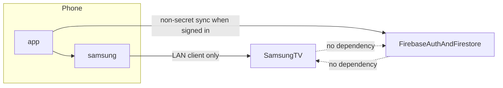
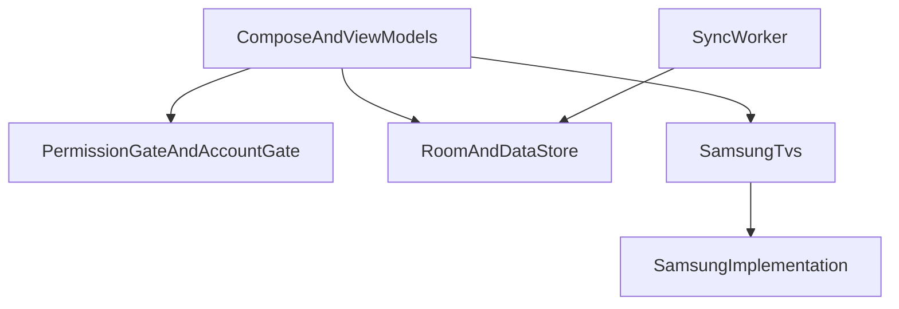

# Modules, dependencies, and composition

Vocabulary follows `.agents/skills/codebase-design/SKILL.md`: **module**, **interface**, **seam**, **adapter**, **depth**, **leverage**, **locality**.

## Shape

Two Gradle modules. No further split until a demonstrated pressure appears.

| Module | Owns | Does not own |
|---|---|---|
| `app` | Compose UI, navigation, permission explanation, account gate, Room, DataStore, sync worker, Crashlytics wiring, Hilt application graph | WebSocket payloads, discovery packets, pairing tokens, TLS pins, retry loops, protocol generation selection |
| `samsung` | Discovery, identity correlation, pairing, security identity, session, reconnect, capability evidence, command translation, wake, secret storage | Permission dialogs, Firebase, account state, sync records, Crashlytics SDK, layout |

`app` depends on `samsung`. `samsung` does not depend on `app`.

There is no `domain`, `data`, `usecase`, or `repository` Gradle module. Packages inside `app` are not a Clean Architecture stack. A universal TV **interface** is not created. Ecosystem #2 is the trigger for that seam; it gets its own module then, not a speculative **adapter** now.

Suggested namespaces, confirmable before the first Play upload: `dev.anthracite.appt` and `dev.anthracite.appt.samsung`. The application id default is `dev.anthracite.appt`. Changing it before the first Play upload is not an architecture change.

## System structure



Local control crosses only the `app` → `samsung` → television path. Firebase is not on that path.

## External seam

`samsung` presents one **interface**: `SamsungTvs`, specified in [samsung-interface.md](samsung-interface.md).

**Depth:** callers learn discovery, open, command, wake, forget, and observable session state. Protocol generations, sockets, tokens, and backoff stay behind the seam.

**Leverage:** every screen, ViewModel test, and Compose test uses the same interface. A fake **adapter** of `SamsungTvs` replaces the production **adapter** in `app` tests.

**Locality:** a protocol change is confined to `samsung`. Callers change only when the observable contract changes.

Deletion test: deleting `samsung` would force WebSocket, discovery, pairing, and reconnect knowledge back into every caller. The module earns its keep. It is not a pass-through.

Two **adapters** of `SamsungTvs` make the seam real:

1. Production `SamsungTvsImpl`, constructed inside `samsung`.
2. Fake, used by `app` unit and Compose tests, installed with Hilt `@TestInstallIn(replaces = SamsungModule::class)`.

## Internal seams

These stay inside `samsung`. They are not parameters of `SamsungTvs` and are not types `app` can import. Each exists because production and test adapters both need it.

| Internal seam | Production adapter | Test adapter |
|---|---|---|
| Discovery transport | SSDP client, `NsdManager`, device-info HTTP | Scripted candidates |
| Session transport | OkHttp WebSocket and TLS | Scripted frames, delays, closes, certificate identities |
| Secret store | Android Keystore AES-GCM files | In-memory |
| Wake sender | UDP magic packet | Records sends, sends nothing |
| Clock | System clock | Controllable |
| Diagnostic log | Redacting ring buffer | Captures events for assertions |

`SamsungTvsImpl` is `internal`. Tests in the `samsung` module construct it with fake internal adapters. `app` receives only `SamsungTvs`.

OkHttp is the HTTP and WebSocket stack inside `samsung`. Android networking primitives are used where multicast, NSD, or Wake-on-LAN require them. No second HTTP stack. No Firebase, Play services, or Crashlytics dependency on the `samsung` Gradle graph. A CI check fails the build if one appears.

## Dependency direction



Allowed edges:

- ViewModels depend on `SamsungTvs`, Room/DataStore readers, and the gates.
- The sync worker depends on Room, DataStore, and Firebase. It does not depend on `RemoteSession` and does not call `command`.
- `samsung` implementation depends on its internal adapters, OkHttp, and Android framework APIs it needs for LAN and Keystore.

Forbidden edges:

- `samsung` → `app`, Firebase, Crashlytics, Room sync entities, or WorkManager.
- ViewModels → OkHttp, `NsdManager`, Keystore aliases, or protocol types.
- Sync worker → secret store or session transport.
- UI → Firestore snapshot listeners. V1 has none.

## Hilt composition roots

Hilt wires the Android graph. It is not the architecture. Ordinary classes take constructor dependencies and stay directly constructible in tests.

| Root | Where | Binds |
|---|---|---|
| `AppTApplication` `@HiltAndroidApp` | `app` | Application graph |
| `SamsungModule` `@InstallIn(SingletonComponent::class)` | `samsung` | `SamsungTvs` to the production implementation |
| App modules | `app` | Room database, DataStore, sync worker, account gate, permission gate, Crashlytics hookup |

`app` does not `@Provides SamsungTvs`. Construction of the production adapter stays in `samsung`, so `app` cannot assemble a half-wired session. Tests replace `SamsungModule` entirely.

`@AndroidEntryPoint` is used on Android entry points in `app` only. `samsung` has no activities, no permission UI, and no `@AndroidEntryPoint`.

ViewModels expose `StateFlow`. Navigation uses Navigation Compose with type-safe Kotlin-serialization routes. Routes grow with the slices in [slices.md](slices.md). V1 route set:

| Route | Role |
|---|---|
| `Welcome` | First open |
| `LocalNetwork` | Explanation immediately before the system prompt |
| `Discovery` | Bounded scan results |
| `Remote` | Active control for one `TvId` |
| `TvList` | Remembered televisions |
| `Account` | Google and email/password, after first control |
| `Settings` | Haptics, volume buttons, navigation mode, names |
| `ExportDiagnostics` | Explicit redacted share |

There is no route for manual IP entry, casting, or IR.

## Process and lifecycle ownership

V1 is a single process. No `android:process`, no foreground service, no boot receiver, no app widget. Background continuous discovery or control is not part of V1.

`app` owns an `ActiveRemote` holder:

- `open` when the remote surface starts and the account gate allows it.
- If that open occurs before `firstControlAchieved` with no signed-in user, the holder owns the first-session account exemption for the lifetime of that same `ActiveRemote`.
- Pass a scope owned by `ActiveRemote`, not the destination ViewModel scope, so leaving the screen does not cancel the grace window.
- Call `close` 15 seconds after the remote surface stops, unless it started again.
- The 15 seconds covers rotation, a share sheet, and a transient pause; returning inside it is the same exempt session rather than a new remote entry.
- Once the exempt holder closes after first success, the next remote entry requires sign-in before a new `open`.
- Cancelling the session does not delete secrets.

The permission gate and the account gate live in `app`. `samsung` never launches permission UI and never reads Firebase Auth. Gate rules are in [discovery.md](discovery.md) and [sync.md](sync.md).

## Package layout

`samsung`:

```text
samsung/SamsungTvs.kt                 // interface and caller-facing types
samsung/internal/SamsungTvsImpl.kt
samsung/internal/discovery/
samsung/internal/session/
samsung/internal/protocol/
samsung/internal/secrets/
samsung/internal/wake/
samsung/internal/diagnostics/
samsung/di/SamsungModule.kt
```

`app`:

```text
gate/          permission gate, account gate
discovery/     scan UI
remote/        remote UI, ActiveRemote
account/
sync/
local/         Room and DataStore
diagnostics/   Crashlytics and share sheet
navigation/
```

`local` is the Room and DataStore package. It is not a Clean Architecture data layer and it is not a Gradle module.

## Platform baseline

From the accepted baseline, restated only where implementers need the number beside the module rule:

- `minSdk` 29, `targetSdk` / `compileSdk` 36.
- Kotlin, Jetpack Compose, ViewModel, Coroutines, StateFlow.
- One `OkHttpClient` inside `samsung` for device-info and the remote WebSocket. No logging interceptor.

`targetSdk` / `compileSdk` 36 stays the V1 baseline. `ACCESS_LOCAL_NETWORK` is not declared and not requested while `targetSdk` is 36. Broad local-network permission is a requirement of a later target-37 bump, not of V1. `NEARBY_WIFI_DEVICES` is not a V1 permission: SSDP, raw sockets, and `NsdManager` do not require it. Android 16 local-network protection is transitional and opt-in at target 36. The gate is specified in [discovery.md](discovery.md).
