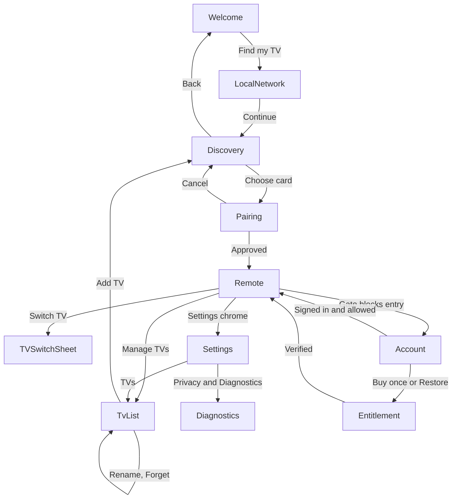

# Presentation architecture

Technical realization of the settled product-surface decisions in [ui-ux.md](ui-ux.md): routes, screen/UI state contracts, Compose/ViewModel ownership, process restoration, responsive rules, design-token categories, accessibility contracts, and error presentation.

Ownership: [ui-ux.md](ui-ux.md) owns what the user sees and which product decisions are settled. This file owns how those surfaces are built. It does not reopen a settled decision. Module seams and dependency direction are owned by [modules.md](modules.md); lifecycle transitions are owned by [lifecycle.md](lifecycle.md); entitlement semantics by [sync.md](sync.md).

Vocabulary follows `.agents/skills/codebase-design/SKILL.md`: **module**, **interface**, **seam**, **adapter**, **depth**, **leverage**, **locality**.

## Composition rules

Four rules keep the frontend from becoming shallow pass-through layers:

1. **The ViewModel is the composition point.** Screens receive one immutable `UiState` and emit intents. ViewModels combine flows from Room, DataStore, `SamsungTvs`, and licensing. No screen collects more than one state source itself.
2. **A module earns its existence through variation or logic, not forwarding.** A class that only forwards DAO calls, or renames one state object into another, must not exist. Room DAO interfaces, `PreferenceStore`, `SamsungTvs`, and `Licensing` already are the seams.
3. **Session ownership is not screen ownership.** `ActiveRemoteHost` (application-scoped) owns the `RemoteSession`; screens retain and release interest. See [modules.md](modules.md) and [lifecycle.md](lifecycle.md).
4. **Composables are stateless.** A composable takes `UiState` plus lambdas, never a ViewModel, DAO, or `RemoteSession`. Animations read tokens, never hardcoded numbers.

Each route has exactly one ViewModel. It exposes one public state stream and public intent functions, and nothing else:

```kotlin
class RemoteViewModel(...) : ViewModel() {
    val state: StateFlow<RemoteUiState>          // single public stream; no second observable surface
    fun onCommand(command: TvCommand)            // intents are plain functions, main-safe
}
```

State is produced with `MutableStateFlow` plus `combine`/`stateIn` over upstream flows (Room DAO flows, `PreferenceStore` flows, `SamsungTvs` snapshots, `Licensing.state`, `ActiveRemoteHost.current`). Upstream flows are collected with `SharingStarted.WhileSubscribed(5_000)` so leaving a screen stops work without losing state across a rotation. Intent functions launch in `viewModelScope` and never mutate shared state outside the ViewModel.

Allowed ViewModel dependencies: `SamsungTvs`, `RemoteSession.snapshot`, `ActiveRemoteHost`, `TvDao`, `FavouriteDao`, `PreferenceStore`, `PermissionGate`, `AccountGate`, `Licensing`, `AccountAuth`, `DiagnosticsConsent`, `SavedStateHandle`.

Forbidden ViewModel dependencies: `EntitlementBackend`, `PlayBilling`, `IntegrityProvider`, `FirebaseAuth`, OkHttp clients, Keystore aliases, DataStore key strings, `android.util.Log`, and any `samsung.internal` type. Purchase and integrity calls happen inside `Licensing`.

## Route graph

Navigation Compose with type-safe Kotlin-serialization routes. One activity. No bottom navigation anywhere.

```kotlin
@Serializable data object WelcomeRoute
@Serializable data object LocalNetworkRoute
@Serializable data object DiscoveryRoute
@Serializable data class PairingRoute(val tvId: String)
@Serializable data class RemoteRoute(val tvId: String)
@Serializable data object TvListRoute
@Serializable data class AccountRoute(val entryOrigin: EntryOrigin)
@Serializable data class EntitlementRoute(val entryOrigin: EntryOrigin)
@Serializable data object SettingsRoute
@Serializable data object DiagnosticsRoute

enum class EntryOrigin { Welcome, Discovery, TvList, Launch, Remote }
```

The TV switch sheet, the More (secondary controls) sheet, edit mode, and confirmation dialogs are **not routes**. They are Remote-screen state, so back dismisses them without changing navigation state.



### Launch routing

`StartDestinationResolver` is a pure function over persisted state. It runs once per launch and never once per frame.

```kotlin
fun resolveLaunch(
    permissionAcknowledged: Boolean,
    remembered: List<TvId>,
    lastOpenedTvId: TvId?,
    gate: (TvId) -> RemoteEntryDecision,
): StartDestination
```

| Order | Condition | Destination |
|---|---|---|
| 1 | `permissionAcknowledged` is false | `Welcome` |
| 2 | No remembered television | `Welcome` |
| 3 | A remembered television resolves and the gate allows | `Remote(tvId)`, session opens quietly |
| 4 | A remembered television resolves and the gate denies | `Account(EntryOrigin.Launch)` or `Entitlement(EntryOrigin.Launch)` |

Remote-first means this: after setup, a normal launch reopens the last-used television with no dashboard, no list, and no scan. `Remote` shows unavailable and recovery states inline rather than navigating away.

## Screen and UI-state contracts

Each contract below is the interface between the ViewModel and the composables. `UiState` types are immutable data classes exposed as a single `StateFlow`; intents are plain functions on the ViewModel. Nothing else is public.

### Welcome

| | |
|---|---|
| State | `WelcomeUiState(permissionAcknowledged: Boolean, rememberedCount: Int, primaryAction: WelcomeAction)` |
| Intents | `onFindMyTv()`, `onOpenLastTv(tvId)` |
| Observes | `PermissionGate`, `TvDao.rememberedCount()` |
| Rules | One screen, one primary action. Brand/mascot may animate; motion is skipped when reduced motion is active. The privacy and local-control reassurance is static text, not a carousel. |

### LocalNetwork

| | |
|---|---|
| State | `LocalNetworkUiState(phase: Explain \| Requesting \| Granted \| Denied, canOpenAppSettings: Boolean)` |
| Intents | `onContinue()`, `onRetry()`, `onOpenSettings()` |
| Observes | `PermissionGate` |
| Rules | Copy explains the home-network need in ordinary language and never names SSDP, mDNS, multicast, or ports. `Granted` advances automatically to Discovery. `Denied` stays on the explanation with retry and a settings path. |

### Discovery

| | |
|---|---|
| State | `DiscoveryUiState(scan: Scanning \| Finished \| Failed(reason), cards: List<TvCardUi>, showEmptyState: Boolean)` where `TvCardUi(tvId, label, state: Ready \| NeedsPairing \| Unsupported, remembered: Boolean)` |
| Intents | `onRescan()`, `onPick(tvId)` |
| Observes | `SamsungTvs.discover()` collected through the ViewModel |
| Rules | A card carries a friendly label and an ordinary-language state, never an address, port, UUID, MAC, or generation. `Unsupported` cards expose no control affordance. Selecting a card cancels the scan. Scanning restarts once on restoration, then stops. |

### Pairing

| | |
|---|---|
| State | `PairingUiState(tvName: String, phase: Connecting \| WaitingForApproval \| Succeeded \| Failed(TvFailure), recallHintVisible: Boolean)` |
| Intents | `onCancel()`, `onRetryApproval()`, `onConfirmRepair()` |
| Observes | `ActiveRemoteHost` session snapshot |
| Rules | A dedicated focused state, never a spinner inside the discovery list. Copy directs the user to the television, exposes no protocol vocabulary, and offers Cancel. Success transitions directly into Remote. `onConfirmRepair()` is only reachable after an explicit confirmation dialog whose meaning is "the saved connection no longer matches this television". |

### Remote

| | |
|---|---|
| State | `RemoteUiState(tvName: String, connection: ConnectionUi, capabilities: TvCapabilities, navigationMode: NavigationMode, pointerAvailable: Boolean, favouriteShelf: List<ShelfItemUi>, secondaryCount: Int, valueFlowOffer: SheetOffer?, editMode: EditModeUiState, wakeOffered: Boolean)` |
| Intents | `onCommand(TvCommand)`, `onKeyPress`/`onKeyRelease`, `onToggleNavigationMode()`, `onRetry()`, `onWake()`, `onOpenSwitchSheet()`, `onOpenMoreSheet()`, `onOpenSettings()`, `onOpenList()`, `onToggleFavourite(ItemKey)`, `onEnterEditMode()`, `onExitEditMode()`, `onMove(ItemKey, delta)` |
| Observes | `ActiveRemoteHost.session(tvId)` snapshot, `TvDao`, `FavouriteDao`, `PreferenceStore`, `Licensing` |
| Rules | No purchase prompt, no account prompt, no trial countdown, and no bottom navigation on this surface. Every control comes from live capability evidence. Power is spatially isolated in the chrome zone. An active session is never interrupted by trial expiry, revocation, purchase processing, or sign-out. |

`ConnectionUi` maps `SessionState` to the presentation the user sees:

| Session | Presentation | Actions shown |
|---|---|---|
| `Connecting` | Quiet chrome status | Cancel is absent; the user may leave |
| `AwaitingTvApproval` | "Approve AppT on <name>" inline | Retry approval |
| `Ready` | Ready status | none |
| `Reconnecting` | "Reconnecting" polite live-region status | none while budget remains |
| `NeedsRepair` | Inline recovery with the reason in ordinary language | Per `RepairReason` |
| `Unreachable` | Inline unavailable state | Try again, Switch TV, Turn on when `powerOn` is `Attemptable` |
| `Unsupported` | Honest unsupported state | Request Support, Switch TV |
| `Closed` | Should not be visible; the route leaves Remote | none |

### TV switch sheet

| | |
|---|---|
| State | `TvSwitchUiState(rows: List<TvRowUi>, addTvAvailable: Boolean)`, `TvRowUi(tvId, name, state: Ready \| Connecting \| Offline \| NeedsPairing, isCurrent: Boolean)` |
| Intents | `onSelect(tvId)`, `onAddTv()`, `onManageTvs()`, `onDismiss()` |
| Observes | `TvDao`, `ActiveRemoteHost`, `SamsungTvs.rememberedIds()` |
| Rules | Bottom sheet with remembered televisions plus Add TV. No horizontal swipe between televisions. Selecting another television releases the current Active Remote through the normal release path and opens the selected one through the gate. |

### TvList (manage televisions)

| | |
|---|---|
| State | `TvListUiState(rows: List<TvRowUi>, renameTarget: TvId?, renameDraft: String, forgetTarget: TvId?, showEmptyState: Boolean)` |
| Intents | `onOpen(tvId)`, `onRenameStart(tvId)`, `onRenameCommit(text)`, `onForgetRequest(tvId)`, `onForgetConfirm(tvId)`, `onAddTv()`, `onDetails(tvId)` |
| Observes | `TvDao`, `FavouriteDao`, `SamsungTvs.rememberedIds()`, `ActiveRemoteHost` |
| Rules | Rows show friendly name and ordinary-language state. Model and firmware appear only in a secondary details surface. `Forget this TV` requires an explicit confirmation whose copy says the television is removed from this phone only. |

### Account

| | |
|---|---|
| State | `AccountUiState(identity: AccountIdentity?, username: UsernameEditState, trial: TrialPresentation?, entitlement: EntitlementPresentation?, backend: BackendStatus, signOutTarget: Boolean, deleteTarget: Boolean)` |
| Intents | `onSignInGoogle()`, `onSignInEmail(email, password)`, `onRegisterEmail(email, password)`, `onSendPasswordReset(email)`, `onVerifyEmailRetry()`, `onUsernameEdit(text)`, `onUsernameCommit()`, `onBuyOnce()`, `onRestorePurchase()`, `onRefresh()`, `onSignOutRequest()`, `onSignOutConfirm()`, `onDeleteRequest()`, `onDeleteConfirm()` |
| Observes | `AccountAuth`, `Licensing` |
| Rules | Reached after the first exempt session ends, or when the gate blocks a remote entry, or from Settings. Not a modal over Remote. Shows exact remaining trial time while a trial is active; purchase is available and not dominant; at most one lightweight expiry reminder exists and it never interrupts control. |

### Entitlement and purchase

| | |
|---|---|
| State | `EntitlementUiState(identity: AccountIdentity?, access: AccessState, purchase: PurchaseUiState, backend: BackendStatus, canRestore: Boolean)` where `PurchaseUiState = Idle \| Pending \| Verifying \| Provisional(expiresAt) \| Failed(reason)` |
| Intents | `onBuyOnce()`, `onRestorePurchase()`, `onRetry()`, `onBack()` |
| Observes | `Licensing`, `PlayBilling` through `Licensing` |
| Rules | Full-screen surface outside Remote. `PENDING` shows "waiting for Google Play", grants nothing, and offers no false success. Backend failures read as licensing problems with explicit "this is not a television problem" wording, plus Try again. Back never lands the user on a blocked Remote. |

### Settings

| | |
|---|---|
| State | `SettingsUiState(interaction: InteractionSettings, tvCount: Int, accountSummary: AccountSummary, crashReportingOptIn: Boolean, appVersion: String)` |
| Intents | `onHaptics(enabled)`, `onVolumeButtons(enabled)`, `onNavigationMode(mode)`, `onOpenTvs()`, `onOpenAccount()`, `onOpenDiagnostics()`, `onOpenAbout()` |
| Observes | `PreferenceStore`, `TvDao`, `Licensing`, `AccountAuth`, `DiagnosticsConsent` |
| Rules | One grouped screen with the five fixed sections. Preference writes happen in the ViewModel, never in a composable effect. Contextual actions deep-link into the correct section. |

### Diagnostics

| | |
|---|---|
| State | `DiagnosticsUiState(crashReporting: ConsentState, lastExportPreview: ExportPreview?, localEventCount: Int, uploading: Boolean)` |
| Intents | `onCrashReportingToggle(enabled)`, `onSendStoredReports()`, `onDeleteStoredReports()`, `onBuildPreview()`, `onConfirmExport()` |
| Observes | `DiagnosticsConsent`, `SamsungTvs.redactedDiagnostics()` |
| Rules | Crash reporting is off until explicitly enabled. The preview lists exactly what will leave the phone before the share sheet opens. Request Support reuses the same preview and export path. Nothing is uploaded to an AppT service. |

## Navigation and back behavior

| Surface | Back behavior |
|---|---|
| Welcome, Discovery, LocalNetwork | Follow the navigation stack; back from the stack root returns to the previous app |
| Pairing | Cancel: release the session, drop the candidate pin, persist nothing, return to Discovery |
| Remote | Leaves the app (task to background) when Remote is the launch root. When Remote was opened from `TvList`, back returns to `TvList` |
| Sheets, edit mode, dialogs | Dismiss without changing navigation state |
| TvList | Returns to its origin (Remote or Settings) |
| Account, Entitlement | Cancel the blocked entry and return to the entry origin (Welcome, Discovery, TvList, Launch). Never open a session the gate denies |
| Settings, Diagnostics | Return to their origin |

`EntryOrigin` exists so a gated entry can be cancelled without stranding the user. A blocked entry is never resumed automatically after sign-in; the user re-enters.

## Active Remote ownership

`ActiveRemoteHost` is application-scoped and owns the single current Active Remote.

```kotlin
interface ActiveRemoteHost {
    val current: StateFlow<ActiveRemoteSnapshot?>          // tvId plus RemoteSession snapshot
    suspend fun enter(tvId: TvId): EnterResult              // consults AccountGate, then SamsungTvs.open
    fun retain(owner: RetainOwner)                          // Remote screen, sheet, edit mode, pairing
    fun release(owner: RetainOwner)
    fun leave(origin: EntryOrigin)                          // closes the gate-blocked entry
}
```

- `enter` is the only path that opens a session, so the licensing gate cannot be bypassed by reaching a screen directly.
- Retain/release is interest counting, not navigation. Rotation, window-size change, and a sheet over Remote do not release.
- Release starts the 15-second grace owned here; the transitions are specified in [lifecycle.md](lifecycle.md).
- A `Successful enter` does not depend on backend availability; the gate decides from cached proofs.
- Process death clears the host. The next entry re-runs launch routing and the gate.

## Process-death restoration

| Restored | Not restored |
|---|---|
| Current route and arguments (Navigation Compose saved state) | The socket, session, or reconnect budget |
| `Remote(tvId)` re-opens the session quietly if the gate still allows | A scan in progress; Discovery starts one fresh bounded scan |
| Permission acknowledgment, `firstControlAchieved`, interaction preferences | Pairing approval candidate pin; the pairing state restarts a fresh `open` |
| TvList scroll position and rename draft? (draft is discarded; the row stays) | An in-flight Play purchase; purchases are re-queried from Play on next use |
| Signed-in identity from the local Auth cache | Sheets, dialogs, and transient edit mode (edit mode restarts off) |

Two rules follow from settled product behavior:

1. Process death after a first successful control ends the exempt session. The next remote entry requires an account, even though the process died rather than the user leaving.
2. A restored Remote is a new remote entry for licensing purposes. Cache-based checks run again; an active session that the process lost is not a session that expiry may not touch.

## Rotation, window size, foldables, and tablets

- No orientation lock. The Remote is not portrait-only.
- Layout keys off window size classes measured on the current window, not on device category: compact width (< 600dp), medium (600–839dp), expanded (≥ 840dp), plus a compact-height variant for landscape phones.
- Rotation and window resizing are configuration changes. They retain the Active Remote, the selected television, navigation mode, and (where safe) edit mode. They never re-pair, re-scan, or re-evaluate the licensing gate.
- Foldable posture and hinge APIs are not used in V1. A foldable is a window that changes size class. If a posture-specific requirement appears later, that is a new decision.
- No separate tablet product architecture: the same screens, the same semantic order, more space.

| Screen | Compact | Medium | Expanded |
|---|---|---|---|
| Remote | Single column: chrome, shelf, navigation zone, high-frequency row | Centered control cluster capped in width, larger spacing, shelf above the navigation zone | Control cluster plus a side panel carrying the shelf and secondary controls |
| Discovery | One column of cards | Two-column card grid | Two-column grid with a wider explanation panel |
| TvList | List | List capped at a comfortable width | Two-column list |
| Settings, Account, Entitlement, Diagnostics | Full-width, single column | Centered column (max ~640dp) | Centered column with side padding |

Compact height (landscape phone): vertical spacing tokens shrink one step, the favourite shelf moves into the More sheet, core controls stay above the fold, and the Remote body scrolls only when the font scale forces it.

## Thumb-first zones

The Remote is composed of four vertical zones. Zone order is architectural because it encodes reach and accidental-activation decisions.

```text
┌──────────────────────────────┐
│ chrome: TV name, status,     │  ← isolated power, switch affordance, settings
│         power                │
├──────────────────────────────┤
│ favourite shelf (compact)    │
├──────────────────────────────┤
│ navigation surface           │  ← D-pad / touchpad, central and lower
│ (D-pad or touchpad in place) │
├──────────────────────────────┤
│ high-frequency row: back,    │  ← volume, mute, channel, home
│ home, volume, mute           │
└──────────────────────────────┘
```

Binding rules: interactive targets are at least 48dp; primary Remote controls should exceed that where space allows; the navigation zone sits in the lower half of the window; power is never adjacent to high-frequency controls; the shelf may not push the navigation zone out of the lower half.

## Design tokens

Token categories are architecture. Roles and floor values are binding; final pixel values are chosen at implementation and reviewed visually, so they are not frozen here.

| Category | Roles it must define | Binding floors |
|---|---|---|
| `color.brand` | mascot/brand palette, accent usage bounds | contrast floor applies where brand color carries text |
| `color.surface` | dark-first surface, elevated surface, sheet, scrim | 3:1 against adjacent non-text content |
| `color.content` | primary, secondary, disabled text on each surface | 4.5:1 for body text |
| `color.status` | Ready, Connecting, Offline, NeedsPairing, Unsupported | state is always paired with text or icon, never color alone |
| `color.feedback` | error, warning, success, informational | same contrast floors |
| `type.*` | display, title, body, label, remote-control label, mascot-adjacent display | scalable sp; no fixed dp text sizes |
| `space.*` | 4dp-based scale with a compact-height step | layout must not clip at 200% font scale |
| `size.*` | minimum touch target, remote control cell, navigation surface, shelf item, sheet radius, icon sizes | 48dp minimum; 56dp for primary controls |
| `shape.*` | control, card, sheet, dialog radii | consistent within a surface |
| `elevation.*` | flat, raised, sheet, dialog | dark-first; shadow is secondary to surface tone |
| `motion.*` | state change, sheet, surface transition, mascot | reduced-motion variants required |
| `haptic.*` | tap, hold start, hold end, error | optional behind the haptics preference; never the only feedback |
| `icon.*` | control glyphs, status glyphs, TV and app placeholders | decorative icons carry no meaning alone |
| `brand.*` | mascot art sizes and placements | mascot never occupies persistent remote space |

## Accessibility contracts and verification hooks

Contracts are binding for every shipped surface. Each has a verification hook so accessibility cannot be a final polish pass.

| Contract | Verification hook |
|---|---|
| Every interactive element has a role, label, state, and action for TalkBack | Compose semantics assertions; manual TalkBack walkthrough recorded in the slice notes |
| Status changes are announced without repeated interruption | Polite live regions on connection, pairing, and entitlement status; a test asserts the live-region node exists once per status change |
| Targets are at least 48dp | Compose `assertTouchWidthIsAtLeast(48.dp)` / `assertTouchHeightIsAtLeast(48.dp)` on every control a slice adds |
| Text scales without clipping, overlap, or unreachable controls | Layout tests at 200% font scale for each route |
| Color is never the only meaning carrier | Every status composable exposes a text label plus icon; a test asserts both nodes |
| Reduced motion is respected | Motion tokens read `LocalMotionDurationScale`; a test with animations disabled asserts no travel animation |
| Focus and semantic traversal follow visual and task order | Explicit traversal grouping per Remote zone; ordering assertion in Compose tests |
| Every gesture has a visible alternative | Long-press reorder has Move earlier / Move later actions; touchpad drag has key navigation; no gesture-only settings or destructive actions |
| Destructive actions are distinct and confirmed | Confirmation dialogs for Forget this TV, sign out, and account deletion; copy states the consequence |
| Mascot and decorative animation never carry meaning | Decorative nodes are marked decorative in semantics; a test asserts no meaning-bearing node is decorative-only |

## Favourites, apps, and edit mode

State lives in the ViewModel and is derived from Room, not from Compose state.

- `FavouriteDao` is keyed by `(tvId, kind, target)` with a `sortOrder`. `kind` is `APP` or `CONTROL`.
- The shelf shows a deliberately small set: favourited launchable apps plus favourited secondary controls. `More` opens the full supported surface, grouped into Apps and Controls.
- Apps appear only for ids in the live `launchableApps` list. A curated shortcut whose id is absent is not shown.
- Toggling a favourite writes Room immediately.
- Entering edit mode is possible by long-press on the shelf **or** by an `Edit` action in the More sheet. The second path is the gesture alternative.
- Reordering commits per move in a single Room transaction. Edit mode is a presentation state with no pending buffer, so a process death or navigation away cannot lose or duplicate an order change.
- Edit mode is transient: it is not restored after process death and does not survive leaving Remote.
- Removing a television (Forget this TV) deletes its favourites in the same Room transaction that removes the row.

## Error and state presentation matrix

One rule decides everything here: **stay in context, show the next useful action, and never confuse licensing with television failure.**

| Condition | Surface | Meaning shown | Actions |
|---|---|---|---|
| `Reconnecting` | Remote chrome | "Reconnecting" | none while the budget lasts |
| `Unreachable` | Remote inline | "Can't reach <name>" | Try again, Switch TV, Turn on when attemptable |
| `NeedsRepair(ApprovalDenied, ApprovalTimedOut)` | Remote or Pairing inline | "Approve AppT on the television" | Retry |
| `NeedsRepair(TokenRejected, IdentityChanged)` | Remote inline | "This television no longer matches your saved connection" | Re-pair (confirmed) |
| `SecretsUnavailable` | Remote or Pairing inline | "Saved connection needs pairing again" | Pair again |
| `Unsupported` | Discovery card or Remote state | "AppT can't control this television yet" | Request Support, Switch TV |
| `LocalNetworkDenied` | LocalNetwork | Explanation with retry | Continue, Open settings |
| No card after a scan | Discovery empty state | "No televisions found" | Scan again |
| Trial active, backend unreachable | Account, Trial | "Couldn't refresh your trial; it runs until <date>" | Retry |
| Trial expired, no lifetime | Entitlement (full screen) | "Your free trial has ended" | Buy once, Restore purchase, Sign in |
| Backend unreachable while trial expired | Entitlement (full screen) | "We can't check your licence right now. This is not a television problem." | Retry, Buy once, Restore purchase |
| Purchase `PENDING` | Entitlement | "Waiting for Google Play to finish the payment" | none; no entitlement is granted |
| Provisional entitlement | Account | "Temporarily unlocked while we confirm your purchase" plus remaining time | Retry validation |
| Revoked purchase | Entitlement on next entry | "This purchase was refunded or withdrawn" | Restore purchase, Buy once |
| Signed out with a cached lifetime proof | Account | "Sign in to keep using AppT" | Google, email/password |
| Account deleted | Account | "Your account was deleted; local televisions stay on this phone" | Continue |

An active remote session is never replaced by any row in this table. These surfaces appear between sessions, not during one.

## What this file does not decide

Final pixel values, the exact mascot illustration, copy wording, and store-listing material. Those are design and implementation choices reviewed against [ui-ux.md](ui-ux.md) and this file's floors.
