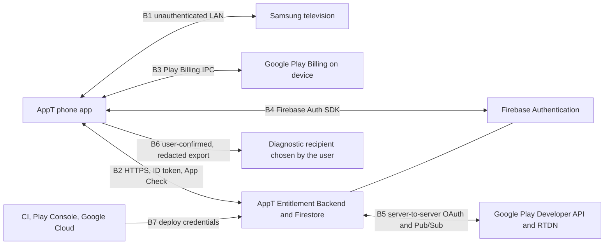

# Security architecture and threat model

Source-controlled threat model for AppT V1. It matches the trust boundaries the accepted architecture actually has.

Method: `.agents/skills/security-audit/SKILL.md` in **guidance mode**. No six-phase audit, no external audit artifacts, no probing of live systems. Implementation does not exist yet, so absent implementation is never recorded here as a vulnerability. Weaknesses are recorded as controls, best-effort mitigations, or provider facts that still need validation.

## Confidence classes

Every claim in this file carries one of these classes:

| Class | Meaning |
|---|---|
| **Enforced by AppT** | The architecture can hold this against a motivated local or remote attacker using only AppT-controlled components. |
| **Best-effort** | AppT reduces the likelihood or impact. A determined attacker with device or network control can defeat it. |
| **Needs validation** | A provider, platform, or deployment fact that must be confirmed against authoritative material before it is relied on. Collected in [README.md](README.md#needs-validation). |

Do not present a best-effort mitigation as a guarantee in product copy, support answers, or release notes.

## Assets

| Asset | Where it lives | Why an attacker wants it |
|---|---|---|
| Television control authority (Samsung token, TLS SPKI pin) | This phone, Keystore-backed file | Control of the television, or impersonation of AppT to the television |
| Local pairing and television identity | This phone, `noBackupFilesDir` | Correlating a person to a television; unlocking remote control |
| Customer identity (Firebase Auth uid, verified email) | Device plus Firebase Auth | Account takeover; trial reset |
| Lifetime Entitlement and other entitlement proofs | Device cache plus entitlement backend | Getting paid local control without paying |
| Purchase binding | Entitlement backend | Rebinding a stolen purchase token to another AppT account |
| Pseudonymous trial markers | Entitlement backend | Linking an identity to trial history; trial reset |
| Local diagnostics | Device only; leaves the phone solely as a user-confirmed, redacted export | Learning network, account, or command details |
| CI, deployment, and signing material | GitHub Actions, Google Cloud, Play Console | Supply-chain compromise; shipping an attacker build |

Adversaries considered: a hostile device on the same LAN; a spoofing or malformed-discovery responder; the television itself behaving unexpectedly; a curious or malicious local app on the phone; a thief of a single credential (purchase token, ID token, App Check token); a motivated user who wants a second free trial or a free lifetime entitlement; a compromised or rooted phone; a compromised dependency or CI pipeline.

Adversaries explicitly **not** in scope: a state-level attacker with physical control of both the phone and the television; a malicious Google Play or Firebase operator; DRM-style content protection on the television.

## Trust boundaries

| Boundary | Crosses | Principal on each side | Primary controls |
|---|---|---|---|
| B1 LAN | Discovery probes, device-info, WebSocket control, wake packets | Phone (trusted locally) against an unauthenticated device | Identity confirmation before a card, SPKI pin compare before a token, capability evidence, bounded parsing, no listening server |
| B2 Backend | Entitlement and account requests | Signed-in customer against AppT's service | Firebase ID token, App Check, server-side authorization, deny-all client datastore rules, input validation, idempotency keys |
| B3 Play Billing | Purchase flow and purchase tokens | App against Play on the same device | Server-authoritative verification, one-account binding, no client trust |
| B4 Firebase Auth | Sign-in and identity | App against Auth | Provider-verified Google identity, required email verification for the fallback path, no profile copying |
| B5 Server to Play | Purchase verification, RTDN | AppT service against Google | Service account with narrow scope, Workload Identity Federation, signature-free Pub/Sub push with authenticated service account |
| B6 Diagnostics | User-confirmed, redacted diagnostic export | Customer against a recipient the customer chooses | No crash-reporting or analytics SDK at all, redaction at write time, allowlisted preview before anything leaves, no upload endpoint to attack |
| B7 Deployment | Code, rules, indexes, secrets | Human/CI against production | No long-lived keys in git, WIF, least-privilege service accounts, pinned actions, manual production promotion |

## Threat catalogue

### B1 LAN television control

| Threat | Control | Class |
|---|---|---|
| A hostile host answers discovery to be picked | A card requires device-info confirmation of a Samsung television; `ssdp:all` is not sent; unrelated brands are not probed. The user still confirms the television; a card is a claim, not trust. | Enforced by AppT |
| Spoofed discovery responder claims a remembered `TvId` | Reconnect uses the saved address and rediscovery of the saved identity only, never a scan-supplied suggestion. | Enforced by AppT |
| Malicious or malformed television payloads | Bounded reader (64 KiB, depth 8, list cap 200, text cap 256), no URL evaluation, no redirect off the candidate host, malformed frames become `Reconnecting` or a dropped frame, never a caller exception. | Enforced by AppT |
| First-contact TLS trust is decided by the wrong party | No global trust-all `TrustManager`. On first contact one certificate is accepted as a candidate, kept in memory, and persisted only together with a successful TV-side approval. | Enforced by AppT |
| Token sent to an impostor television | The saved SPKI pin is compared before the token is attached; a mismatch closes the socket and requires explicit re-pair. Plaintext pairing compares the protocol UUID where one exists. | Enforced by AppT |
| Television security identity changes unexpectedly | Fail closed: `NeedsRepair` with `IdentityChanged`, token withheld, explicit user confirmation required before `confirmRepair`. AppT is never allowed to "ignore certificate errors". | Enforced by AppT |
| Token exposure through logs, crash reports, or an app-local leak | Secrets live in `noBackupFilesDir`, Keystore-encrypted, typed so they cannot enter Room, DataStore, diagnostics, or the sync-free local records; `samsung` never calls `android.util.Log`; a redactor also strips UUID-shaped and token-shaped values. | Enforced by AppT (structural) / Best-effort for a rooted device |
| Token replay by another app on the same phone | Android app sandbox plus Keystore-backed key that is non-exportable and bound to the app. A rooted or instrumented device can defeat this. | Best-effort |
| Plaintext port 8001 has no confidentiality or integrity | Plaintext is adopted only when the television does not speak the TLS remote channel; a plaintext-paired television keeps a UUID identity check and can still be spoofed by a hostile LAN host. Copy never claims the connection is protected. A television that previously completed TLS pairing never receives its token over plaintext. | Best-effort with an honest product claim |
| Hostile local network watches or manipulates traffic | Wake and discovery are unauthenticated by nature. AppT does not send credentials on those paths. Control traffic is protected only by the adopted channel's TLS; the residual risk is documented in the physical matrix and in support copy rather than hidden. | Best-effort |
| Television reached across subnets, VLANs, or VPNs | Not bypassed. No NAT proxy, no relay, no VPN bypass. A cross-subnet failure is `Unreachable` with honest copy. | Enforced by AppT |
| AppT turns into a LAN listener | No server socket, no resident SSDP listener, no MQTT/relay, no mirroring listener. The manifest permission allowlist and CI checks hold this. | Enforced by AppT |
| Port scan or surveillance of the LAN | Probes are SSDP M-SEARCH, one DIAL M-SEARCH, and `_airplay._tcp` browse; device-info is fetched only for candidates on ports 8001 and 8002. No port sweep, no `ssdp:all`, no continuous scan. | Enforced by AppT |

### B2 and B4 Customer Account, backend, and integrity

| Threat | Control | Class |
|---|---|---|
| Unauthenticated or forged backend calls | Every endpoint requires a Firebase ID token; the handler derives the uid from the verified token, never from a request field. App Check with Play Integrity is enforced on all endpoints. | Enforced by AppT |
| A signed-in customer reads or writes another customer's records | Records are keyed by uid and only reachable through endpoints; Firestore client access is denied entirely, including reads; the Admin SDK path is server-only. | Enforced by AppT |
| Privilege escalation through client-supplied fields | The client never sends `uid`, trial dates, entitlement state, purchase bindings, or usernames of other users. The only client-writable semantic value is the Username, validated server-side. | Enforced by AppT |
| Trial reset through a new account, reinstall, or device | Trial eligibility is decided server-side from pseudonymous markers keyed on the verified email identity and the device signal. The client has no path to mark a trial as fresh. | Enforced by AppT, subject to the marker-rotation limits below |
| Trial reset through email aliasing | Eligibility uses the normalized verified email identity. Provider aliasing (for example address-level `+` tags or dot-insensitivity) is not normalized in V1. This is a known, accepted gap; normalizing it is a future decision, not an invented rule. | Needs validation (provider normalization + abuse measurement) |
| Fabricated trial requests from a modified app or emulator | Play Integrity at activation: `PLAY_RECOGNIZED` app integrity plus a device verdict. Weaker device verdicts may deny a trial. | Best-effort, provider-dependent |
| Integrity verdicts used as general tracking | Integrity tokens are evaluated for a single decision and are not retained as identifiers, not stored in markers, and not used for behavioral history. | Enforced by AppT |
| Trial-marker linkability | Markers are HMAC values under a server-only key held in Secret Manager and never stored alongside raw email, username, television, or usage data. They can be linked to each other by an operator with key access; they cannot be reversed. Key rotation limits new linkability, not historical linkability. | Best-effort, documented |
| Account takeover of the fallback path | Email/password accounts must verify the email before trial activation. Firebase enforces password policy and reset flows. Auth errors never silently clear a cached identity. | Enforced by AppT + provider |
| Google sign-in returns an identity the app over-trusts | Only the provider-verified identity and display name are read. Profile photos, contacts, and unrelated fields are never copied. The Username is editable and non-unique. | Enforced by AppT |
| Session theft of an ID token | Tokens are short-lived and used only over TLS; App Check raises the bar for use from a repackaged client. A stolen token grants only that customer's own account access. | Best-effort |

### B3 and B5 Purchase, entitlement, and refunds

| Threat | Control | Class |
|---|---|---|
| Client reports a purchase that never happened | No client claim grants a Lifetime Entitlement. The backend calls the Google Play Developer API and grants only on an authoritative, matching result for package, product, and token. | Enforced by AppT |
| Purchase token forgery or replay | The purchase fingerprint (server-keyed HMAC of package plus token) is the record key. A fingerprint already bound to a live account cannot be bound to a different live account; a replay of the same token resolves to the existing binding. | Enforced by AppT |
| Purchase token theft | Raw tokens are never persisted by AppT and never logged. A stolen token that is already bound to a live account cannot be rebound; if it is unbound, the thief still has to pass Play Integrity and own the Play account relationship. | Best-effort |
| Unbounded account-to-account transfer of one purchase | Binding is one-to-one while the bound account is live. Rebinding requires an authoritative verification after the previously bound account is deleted, or an audited support action. | Enforced by AppT |
| Licence-test or promo purchases granting production lifetime entitlement | The Developer API `purchaseType` field distinguishes test, promo, and rewarded purchases from standard purchases. Such purchases are recorded but do not grant a durable production Lifetime Entitlement. | Needs validation (exact field behaviour at implementation time) |
| Refund or chargeback keeps entitlement | Play RTDN voided-purchase and one-time-product cancellation notifications drive revocation. A revocation applies on the next remote entry and never interrupts an active remote. | Enforced by AppT, provider-dependent |
| RTDN delivery loss or duplication | Processing is idempotent, keyed by fingerprint and event, and tolerates out-of-order and duplicate messages. The entitlement endpoint re-checks state on every online entitlement refresh, so a missed notification self-heals. | Best-effort |
| Backend outage used to confiscate paid access | A validated Lifetime Entitlement is cached as a signed proof and permits local control offline indefinitely. A network failure never removes it. | Enforced by AppT |
| Local entitlement tampering | Proofs are signed with a non-exportable Cloud KMS key; the client verifies the signature against a cached key set before granting access. The cached copy is Keystore-encrypted so casual edits fail. A rooted device can still patch the app. | Enforced against file tampering; Best-effort against a rooted device |
| Clock manipulation to extend a trial or provisional entitlement | Server timestamps are authoritative. The client keeps a server time offset and a monotonic adjusted-time floor, so moving the device clock backwards does not extend an entitlement window. Any successful online check replaces local truth. | Best-effort, bounded |
| Provisional entitlement abused as permanent access | Provisional access comes only from a Play-reported `PURCHASED` transaction, is non-renewable, and expires within the architecture target of 24 hours; a validator rejection or an authoritative paid result replaces it. It cannot be re-granted for the same purchase token. | Best-effort |
| Entitlement revocation interrupts an active remote | Revocation, expiry, refunds, and sign-out never interrupt an active remote session. They gate the next remote entry. | Enforced by AppT |
| Deletion used to erase abuse or purchase history | Account deletion removes ordinary account records but retains pseudonymous trial markers for the trial program's life and the released purchase-binding record that keeps the purchase non-transferable and restorable. Both are documented and contain no television, personalization, or behavioral data. | Enforced by AppT |
| Deletion used to reset a purchase relationship | Deletion is ordered: the account is marked `deleting`, every binding it owns is frozen with the uid dropped, and the Firebase Auth user is removed before any binding becomes re-bindable. Only after Auth deletion is confirmed does the binding become `released`, so the legitimate purchaser can restore it into a recreated account while no live account can take it over. | Enforced by AppT |
| Partial deletion leaving a purchase re-bindable while the old identity still works | The freeze step precedes Auth deletion, every phase is idempotent and resumable, a frozen binding denies use with `deletion_pending`, and a scheduled reconciliation job finishes deletions that stopped after the Auth user was removed. | Enforced by AppT |

### B6 Diagnostics

| Threat | Control | Class |
|---|---|---|
| Diagnostic data leaking television, account, or network detail | The record is redacted at write time and never leaves the phone unless the customer previews and shares it. No crash-reporting or analytics SDK exists, and no identifier is ever written or sent. | Enforced by AppT |
| Diagnostics used as implicit analytics or reporting | No crash-reporting, analytics, or attribution dependency; no event-volume or usage reporting; no diagnostic upload endpoint; no HTTP client in the diagnostics package. A CI dependency check fails if any such artifact appears. | Enforced by AppT |
| Silent upload through a diagnostic path | There is nothing to switch on: V1 ships no reporting SDK, the diagnostics package holds no network client, and no backend endpoint could receive a report. A dependency check and an endpoint-inventory test enforce both. | Enforced by AppT |
| Local diagnostic record outliving the customer's wishes | The Diagnostics surface offers Clear local history, which deletes the buffer and the rolling file, and uninstall removes both anyway. Nothing was ever uploaded, so no provider-side copy exists to delete. | Enforced by AppT |
| Diagnostic export exceeding the preview | Export is built from an allowlist, previewed, and shared only after explicit confirmation. | Enforced by AppT |

### B7 CI, supply chain, and release

| Threat | Control | Class |
|---|---|---|
| Unreviewed dependency or tracker SDK reaching production | Locked and verified dependencies, restricted repositories, license/provenance review for significant additions, manifest permission allowlist, and dependency-insight checks that no crash-reporting, analytics, advertising, or attribution artifact reaches either production module. | Enforced by AppT |
| CI action retargeted by a moving tag | Actions pinned to immutable commit SHAs. | Enforced by AppT |
| Production credentials in git | No service-account keys in the repository. CI uses Workload Identity Federation; runtime secrets live in Secret Manager; production Firebase configuration is injected at build time. Secret scanning runs in CI. | Enforced by AppT |
| Debug or internal build pointing at production infrastructure | Per-variant configuration with CI checks that the debug variant cannot resolve production identifiers, that the release variant cannot resolve development identifiers, and that the internal and production release artifacts from one commit differ only in environment configuration. | Enforced by AppT |
| Accidental public promotion before gates | Production promotion is a manual dispatch that requires internal testing to have passed, plus human confirmation of the source license and the Samsung vendor-terms review. | Enforced by process |
| Compromised release artifact | Play App Signing; the upload key is a CI secret; mapping files uploaded from the release workflow. | Best-effort |

## What AppT cannot guarantee

These stay out of product copy as promises:

- a rooted, unlocked, or instrumented phone cannot be made trustworthy by app code;
- a hostile LAN host can still impersonate a television that only offers the plaintext channel, or prevent service;
- a television vendor can change protocol behaviour without notice;
- a customer who controls their Play account and their phone can always reinstall; anti-abuse raises cost, it does not make abuse impossible;
- Google Play and Firebase availability are outside AppT control, which is why local control never depends on them.

## Privacy controls summary

- No behavioral analytics anywhere in the graph.
- No television, personalization, pairing, or usage data in the backend, checked structurally and by test.
- Backend storage limited to: Firebase Auth identity, Username, Trial state, pseudonymous eligibility markers, purchase binding, and Lifetime Entitlement state.
- Raw anti-abuse identifiers and raw purchase tokens are never persisted.
- There is no cloud crash reporting, behavioral analytics, or diagnostic upload path in V1, so no provider receives diagnostic data and none can be tied together across services.
- Local redacted diagnostics are always available and are never in the command path; they leave the phone only as an explicit, previewed, user-confirmed export.

## Needs validation

Facts that this architecture relies on and that must be confirmed against authoritative provider material during implementation or before public release. They are also listed in [README.md](README.md#needs-validation).

| Fact | Why it matters | Where it is used |
|---|---|---|
| Play RTDN one-time-product and voided-purchase notification shapes, and that enabling "all notifications" is required for one-time products | Refund and chargeback revocation | B5, [sync.md](sync.md) |
| Current Google Play Developer API method for one-time product state (`purchases.products.get` versus the v2 product-purchase lookup) | Purchase verification | [sync.md](sync.md) |
| `purchaseType` behaviour for licence-test, promo, and rewarded purchases at verification time | Preventing test purchases from granting production entitlement | [sync.md](sync.md), [release.md](release.md) |
| Play Integrity verdict vocabulary and standard-request nonce binding | Trial and purchase abuse decisions | [sync.md](sync.md) |
| Behaviour of the app-scoped Android ID across reinstall, restore, and signing-key rotation | Device marker stability for one-trial-per-device | [sync.md](sync.md) |
| Whether Play Console Android vitals crash and ANR reporting covers an app that ships no crash-reporting SDK, and whether Play accepts an R8 mapping upload for deobfuscation | The release halt criterion and crash visibility after cloud reporting was removed | [release.md](release.md), [diagnostics.md](diagnostics.md) |
| Firebase App Check enforcement modes per environment | Backend call authenticity in dev versus production | [release.md](release.md) |
| Cloud KMS asymmetric signing limits, JWKS hosting, and key-rotation procedure | Offline proof verification | [sync.md](sync.md) |

## Review hooks

Controls above become tests in [testing.md](testing.md). At minimum: `identityMismatchDoesNotSendToken`, `noPlaintextTokenAfterTlsPairing`, `malformedFrameDoesNotEscapeSession`, `backendRejectsClientSuppliedUid`, `clientFirestoreAccessDenied`, `trialMarkerKeyRotationResolvesOldMarkers`, `testPurchaseDoesNotGrantLifetime`, `proofSignatureTamperDenied`, `clockRollbackDoesNotExtendEntitlement`, `revocationAppliesOnNextEntry`, `deletionFreezesBeforeAuthDelete`, `deletionRetryConverges`, `trialAttachIsIdempotent`, `provisionalUsesLocalKey`, `redactedReportContainsNoFixtureSecret`, `noTelemetryDependency`, `noDiagnosticsUploadPath`, `samsungGraphExcludesFirebase`, `releaseVariantCannotReachDevelopment`.

Any new threat that changes a boundary, a guarantee, or a data category must update this file in the same change that introduces it.

## Provider references

Checked while writing this map; re-check before relying on them in code.

- Google Play billing security and server-side verification: <https://developer.android.com/google/play/billing/security>
- One-time purchase lifecycle and RTDN requirement: <https://developer.android.com/google/play/billing/lifecycle/one-time>
- `purchases.products` REST resource, including `purchaseState`, `acknowledgementState`, and `purchaseType`: <https://developers.google.com/android-publisher/api-ref/rest/v3/purchases.products>
- Play Integrity token decoding: <https://developer.android.com/google/play/integrity/verdicts>
- App-scoped Android ID behaviour: <https://android-developers.googleblog.com/2017/04/changes-to-device-identifiers-in.html>
