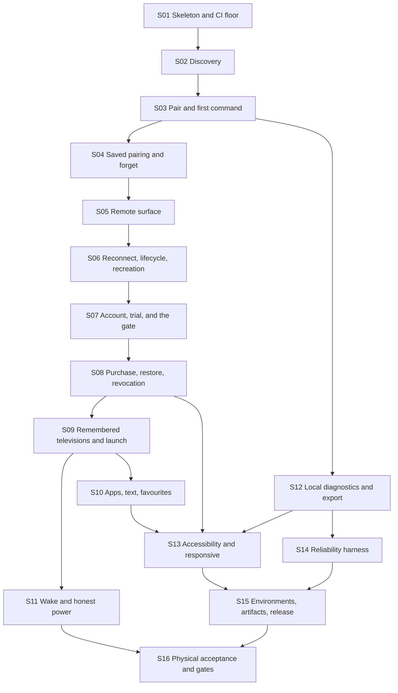

# Implementation slice map

Architecture output only. **Do not open implementation Issues from this file in this task.** After the human explicitly exits the architecture phase, ChatGPT compiles one slice at a time into an Arena Issue; each dispatch names this file, the slice, and that slice's architecture sources.

Every slice is vertical: a user or tester can observe the outcome, and CI proves it, without waiting for a later slice to make the earlier one real. Security, privacy, accessibility, and reliability constraints appear in the slice where they first become real, not in a final cleanup slice.

Not in this route: iOS, a second television ecosystem, IR, casting, mirroring, voice, advertising, a subscription, a diagnostic upload service, cloud crash reporting, a paid-device roster, a public compatibility page, or TV-personalization cloud sync of any kind.

External gates, not slices: the source-license decision and the Samsung vendor-terms review. Both gate public production promotion only; internal testing does not wait on them.

## Definition of V1-ready

V1-ready for public production means S01 through S16 are accepted, the two external gates are passed, at least one physical matrix row passes the TLS token path with a recorded wake attempt, and the recorded paid-path drill in S08 has run on production.

## Ordering rule

The licensing gate is part of the spine, not an appendix. Any slice that can route a post-first-session entry to Account or Entitlement comes **after** the slice that provides the gate and those surfaces, so no slice is ever accepted in a state where the product rule cannot be honored. That is why account and trial (S07) precede remembered televisions and remote-first launch routing (S09).

## Route

S11 may run in parallel with S10 and S12. S12 may start as soon as S03 lands. S16 is the last gate and may overlap S13–S15 once S11 exists. Public production promotion waits for S15, S16, the recorded paid-path drill from S08, and the two external gates.

## S01 — Walking skeleton and CI floor

Observable outcome: a debug build installs and shows Welcome. Pull-request CI is green with the repository, dependency, manifest, environment, and telemetry guards in place. The design-token module exists with the categories from the presentation architecture, and the test-only benchmark module compiles.

Architecture sources: [presentation.md](presentation.md), [release.md](release.md), [modules.md](modules.md), [diagnostics.md](diagnostics.md).

Depends on: none.

Acceptance: Welcome route renders on a device; the navigation graph contains only `WelcomeRoute`; three Gradle modules exist (`app`, `samsung`, and test-only `:macrobenchmark`) and neither production module depends on the benchmark module (`noProductionModuleDependsOnBenchmark`); version catalog pins versions with no `+` ranges and no snapshot; repository mode fails on project repositories; lockfiles and verification metadata committed; manifest allowlist matches [release.md](release.md) exactly; actions pinned to commit SHAs; token module exposes color, type, space, size, and motion categories with the 48dp floor; `noTelemetryDependency` and `adIdAbsentFromManifest` pass; `:app` dependency insight shows no Firestore artifact; `backend/` exists with its lockfile, typecheck, lint, and test jobs wired into CI.

Verification: `./gradlew assembleDebug lintDebug testDebugUnitTest dependencyLockCheck`, `./gradlew :app:dependencyInsight --configuration debugRuntimeClasspath --dependency firestore` (no match), `./gradlew :app:dependencyInsight --configuration debugRuntimeClasspath --dependency crashlytics` (no match), `npm ci --prefix backend && npm test --prefix backend`, install the debug build, CI log shows pinned actions.

Not in this slice: Room, discovery, Firebase configuration, any backend endpoint.

## S02 — Local-network explanation and bounded discovery

Observable outcome: after an ordinary-language explanation, the user sees friendly television cards and the scan ends. An unsupported Samsung fixture appears as not controllable. No address, port, or UUID is ever shown. No command is sent.

Architecture sources: [discovery.md](discovery.md), [samsung-interface.md](samsung-interface.md), [protocol.md](protocol.md), [presentation.md](presentation.md#discovery), [reliability.md](reliability.md).

Depends on: S01.

Acceptance: explanation precedes any system prompt and precedes the first scan; the first scan starts as soon as the gate is granted with no separate setup step; a rescan starts a new `discover()`; target 36 probes request neither `NEARBY_WIFI_DEVICES` nor location and do not declare `ACCESS_LOCAL_NETWORK`; a system prompt appears only when a chosen API requires one; the scan finishes at 10 seconds; the soundbar fixture emits no card; the unsupported fixture emits `Unsupported` and writes no key frame; cards contain no IP text; the multicast lock is released on cancel; a card is rendered from live evidence with no parallel model table; every control this slice adds has a content description and at least 48dp touch bounds; the Discovery ViewModel depends on `SamsungTvs`, never on `samsung.internal`.

Verification: `./gradlew :samsung:test` for fixture contracts; `./gradlew :app:testDebugUnitTest` for ViewModel state; Compose test for the card and empty state; `./gradlew :app:lintDebug` for the manifest; one device walkthrough of the explanation.

Not in this slice: pairing, Room, Request Support export.

## S03 — Pair on the television and the first command

Observable outcome: the user selects a controllable card, allows AppT on the television, presses volume or a direction key, and the command is written on the already open session. The first `Accepted` records the first-control milestone that later decides the account exemption.

Architecture sources: [connection.md](connection.md), [protocol.md](protocol.md), [samsung-interface.md](samsung-interface.md), [sync.md](sync.md#remote-entry-gate), [presentation.md](presentation.md#pairing).

Depends on: S02.

Acceptance: fixture `tls-approval-then-volume` reaches `Ready` and records a volume write; `command` does not open a second socket; `:samsung` has no Firebase or Play dependency; `cloudAbsenceDoesNotBlockCommand` and `noBackendCallOnCommandPath` pass; a malformed fixture does not crash the caller; the Pairing surface shows the approval meaning and no port, certificate, or generation; `firstControlAchieved` is written on the first `Accepted`; no account prompt appears during this session.

Verification: `./gradlew :samsung:test`, `./gradlew :app:testDebugUnitTest`, Gradle dependency check, Compose test from card to `Accepted` using the fake `SamsungTvs`.

Not in this slice: saved pairing, full remote layout, account, remembered television list.

## S04 — Saved pairing, fail-closed identity, and forget

Observable outcome: after approval, force-stopping and reopening the same television does not prompt again. A television presenting a different security identity never receives the token and asks for explicit re-pair. Forget removes the television from this phone immediately, including its favourites, and finishes the local unpair even if `samsung` is temporarily unavailable.

Architecture sources: [data.md](data.md), [connection.md](connection.md), [samsung-interface.md](samsung-interface.md), [presentation.md](presentation.md#tvlist-manage-televisions).

Depends on: S03.

Acceptance: `token-resume` fixture passes; `identityMismatchDoesNotSendToken` passes and the recorded socket URL carries no token; `unauthorized-with-token` produces `TokenRejected` with no reconnect loop; instrumented Keystore round trip succeeds; the secret file exists only under `noBackupFilesDir/samsung-secrets/`; `forgetRemovesRowAndFavouritesInOneTransaction` passes (profile and favourites gone, one `PendingForget` row, television absent from every list); `forgetIsRetryable` and `forgetRemovesSecret` pass; `newPairingSupersedesPendingForget` passes; backup and device-transfer configuration cannot carry the secret, device, or diagnostics directory; no plaintext token appears in Room, DataStore, or any log the test captures; `samsung` still has no Firebase dependency.

Verification: `./gradlew :samsung:test`, `./gradlew :app:testDebugUnitTest`, one instrumented test on a device or emulator, a grep over captured logs for a planted token.

Not in this slice: the television list surface, favourites UI, account.

## S05 — Capability-driven Remote surface

Observable outcome: the Remote is recognizable and phone-native. Standard controls work, a rejected key disappears, haptics and phone volume buttons follow settings, and the D-pad/touchpad toggle appears only when the television demonstrates pointer support.

Architecture sources: [commands.md](commands.md), [presentation.md](presentation.md) (Remote contract, thumb-first zones, tokens, accessibility), [lifecycle.md](lifecycle.md), [reliability.md](reliability.md).

Depends on: S04.

Acceptance: the UI binds only to `capabilities.keys`; the four thumb-first zones are implemented as specified and power is spatially isolated; pointer toggle is absent until the fixture probe accepts; haptics default on and can be disabled; volume buttons send volume taps only while the remote is started and the setting is on; every control has a content description, a role, and at least 48dp touch bounds with primary controls at 56dp or more; no `KEY_*` string appears in the Compose tree; `commandLatencyBudget` p50 is inside the control-path target on the reference device; a baseline profile for Remote is committed.

Verification: Compose tests with the fake adapter; `./gradlew :app:testDebugUnitTest`; `./gradlew :macrobenchmark:connectedCheck` for the control-latency target; a unit test that a rejected key leaves the capability set.

Not in this slice: reconnect behavior, the television list, favourites shelf, account.

## S06 — Reconnect, lifecycle, and Activity recreation

Observable outcome: a dropped socket shows a quiet inline status and recovers on its own; an address change recovers without the user doing anything; leaving the app and returning inside the grace window reuses the same session; rotating the phone keeps the session and the route.

Architecture sources: [connection.md](connection.md), [lifecycle.md](lifecycle.md), [presentation.md](presentation.md#rotation-window-size-foldables-and-tablets), [reliability.md](reliability.md).

Depends on: S05.

Acceptance: the backoff fixture ends in `Unreachable` and stops; `reconnectBackoff` and `rediscoverSameUuid` pass; `graceClosesAfterFifteenSeconds` and `backgroundReleasesRemote` pass; `networkLossShowsReconnectingNotDialog` and `vpnDoesNotBypass` pass; `rotationKeepsSession` passes with the Activity genuinely recreated (no `android:configChanges`, one session, no second `open`, no gate evaluation); `recreationRestoresRouteAndDrafts` and `recreationDropsTransientUiOnly` pass; commands issued while not `Ready` return `Rejected(Unavailable)` and nothing is replayed; reconnect status is never a dialog loop.

Verification: `./gradlew :samsung:test` with the fake transport, `./gradlew :app:testDebugUnitTest`, an instrumented rotation test that asserts Activity recreation, a scripted LAN-flap run, and one device check of the grace path.

Not in this slice: account, television list, TV switching.

## S07 — Account, server-authoritative trial, and the licensing gate

Observable outcome: the first successful local-control session is never blocked on sign-in. When that session ends, the next remote entry asks the user to continue, and the television is never opened while the gate denies. Google sign-in and email/password both work, an unverified email cannot start a trial, and an eligible account receives a seven-day trial with an exact remaining time in Account and Settings. Signing in on a second phone returns the same expiry and marks that phone as trial-consumed. Signing out keeps every television and the cached proof, blocks a new entry, and never interrupts an active session. With the backend unreachable, a valid trial still permits control.

Architecture sources: [sync.md](sync.md) (authentication, topology, backend source architecture, API surface, record shapes, trial and attach, gate, local cache), [presentation.md](presentation.md#account), [lifecycle.md](lifecycle.md#workmanager), [release.md](release.md#environments).

Depends on: S06.

Acceptance: `accountlessFirstSessionIsExemptOnce` and `firstSessionGateEndsWithActiveRemote` pass; `gatedLaunchNeverOpensSession` passes (`SamsungTvs.open` is not called while the gate denies); a blocked entry returns to its origin and is never resumed automatically; process death after the first success also requires sign-in; Google and email/password paths reach a signed-in state; `entitlementRequiresVerifiedEmail` passes; `trialStartsServerSideAndSevenDays` passes against the emulator suite; `trialAttachIsIdempotent` passes with the original expiry returned and exactly one device marker written; `deviceMarkerDeniesSecondTrial`, `trialMarkerKeyRotationResolvesOldMarkers`, and `trialFollowsAccountAcrossPhones` pass; `proofSignatureTamperDenied`, `proofForAnotherUidIgnored`, and `clockRollbackDoesNotExtendEntitlement` pass; `signOutKeepsLocalStateAndCachedProof` passes; `backendRejectsClientSuppliedUid`, `clientFirestoreAccessDenied`, and `backendStoresNoTelevisionField` pass; account deletion runs its phases in order, freezing writes one deletion-scoped id across the binding and the account so the deletion stays correlatable, and no `accountDeleted` release happens without the Auth-removal proof (`deletionFreezesBeforeAuthDelete`, `frozenBindingRetainsOwnerCorrelation`, `releaseRequiresAuthRemovalProof`, `deletionRetryConverges`, `reconciliationRequiresAuthRemoval`, `reconciliationReleasesOrphanedBindings`); Account surfaces never show a television error and Remote never shows a licensing prompt; `workManagerNeverTouchesSamsung` passes; the trial's remaining time is exposed to accessibility services as text, not color.

Verification: `./gradlew :app:testDebugUnitTest`; `npm ci --prefix backend && npm test --prefix backend` plus `npm run test:emulator --prefix backend` with the fake Play verifier and fake integrity decoder; one instrumented test for Credential Manager through the fake seam; Compose tests for the gated entry, the blocked-entry back path, and the backend-outage copy.

Not in this slice: purchase, restore, revocation, remembered-television routing.

## S08 — Lifetime purchase, restore, revocation, and paid offline

Observable outcome: Buy once completes a Play purchase and unlocks a lifetime entitlement; a reinstall plus sign-in restores it; a refund or chargeback blocks the next remote entry without interrupting an active one; a paid customer keeps local control while the backend is unreachable; if the validator is unavailable while Play reports a purchase, the user gets an honest temporary unlock that expires within 24 hours and cannot be renewed for that purchase.

Architecture sources: [sync.md](sync.md) (purchase, binding, deletion durability, revocation, provisional, local cache, gate), [presentation.md](presentation.md#entitlement-and-purchase), [release.md](release.md#play-and-rtdn-are-shared-by-design), [security.md](security.md).

Depends on: S07.

Acceptance: `testPurchaseDoesNotGrantLifetime` passes for a `purchaseType` test purchase in every environment; `onePurchaseBindsToOneLiveAccount` passes; a replay of the same token resolves to the existing binding with no duplicate grant; `restoreAfterAccountDeletionSucceeds` passes, and the purchase is re-bindable only after the Auth user is deleted; acknowledgement happens from the backend inside the three-day window; `revocationAppliesOnNextEntry` passes; duplicate and out-of-order RTDN delivery converge; raw purchase tokens never appear in stored documents, logs, or the provisional record, and the provisional record uses the device-computed key (`provisionalUsesLocalKey`); `provisionalIsNonRenewable` and `provisionalExpiresWithin24Hours` pass and the Account surface labels it as temporary; `paidOfflineControlSurvivesOutage` passes; `PENDING` grants nothing and says so; no device roster or device cap exists anywhere in the code or schema.

Verification: `./gradlew :app:testDebugUnitTest`; backend tests including the RTDN handlers, binding-freeze, and release paths; the internal testing track run with a licence tester that asserts withholding; a Compose test for pending, revoked, and provisional surfaces; **a recorded paid-path drill before public promotion** — one real purchase on the production environment, verifying grant and acknowledgement, then refunded, exercising RTDN void and revocation; the drill record states the outcome and leaves no entitlement behind.

Not in this slice: any television-related cloud data, any entitlement-based device registry.

## S09 — Remembered televisions, remote-first launch, and TV switching

Observable outcome: reopening AppT lands on the last-used television and starts connecting; the remembered list shows friendly names and ordinary-language state; Add TV returns to discovery; Forget from the list removes the television from this phone; the switch sheet moves between remembered televisions without a swipe gesture; every one of those entries passes through the licensing gate first.

Architecture sources: [data.md](data.md), [presentation.md](presentation.md) (launch routing, Remote, switch sheet, TvList), [lifecycle.md](lifecycle.md), [sync.md](sync.md#remote-entry-gate).

Depends on: S07.

Acceptance: `launchRoutingResolvesRemoteFirst` and `gatedLaunchNeverOpensSession` pass with a remembered television; `rememberedIds` and `forgetRemovesRowAndFavouritesInOneTransaction` behave as specified from the list; renaming writes one transaction with `nameSource = USER`, and `nameSourceUserIsNotOverwritten` passes; the switch sheet lists remembered televisions plus Add TV and contains no swipe gesture; `lastOpenedIsDeviceLocal` passes; a row whose television is offline shows an ordinary-language state and no address; backing out of a blocked entry returns to its origin (`EntryOrigin.TvList` or `Remote`); the Active Remote is released through the normal path when switching, never in parallel.

Verification: `./gradlew :app:testDebugUnitTest`, Room transaction tests, Compose tests for the list, the empty state, rename, forget confirmation, and the sheet, and one device walkthrough of reopen-to-Remote.

Not in this slice: favourites UI, apps surface, wake.

## S10 — Apps, text, and favourites

Observable outcome: a supported television lists its launchable apps, text entry uses the phone keyboard when the television accepts it, and favourite apps or controls can be added, reordered, and removed.

Architecture sources: [commands.md](commands.md), [presentation.md](presentation.md#favourites-apps-and-edit-mode), [data.md](data.md).

Depends on: S09.

Acceptance: `app-list` and `text-rejected` fixtures behave as specified; `LaunchApp` with an unknown id returns `Rejected(Unavailable)` and sends nothing; `textInput` false hides the keyboard affordance; `favouriteReorderIsAtomic` passes; the shelf and the More sheet read one `FavouriteDao` source; edit mode is opt-in, cancellable, and never reorders core controls; a missing app degrades to a clear state rather than a dead control; nothing about a favourite leaves the phone.

Verification: fixtures `text-rejected` and `app-list`, Room tests, `./gradlew :app:testDebugUnitTest`, Compose tests for a missing app and for reordering.

Not in this slice: DIAL launch, a full layout designer.

## S11 — Wake and honest power

Observable outcome: with the television off and a stored MAC, the power control attempts a wake and then opens the session; when wake is unavailable or has failed repeatedly, the screen says so honestly instead of offering a button that cannot work.

Architecture sources: [commands.md](commands.md), [connection.md](connection.md), [discovery.md](discovery.md), [presentation.md](presentation.md#remote), [reliability.md](reliability.md).

Depends on: S09.

Acceptance: `powerOn` is `Attemptable` only with a stored MAC for the interface actually reached; wake sends a bounded burst and then opens; repeated failure moves to `Unavailable` with the explanatory copy; no SmartThings or consumer-IP-control fallback exists; a Mac that was never observed for this television never produces a wake attempt; the wake path never blocks the first frame or a command.

Verification: `./gradlew :samsung:test` with the recording wake sender, `./gradlew :app:testDebugUnitTest`, and one physical attempt recorded in the acceptance matrix (a recorded failure is a valid outcome).

Not in this slice: IR, HDMI discrete selection, a compatibility claim.

## S12 — Local diagnostics, redacted export, and Request Support

Observable outcome: the Diagnostics surface shows what the local record holds and how old it is; building a report shows a preview of every field before anything leaves the phone; sharing happens only after explicit confirmation; Request Support on an unsupported card uses the same path; Clear local history empties the record. Nothing is uploaded anywhere, because V1 has no cloud crash reporting and no analytics.

Architecture sources: [diagnostics.md](diagnostics.md), [presentation.md](presentation.md#diagnostics), [security.md](security.md#b6-diagnostics), [release.md](release.md).

Depends on: S03.

Acceptance: `noTelemetryDependency` and `adIdAbsentFromManifest` pass; `localRecordIsBoundedAndRedacted` passes for both sources and the rolling file; `diagnosticFileIsExcludedFromBackup` passes; `exportRequiresUserConfirmation` passes and the preview lists every field; `clearLocalHistoryDeletesRecordAndFile` passes with a confirmation step; `noDiagnosticsUploadPath` passes (no HTTP client in the package, no endpoint in the backend inventory); `redactedReportContainsNoFixtureSecret` passes with a planted token, pin, IP, MAC, email, Username, and text; `samsungHasNoLogCalls` passes; a full record never delays a command (`commandDoesNotAwaitDiagnostics`); the unsupported card offers Request Support through the same preview.

Verification: unit redaction tests, `./gradlew :app:testDebugUnitTest`, manifest merge check, dependency check, `npm test --prefix backend` endpoint inventory test, and a Compose test for the preview, confirmation, and clear-history states.

Not in this slice: a diagnostic backend, crash reporting, analytics, an upload endpoint.

## S13 — Accessibility and responsive closure

Observable outcome: a screen-reader user completes Welcome, explanation, discovery, approval, one command, the account gate, trial and purchase surfaces, settings, and diagnostics. Text scales to 200% without clipping. Contrast and target sizes hold. Landscape, foldable, and tablet windows behave per the responsive rules.

Architecture sources: [presentation.md](presentation.md) (accessibility contracts, responsive rules, tokens), [ui-ux.md](ui-ux.md), [reliability.md](reliability.md).

Depends on: S10, S08, S12.

Acceptance: every interactive control across the routes has a name, role, and state; `everyControlMeetsTouchTarget` passes for every route; `fontScale200DoesNotClip` passes for every route; `statusIsNotColorOnly` passes; `reducedMotionSkipsTravel` passes; `gestureAlternativesExist` passes; `destructiveActionsConfirm` passes for forget, sign-out, account deletion, and clear-local-history; `statusAnnouncedOnce` passes; traversal order matches the visual task order in the Remote zones; a TalkBack walkthrough record is attached to the slice; each window size class renders per the responsive table with control ordering preserved.

Verification: Compose accessibility assertions, `./gradlew :app:connectedDebugAndroidTest` on a phone and a tablet-sized emulator, a manual TalkBack script, and a screenshot set at 100% and 200% font scale.

Not in this slice: a new visual brand, a separate tablet product.

## S14 — Reliability and performance verification harness

Observable outcome: launch, control latency, frame timing, memory, and battery results are recorded per release from the benchmark module, and a regression beyond the thresholds fails the pipeline.

Architecture sources: [reliability.md](reliability.md), [testing.md](testing.md#performance-and-reliability), [modules.md](modules.md#shape), [lifecycle.md](lifecycle.md).

Depends on: S12.

Acceptance: the `:macrobenchmark` module measures cold and warm start, Remote frame timing, control latency, discovery, reopen after process death, and recreation; `launchBudget`, `commandLatencyBudget`, `frameTimingBudget`, and `reconnectRecoveryRate` are enforced; baseline profiles for Remote, Discovery, and TvList are generated by the module and committed; `commandDoesNotAwaitDiagnostics` passes; memory and battery budgets are recorded with a battery-historian run on the reference device; a >20% regression blocks promotion until explained; results are stored as release artifacts, never as analytics; `noProductionModuleDependsOnBenchmark` passes.

Verification: `./gradlew :macrobenchmark:connectedCheck`, recorded benchmark JSON per release, the release checklist entry, and a CI job that fails on a threshold breach.

Not in this slice: public performance claims or SLAs.

## S15 — Environment separation, artifact identity, and internal release

Observable outcome: the production-flavoured release candidate installs from the Play internal testing track against the production environment, the internal tester build installs against the internal environment outside Play, and a backend rollback drill is recorded. The artifact that will be promoted is the artifact that was tested.

Architecture sources: [release.md](release.md) (environments, release path and artifact identity, signing identity and distribution channel, backend deployment and rollback, checks), [sync.md](sync.md), [security.md](security.md#b7-ci-supply-chain-and-release).

Depends on: S13, S14.

Acceptance: `dev`, `internal`, and `production` projects exist with separate Firebase, Firestore, functions, Secret Manager keys, and Cloud KMS keys; `debugVariantCannotReachProduction` and `releaseVariantCannotReachDevelopment` pass; `releaseArtifactsDifferOnlyByConfig` passes on the signature-stripped comparison — the internal and production release artifacts from one commit differ only in environment configuration, the production artifact carries none of the development or internal configuration, and no version-code exception exists in the check; `releaseVariantsShareVersionCode` passes — both variants from the same commit carry the same version code and name; `signingIdentityMatchesChannel` passes — the tester build carries the internal signing certificate, the bundle uploaded to Play carries the upload certificate, and neither is a debug certificate; `appCheckRegistrationMatchesChannel` passes — the Play app-signing certificate fingerprint is registered in `appt-prod`, the internal certificate fingerprint in `appt-internal`, and no fingerprint appears in both; the candidate AAB installs from the Play internal testing track against production; the tester build installs against internal outside Play, is never uploaded to Play, needs an uninstall to coexist with a Play-signed build on the same device, and completes no real purchase because Play Billing serves only Play-installed apps; lockfiles and verification metadata are committed; the permission allowlist matches this map; actions are pinned by SHA; `main` is green; every pull-request check in [release.md](release.md#pull-request-checks) runs, including the backend typecheck, lint, and emulator jobs; production functions deploy with a traffic split from 0% and the rollback step is exercised once and recorded; secret scanning finds no credential; the production promotion workflow exists, is manual, and is not run by this slice.

Verification: CI logs, a Play internal testing install of the production candidate, an internal-environment install of the tester build, `apksigner verify --print-certs` on the tester artifact and certificate inspection of the uploaded bundle, the recorded App Check fingerprints per project, the recorded rollback drill note, and the environment and artifact guard checks.

Not in this slice: public rollout, the license decision, the vendor-terms decision.

## S16 — Physical acceptance and external gates

Observable outcome: one real Samsung television completes pair, command, reconnect, and process-death resume on the TLS token path. Wake is attempted and recorded, including an honest failure. The matrix row contains no address, MAC, token, or account email. Both external gates are recorded as passed before public promotion.

Architecture sources: [testing.md](testing.md#physical-acceptance-matrix), [release.md](release.md#two-external-gates).

Depends on: S11. May run in parallel with S13–S15. A debug or internal build is enough.

Acceptance: one matrix row with the required columns filled; pin-survived-reboot recorded as yes, no, or not tried; no year range added to the app as a support gate; honest wake failure recorded if wake does not work; the source-license decision and the Samsung vendor-terms review are recorded as human decisions before public promotion; the S08 paid-path drill is recorded as complete; production promotion is not started by this slice.

Verification: the matrix note in the slice record plus a rerun of the contract tests against the same build.

Not in this slice: a public compatibility page, a second ecosystem, a commitment that untested generations work.

## Slice count and dependency outline

Sixteen slices. Control spine: S01 → S02 → S03 → S04 → S05 → S06. The licensing spine follows immediately: S07 (account, trial, and the gate) → S08 (purchase and entitlement) → S09 (remembered televisions, remote-first launch, switching). Branches: S10 (apps, text, favourites) and S11 (wake and honest power) from S09; S12 (local diagnostics) from S03. Closure: S13 (accessibility and responsive) after S10, S08, and S12; S14 (reliability harness) after S12; S15 (environments, artifact identity, release) after S13 and S14; S16 (physical acceptance and external gates) after S11 and gating public promotion with S15 and the two external decisions.

This count replaces the previous S01–S15 route. The old S10/S11 pair (account plus non-secret TV-sync) no longer exists, because there is no TV-sync architecture to implement, and the account/trial slice now sits before remembered-television routing so that every slice which can open a gated entry ships the gate and its surfaces together.
