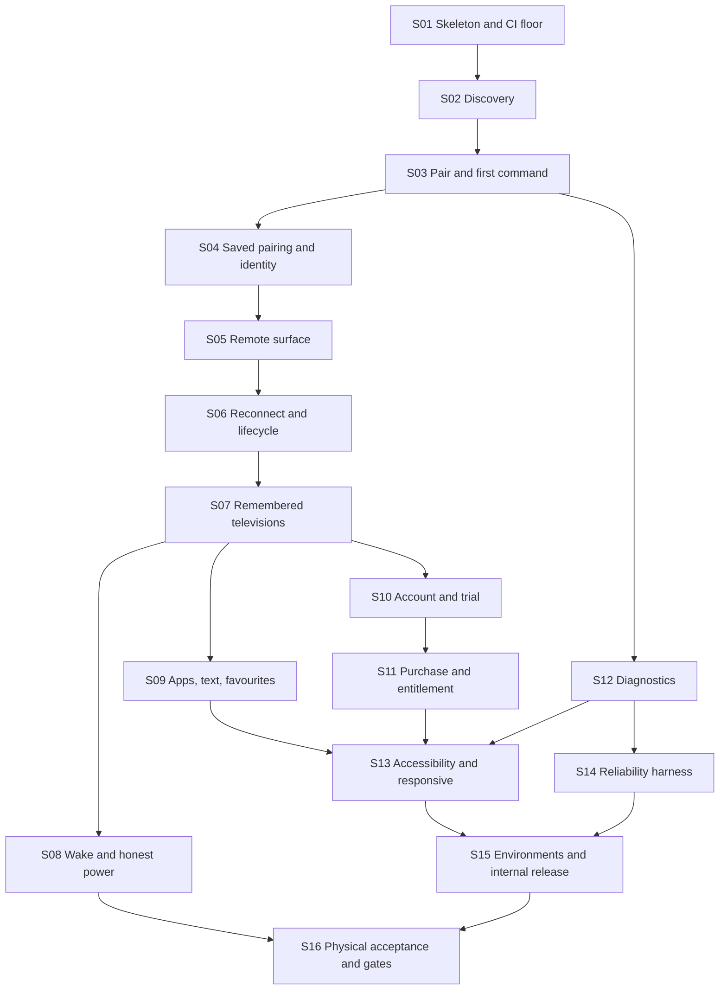

# Implementation slice map

Architecture output only. **Do not open implementation Issues from this file in this task.** After the human explicitly exits the architecture phase, ChatGPT compiles one slice at a time into an Arena Issue; each dispatch names this file, the slice, and that slice's architecture sources.

Every slice is vertical: a user or tester can observe the outcome, and CI proves it, without waiting for a later slice to make the earlier one real. Security, privacy, accessibility, and reliability constraints appear in the slice where they first become real, not in a final cleanup slice.

Not in this route: iOS, a second television ecosystem, IR, casting, mirroring, voice, advertising, a subscription, a diagnostic upload service, a paid-device roster, a public compatibility page, or TV-personalization cloud sync of any kind.

External gates, not slices: the source-license decision and the Samsung vendor-terms review. Both gate public production promotion only; internal testing does not wait on them.

## Definition of V1-ready

V1-ready for public production means S01 through S16 are accepted, the two external gates are passed, and at least one physical matrix row passes the TLS token path with a recorded wake attempt.

## Route

S08 may run in parallel with S09 and S10. S12 may start after S03. S16 may run in parallel with S13–S15 once S08 exists. Public production promotion waits for S15, S16, and the external gates.

## S01 — Walking skeleton and CI floor

Observable outcome: a debug build installs and shows Welcome. Pull-request CI is green with the repository, dependency, manifest, and environment guards in place. The design-token module exists with the categories from the presentation architecture.

Architecture sources: [presentation.md](presentation.md), [release.md](release.md), [modules.md](modules.md).

Depends on: none.

Acceptance: Welcome route renders on a device; navigation graph contains only `WelcomeRoute`; version catalog pins versions with no `+` ranges and no snapshot; repository mode fails on project repositories; lockfiles and verification metadata committed; manifest allowlist matches [release.md](release.md) exactly; actions pinned to commit SHAs; token module exposes color, type, space, size, and motion categories with the 48dp floor; no analytics dependency; `:app` dependency insight shows no Firestore artifact.

Verification: `./gradlew assembleDebug lintDebug testDebugUnitTest dependencyLockCheck`, `./gradlew :app:dependencyInsight --configuration debugRuntimeClasspath --dependency firestore` (no match), install the debug build, CI log shows pinned actions.

Not in this slice: `:samsung`, Room, discovery, Firebase.

## S02 — Local-network explanation and bounded discovery

Observable outcome: after an ordinary-language explanation, the user sees friendly television cards and the scan ends. An unsupported Samsung fixture appears as not controllable. No address, port, or UUID is ever shown. No command is sent.

Architecture sources: [discovery.md](discovery.md), [samsung-interface.md](samsung-interface.md), [protocol.md](protocol.md), [presentation.md](presentation.md#discovery), [reliability.md](reliability.md).

Depends on: S01.

Acceptance: explanation precedes any system prompt and precedes the first scan; the first scan starts as soon as the gate is granted with no separate setup step; a rescan starts a new `discover()`; target 36 probes request neither `NEARBY_WIFI_DEVICES` nor location and do not declare `ACCESS_LOCAL_NETWORK`; a system prompt appears only when a chosen API requires one; the scan finishes at 10 seconds; the soundbar fixture emits no card; the unsupported fixture emits `Unsupported` and writes no key frame; cards contain no IP text; the multicast lock is released on cancel; a card is rendered from live evidence with no parallel model table; every control this slice adds has a content description and at least 48dp touch bounds; the Discovery ViewModel depends on `SamsungTvs`, never on `samsung.internal`.

Verification: `./gradlew :samsung:test` for fixture contracts; `./gradlew :app:testDebugUnitTest` for ViewModel state; Compose test for the card and empty state; `./gradlew :app:lintDebug` for the manifest; one device walkthrough of the explanation.

Not in this slice: pairing, Room, Request Support export.

## S03 — Pair on the television and the first command

Observable outcome: the user selects a controllable card, allows AppT on the television, presses volume or a direction key, and the command is written on the already open session. The first `Accepted` records the first-control milestone that later decides the account exemption.

Architecture sources: [connection.md](connection.md), [protocol.md](protocol.md), [samsung-interface.md](samsung-interface.md), [sync.md](sync.md#remote-entry-gate), [presentation.md](presentation.md#pairing).

Depends on: S02.

Acceptance: fixture `tls-approval-then-volume` reaches `Ready` and records a volume write; `command` does not open a second socket; `:samsung` has no Firebase or Play dependency; `cloudAbsenceDoesNotBlockCommand` and `noBackendCallOnCommandPath` pass; a malformed fixture does not crash the caller; the Pairing surface shows the approval meaning and no port, certificate, or generation; `firstControlAchieved` is written on the first `Accepted`; no account prompt appears during this session.

Verification: `./gradlew :samsung:test`, `./gradlew :app:testDebugUnitTest`, Gradle dependency check, Compose test from card to `Accepted` using the fake `SamsungTvs`.

Not in this slice: saved pairing, full remote layout, account.

## S04 — Saved pairing, fail-closed identity, and forget

Observable outcome: after approval, force-stopping and reopening the same television does not prompt again. A television presenting a different security identity never receives the token and asks for explicit re-pair. Forget removes the secret and the local record.

Architecture sources: [data.md](data.md), [connection.md](connection.md), [samsung-interface.md](samsung-interface.md).

Depends on: S03.

Acceptance: `token-resume` fixture passes; `identityMismatchDoesNotSendToken` passes and the recorded socket URL carries no token; `unauthorized-with-token` produces `TokenRejected` with no reconnect loop; instrumented Keystore round trip succeeds; the secret file exists only under `noBackupFilesDir/samsung-secrets/`; `forgetRemovesSecret` and `forgetIsRetryable` pass; backup and device-transfer configuration cannot carry the secret directory; no plaintext token appears in Room, DataStore, or any log the test captures; `samsung` still has no Firebase dependency.

Verification: `./gradlew :samsung:test`, `./gradlew :app:testDebugUnitTest`, one instrumented test on a device or emulator, a grep over captured logs for a planted token.

Not in this slice: the television list, favourites, account.

## S05 — Capability-driven Remote surface

Observable outcome: the Remote is recognizable and phone-native. Standard controls work, a rejected key disappears, haptics and phone volume buttons follow settings, and the D-pad/touchpad toggle appears only when the television demonstrates pointer support. Rotation keeps the session.

Architecture sources: [commands.md](commands.md), [presentation.md](presentation.md) (Remote contract, thumb-first zones, tokens, accessibility), [lifecycle.md](lifecycle.md), [reliability.md](reliability.md).

Depends on: S04.

Acceptance: the UI binds only to `capabilities.keys`; the four thumb-first zones are implemented as specified and power is spatially isolated; pointer toggle is absent until the fixture probe accepts; haptics default on and can be disabled; volume buttons send volume taps only while the remote is started and the setting is on; every control has a content description, a role, and at least 48dp touch bounds with primary controls at 56dp or more; no `KEY_*` string appears in the Compose tree; `rotationKeepsSession` passes; a baseline profile for Remote is committed; `commandLatencyBudget` p50 is inside the control-path target on the reference device.

Verification: Compose tests with the fake adapter; `./gradlew :app:testDebugUnitTest`; `./gradlew :macrobenchmark:connectedCheck` for the launch and frame budgets; a unit test that a rejected key leaves the capability set.

Not in this slice: app shortcuts, text entry, favourites, account.

## S06 — Quiet reconnect, address change, and lifecycle transitions

Observable outcome: when the socket drops, the Remote shows a lightweight Reconnecting status and control returns without a dialog loop. A changed address for the same identity is recovered without the user typing anything. Leaving the remote closes the socket after the grace period and keeps the secret. Backgrounding, screen lock, and network loss behave per the lifecycle map.

Architecture sources: [connection.md](connection.md), [lifecycle.md](lifecycle.md), [presentation.md](presentation.md#navigation-and-back-behavior), [reliability.md](reliability.md).

Depends on: S05.

Acceptance: the backoff fixture ends in `Unreachable` and stops; the rediscovery fixture connects to the new address only when identity matches; the UI test shows a non-modal Reconnecting status; a grace test calls `close` at 15 seconds and not on rotation; `backgroundReleasesRemote` and `networkLossShowsReconnectingNotDialog` pass; `vpnDoesNotBypass` passes with honest copy; commands during reconnect return `Unavailable` and are not replayed as a burst; `gateRunsOnlyOnEntry` passes; reconnect status is announced once to accessibility services.

Verification: fake-clock contract tests, `./gradlew :app:testDebugUnitTest`, a Compose test for the status, a unit test of the grace holder.

Not in this slice: wake, account.

## S07 — Remembered televisions, last-used reopen, and process-death restore

Observable outcome: the user can name more than one television, open the TV switch sheet, reopen the last-used one quietly on launch, rename and forget from the list, and return to a usable Remote after the process is killed.

Architecture sources: [data.md](data.md), [presentation.md](presentation.md) (TvList, switch sheet, restoration, launch routing), [lifecycle.md](lifecycle.md), [discovery.md](discovery.md).

Depends on: S06.

Acceptance: two fixture televisions keep distinct ids; `stableIdentitySurvivesRediscovery` and `mintedIdentityIsLocal` pass; a user edit sets `nameSource` USER and a later television name does not overwrite it; last-used reopen happens with no scan UI; the switch sheet lists remembered televisions with ordinary-language states and has no swipe gesture; switch is explicit and gate-checked; launch routing resolves to Remote first and to Account/Entitlement when the gate denies; a blocked launch never calls `SamsungTvs.open`; `roomMigrationEveryVersion`, `schemaContainsNoForbiddenColumn`, and `backupExcludesAllTvState` pass; `fallbackToDestructiveMigration` is absent; process-death restore renders Remote within the reopen budget.

Verification: Room tests, `./gradlew :app:testDebugUnitTest`, `./gradlew :app:connectedDebugAndroidTest` for the migration and process-death cases, Macrobenchmark `processDeathReopen`.

Not in this slice: wake, favourites, account.

## S08 — Wake and honest power

Observable outcome: power-on sends a wake burst when a MAC is known, then waits the wake window. After repeated failure the power-on control is gone and the screen explains that the television cannot be turned on from the phone.

Architecture sources: [commands.md](commands.md), [connection.md](connection.md), [protocol.md](protocol.md).

Depends on: S07.

Acceptance: the fake wake sender records three bursts and no burst when the MAC is absent; `open` during the wake window does not give up at 5 seconds; the fourth distinct failure hides power-on; a later success clears the failure count; the UI never shows a permanently dead power button; no cloud or SmartThings path is added for power.

Verification: contract tests with the fake wake sender, `./gradlew :app:testDebugUnitTest`, a Compose test for the explanation state.

Not in this slice: SmartThings, Consumer IP Control, cloud power.

## S09 — Apps, text, favourites, and the More sheet

Observable outcome: the phone keyboard sends text only when text is available and hides after a rejection. App shortcuts appear only for apps the television returned. The user can favourite and reorder both app shortcuts and secondary controls, and the ordering survives restart.

Architecture sources: [commands.md](commands.md), [data.md](data.md), [presentation.md](presentation.md#favourites-apps-and-edit-mode).

Depends on: S07.

Acceptance: over-long text sends nothing; a rejected text clears the affordance and is absent from diagnostics; an app id not in the live list has no button; a curated hint does not invent a missing app; the composite favourite key is idempotent; reordering commits one Room transaction per move and survives process death; edit mode is entered by long-press or by the accessible Edit action; Move earlier / Move later actions exist as the gesture alternative; edit mode is not restored after process death; the shelf stays compact and does not push the navigation zone out of the lower half.

Verification: fixtures `text-rejected` and `app-list`, Room tests, `./gradlew :app:testDebugUnitTest`, Compose tests for a missing app and for reordering.

Not in this slice: DIAL launch, a full layout designer.

## S10 — Account and server-authoritative trial

Observable outcome: the first successful local-control session is never blocked on sign-in. When that session ends, the next remote entry asks the user to continue. Google sign-in and email/password both work, an unverified email cannot start a trial, and an eligible account receives a seven-day trial with an exact remaining time shown in Account and Settings. Signing out keeps every television and the cached proof, blocks a new entry, and never interrupts an active session. With the backend unreachable, a valid trial still permits control.

Architecture sources: [sync.md](sync.md) (authentication, topology, API surface, record shapes, trial, gate, local cache), [presentation.md](presentation.md#account), [lifecycle.md](lifecycle.md#workmanager), [release.md](release.md#environments).

Depends on: S07.

Acceptance: the first session is exempt exactly once (`accountlessFirstSessionIsExemptOnce`): it continues after the first `Accepted`, and the next entry is gated (`firstSessionGateEndsWithActiveRemote`); process death after first success also requires sign-in; Google and email/password paths reach a signed-in state; `entitlementRequiresVerifiedEmail` passes; `trialStartsServerSideAndSevenDays` passes against the emulator suite; `deviceMarkerDeniesSecondTrial` and `trialMarkerKeyRotationResolvesOldMarkers` pass; `trialFollowsAccountAcrossPhones` passes; `proofSignatureTamperDenied`, `proofForAnotherUidIgnored`, and `clockRollbackDoesNotExtendEntitlement` pass; `signOutKeepsLocalStateAndCachedProof` passes; `backendRejectsClientSuppliedUid` and `clientFirestoreAccessDenied` pass; `backendStoresNoTelevisionField` passes; Account surfaces never show a television error and Remote never shows a licensing prompt; `workManagerNeverTouchesSamsung` passes; the trial's remaining time is exposed to accessibility services as text, not color.

Verification: `./gradlew :app:testDebugUnitTest`; backend tests against the Firebase emulator with the fake Play verifier and fake integrity decoder; one instrumented test for Credential Manager through the fake seam; a Compose test for the gated entry and for the backend-outage copy.

Not in this slice: purchase, restore, revocation.

## S11 — Lifetime purchase, restore, revocation, and paid offline

Observable outcome: Buy once completes a real Play purchase and unlocks a lifetime entitlement; a reinstall plus sign-in restores it; a refund or chargeback blocks the next remote entry without interrupting an active one; a paid customer keeps local control while the backend is unreachable; if the validator is unavailable while Play reports a purchase, the user gets an honest temporary unlock that expires within 24 hours.

Architecture sources: [sync.md](sync.md) (purchase, binding, revocation, provisional, local cache, gate), [presentation.md](presentation.md#entitlement-and-purchase), [release.md](release.md#play-and-rtdn-are-shared-by-design), [security.md](security.md).

Depends on: S10.

Acceptance: `testPurchaseDoesNotGrantLifetime` passes for a `purchaseType` test purchase; `onePurchaseBindsToOneLiveAccount` passes; a replay of the same token resolves to the existing binding with no duplicate grant; `restoreAfterAccountDeletionSucceeds` passes; acknowledgement happens from the backend inside the three-day window; `revocationAppliesOnNextEntry` passes; duplicate and out-of-order RTDN delivery converge; raw purchase tokens never appear in stored documents or logs; `provisionalIsNonRenewable` and `provisionalExpiresWithin24Hours` pass and the Account surface labels it as temporary; `paidOfflineControlSurvivesOutage` passes; `PENDING` grants nothing and says so; no device roster or device cap exists anywhere in the code or schema.

Verification: `./gradlew :app:testDebugUnitTest`; backend tests including the RTDN handlers; an end-to-end check on the internal testing track with a licence tester; a Compose test for pending, revoked, and provisional surfaces.

Not in this slice: any TV-related cloud data, any entitlement-based device registry.

## S12 — Diagnostics: opt-in crash reporting and redacted export

Observable outcome: crash reporting is off until the user enables it; the user can preview and share a redacted report; Request Support on an unsupported card uses that same preview; nothing is uploaded to an AppT service.

Architecture sources: [diagnostics.md](diagnostics.md), [presentation.md](presentation.md#diagnostics), [security.md](security.md#b6-diagnostics), [release.md](release.md).

Depends on: S03.

Acceptance: `crashReportingOffByDefault`, `optedOutStoredReportsAreNotSent`, `noAnalyticsDependency`, and `adIdAbsentFromManifest` pass; manifest meta-data disables collection; enabling collection happens only from an explicit user action; send-stored and delete-stored actions exist; `setUserId` is absent from production sources; a planted token, pin, IP, MAC, email, and text are absent from the report; preview precedes share; `redactedReportContainsNoFixtureSecret` passes; a full diagnostic buffer does not delay a command; `samsung` does not depend on Crashlytics.

Verification: unit redaction tests, `./gradlew :app:testDebugUnitTest`, manifest merge check, dependency check, a Compose test for the preview and consent states.

Not in this slice: a diagnostic backend, analytics, an upload endpoint.

## S13 — Accessibility and responsive closure

Observable outcome: a screen-reader user completes Welcome, explanation, discovery, approval, one command, the account gate, trial surfaces, and settings. Text scales to 200% without clipping. Contrast and target sizes hold. Landscape, foldable, and tablet windows behave per the responsive rules.

Architecture sources: [presentation.md](presentation.md) (accessibility contracts, responsive rules, tokens), [ui-ux.md](ui-ux.md), [reliability.md](reliability.md).

Depends on: S09, S11, S12.

Acceptance: every interactive control across the routes has a name, role, and state; `everyControlMeetsTouchTarget` passes for every route; `fontScale200DoesNotClip` passes for every route; status is never color-only; `reducedMotionSkipsTravel` passes; `gestureAlternativesExist` passes; `destructiveActionsConfirm` passes for forget, sign-out, and account deletion; `statusAnnouncedOnce` passes; traversal order matches the visual task order in the Remote zones; a TalkBack walkthrough record is attached to the slice; each window size class renders per the responsive table with control ordering preserved.

Verification: Compose accessibility assertions, `./gradlew :app:connectedDebugAndroidTest` on a phone and a tablet-sized emulator, a manual TalkBack script, and a screenshot set at 100% and 200% font scale.

Not in this slice: a new visual brand, a separate tablet product.

## S14 — Reliability and performance verification harness

Observable outcome: launch, control latency, frame timing, memory, and battery results are recorded per release on the reference device, and a regression beyond the thresholds fails the pipeline.

Architecture sources: [reliability.md](reliability.md), [testing.md](testing.md#performance-and-reliability), [lifecycle.md](lifecycle.md).

Depends on: S12.

Acceptance: Macrobenchmark module measures cold and warm start, Remote frame timing, discovery, reopen after process death, and rotation; `launchBudget`, `commandLatencyBudget`, `frameTimingBudget`, and `reconnectRecoveryRate` are enforced; baseline profiles for Remote, Discovery, and TvList are committed and refreshed when composition changes materially; `commandDoesNotAwaitDiagnostics` passes; memory and battery budgets are recorded with a battery-historian run on the reference device; a >20% regression blocks promotion until explained; results are stored as release artifacts, never as analytics.

Verification: `./gradlew :macrobenchmark:connectedCheck`, recorded benchmark JSON per release, the release checklist entry, and a CI job that fails on the threshold breach.

Not in this slice: public performance claims or SLAs.

## S15 — Environment separation, deployment drill, and internal release

Observable outcome: an App Bundle installs from the Play internal testing track, pointed at the internal backend, with production infrastructure untouched. A backend rollback drill is recorded.

Architecture sources: [release.md](release.md) (environments, backend deployment and rollback, checks, release path), [sync.md](sync.md), [security.md](security.md#b7-ci-supply-chain-and-release).

Depends on: S13, S14.

Acceptance: `dev`, `internal`, and `production` projects exist with separate Firebase, Firestore, functions, Secret Manager keys, and Cloud KMS keys; `debugVariantCannotReachProduction` and `releaseVariantCannotReachDevelopment` pass; AAB builds; the internal track installs on a device; lockfiles and verification metadata are committed; the permission allowlist matches this map; actions are pinned by SHA; `main` is green; every pull-request check in [release.md](release.md#pull-request-checks) runs; production functions deploy with a traffic split from 0% and the rollback step is exercised once and recorded; secret scanning finds no credential; production promotion workflow exists, is manual, and is not run by this slice.

Verification: CI logs, Play internal testing install, the recorded rollback drill note, and the environment guard checks.

Not in this slice: public rollout, the license decision, the vendor-terms decision.

## S16 — Physical acceptance and release gates

Observable outcome: one real Samsung television completes pair, command, reconnect, and process-death resume on the TLS token path. Wake is attempted and recorded, including an honest failure. The matrix row contains no address, MAC, token, or account email. Both external gates are recorded as passed before public promotion.

Architecture sources: [testing.md](testing.md#physical-acceptance-matrix), [release.md](release.md#two-external-gates).

Depends on: S08. May run in parallel with S13–S15. A debug or internal build is enough.

Acceptance: one matrix row with the required columns filled; pin-survived-reboot recorded as yes, no, or not tried; no year range added to the app as a support gate; honest wake failure recorded if wake does not work; the source-license decision and the Samsung vendor-terms review are recorded as human decisions before public promotion; production promotion is not started by this slice.

Verification: the matrix note in the slice record plus a rerun of the contract tests against the same build.

Not in this slice: a public compatibility page, a second ecosystem, a commitment that untested generations work.

## Slice count and dependency outline

Sixteen slices. Linear control spine S01→S02→S03→S04→S05→S06→S07, then S08 (power honesty) and S09 (secondary surfaces) branch from S07. S10 (account and trial) follows S07, S11 (purchase and entitlement) follows S10. S12 (diagnostics) follows S03. S13 (accessibility closure) follows S09, S11, and S12. S14 (reliability harness) follows S12. S15 (environments and internal release) follows S13 and S14. S16 (physical acceptance and gates) follows S08 and gates public promotion with S15 and the two external decisions.

This count replaces the previous S01–S15 route. The old S10/S11 pair (account plus non-secret TV-sync) no longer exists, because there is no TV-sync architecture to implement.
