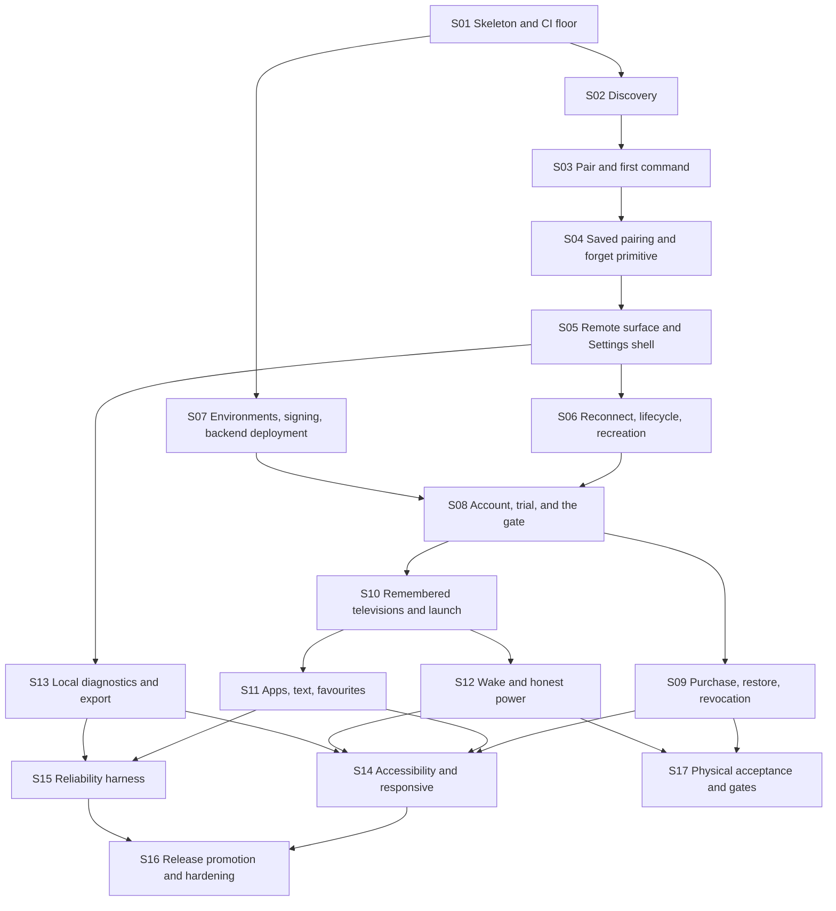

# Implementation slice map

Architecture output only. **Do not open implementation Issues from this file.** This route was reconciled through Issue #23 and is under human review; after acceptance, ChatGPT compiles one slice at a time into an Arena Issue, and each dispatch names this file, the slice, and that slice's architecture sources.

Every slice is vertical: a user or tester can observe the outcome, and CI proves it, without waiting for a later slice to make the earlier one real. Security, privacy, accessibility, and reliability constraints appear in the slice where they first become real, not in a final cleanup slice.

Not in this route: iOS, a second television ecosystem, IR, casting, mirroring, voice, advertising, a subscription, a diagnostic upload service, cloud crash reporting, a paid-device roster, a public compatibility page, or TV-personalization cloud sync of any kind.

External gates, not slices: the source-license decision and the Samsung vendor-terms review. Both gate public production promotion only; internal testing does not wait on them.

## Definition of V1-ready

V1-ready for public production means S01 through S17 are accepted, the two external gates are passed, at least one physical matrix row passes the TLS token path with a recorded wake attempt, and the recorded paid-path drill in S09 has run on production.

## Ordering rules

Two rules shape the spine:

1. The licensing gate is part of the spine, not an appendix. Any slice that can route a post-first-session entry to Account or Entitlement comes **after** the slice that provides the gate and those surfaces, so no slice is ever accepted in a state where the product rule cannot be honored. That is why account and trial (S08) precede remembered televisions and remote-first launch routing (S10).
2. Foundations precede verification. The environment, signing, backend-deployment, and Play foundations (S07) land before the first slice that must verify against real infrastructure, so the account, trial, and purchase slices prove themselves without waiting on a release slice. Release promotion and hardening (S16) own only what becomes real once a release candidate exists.

## Route

S07 may run in parallel with the control spine as soon as S01 lands. S11 and S12 may run in parallel once S10 lands. S13 may start as soon as S05 lands. S17 may overlap S14–S16 once S09 and S12 exist. Public production promotion waits for S16, S17, and the two external gates.

## S01 — Walking skeleton and CI floor

Observable outcome: a debug build installs and shows Welcome. Pull-request CI is green with the repository, dependency, manifest, and telemetry guards in place, and secret scanning runs on every change. The design-token module exists with the categories from the presentation architecture, and the test-only benchmark module compiles.

Architecture sources: [presentation.md](presentation.md), [release.md](release.md), [modules.md](modules.md), [diagnostics.md](diagnostics.md).

Depends on: none.

Acceptance: Welcome route renders on a device; the navigation graph contains only `WelcomeRoute`; three Gradle modules exist (`app`, `samsung`, and test-only `:macrobenchmark`) and neither production module depends on the benchmark module (`noProductionModuleDependsOnBenchmark`); version catalog pins versions with no `+` ranges and no snapshot; repository mode fails on project repositories; lockfiles and verification metadata committed; manifest allowlist matches [release.md](release.md) exactly; actions pinned to commit SHAs; token module exposes color, type, space, size, and motion categories with the 48dp floor; `noTelemetryDependency` and `adIdAbsentFromManifest` pass; `:app` dependency insight shows no Firestore artifact; `backend/` exists with its lockfile, typecheck, lint, and test jobs wired into CI.

Verification: `./gradlew assembleDebug lintDebug testDebugUnitTest dependencyLockCheck`, `./gradlew :app:dependencyInsight --configuration debugRuntimeClasspath --dependency firestore` (no match), `./gradlew :app:dependencyInsight --configuration debugRuntimeClasspath --dependency crashlytics` (no match), `npm ci --prefix backend && npm test --prefix backend`, install the debug build, CI log shows pinned actions.

Not in this slice: Room, discovery, Firebase configuration, any backend endpoint, environment variants and guards (S07).

## S02 — Local-network explanation and bounded discovery

Observable outcome: after an ordinary-language explanation, the user sees friendly television cards and the scan ends. An unsupported Samsung fixture appears as not controllable. No address, port, or UUID is ever shown. No command is sent.

Architecture sources: [discovery.md](discovery.md), [samsung-interface.md](samsung-interface.md), [protocol.md](protocol.md), [presentation.md](presentation.md#discovery), [reliability.md](reliability.md), [flows.md — first run to first control](flows.md#first-run-to-first-control).

Depends on: S01.

Acceptance: explanation precedes any system prompt and precedes the first scan; the first scan starts as soon as the gate is granted with no separate setup step; a rescan starts a new `discover()`; target 36 probes request neither `NEARBY_WIFI_DEVICES` nor location and do not declare `ACCESS_LOCAL_NETWORK`; a system prompt appears only when a chosen API requires one; the scan finishes at 10 seconds; the soundbar fixture emits no card; the unsupported fixture emits `Unsupported` and writes no key frame; cards contain no IP text; the multicast lock is released on cancel; a card is rendered from live evidence with no parallel model table; every control this slice adds has a content description and at least 48dp touch bounds; the Discovery ViewModel depends on `SamsungTvs`, never on `samsung.internal`.

Verification: `./gradlew :samsung:test` for fixture contracts; `./gradlew :app:testDebugUnitTest` for ViewModel state; Compose test for the card and empty state; `./gradlew :app:lintDebug` for the manifest; one device walkthrough of the explanation.

Not in this slice: pairing, Room, Request Support export.

## S03 — Pair on the television and the first command

Observable outcome: the user selects a controllable card, allows AppT on the television, presses volume or a direction key, and the command is written on the already open session. The first `Accepted` records the first-control milestone that later decides the account exemption.

Architecture sources: [connection.md](connection.md), [protocol.md](protocol.md), [samsung-interface.md](samsung-interface.md), [sync.md](sync.md#remote-entry-gate), [presentation.md](presentation.md#pairing), [data.md](data.md), [flows.md — first run to first control](flows.md#first-run-to-first-control).

Depends on: S02.

Acceptance: fixture `tls-approval-then-volume` reaches `Ready` and records a volume write; `command` does not open a second socket; `:samsung` has no Firebase or Play dependency; `cloudAbsenceDoesNotBlockCommand` and `noBackendCallOnCommandPath` pass; a malformed fixture does not crash the caller; the Pairing surface shows the approval meaning and no port, certificate, or generation; selecting a controllable card inserts the `TvProfile` row; `firstControlAchieved` is written on the first `Accepted`; no account prompt appears during this session.

Verification: `./gradlew :samsung:test`, `./gradlew :app:testDebugUnitTest`, Gradle dependency check, Compose test from card to `Accepted` using the fake `SamsungTvs`.

Not in this slice: saved pairing, full remote layout, account, remembered television list.

## S04 — Saved pairing, fail-closed identity, and the safe forget primitive

Observable outcome: after approval, force-stopping and reopening the same television does not prompt again. A television presenting a different security identity never receives the token and asks for explicit re-pair. The safe forget primitive deletes the television's secret, is idempotent, and is verified at the `SamsungTvs` seam; the user-facing Forget transaction lands with the management surface in S10.

Architecture sources: [data.md](data.md), [connection.md](connection.md), [samsung-interface.md](samsung-interface.md).

Depends on: S03.

Acceptance: `token-resume` fixture passes; `identityMismatchDoesNotSendToken` passes and the recorded socket URL carries no token; `unauthorized-with-token` produces `TokenRejected` with no reconnect loop; instrumented Keystore round trip succeeds; the secret file exists only under `noBackupFilesDir/samsung-secrets/`; `forgetRemovesSecret` passes — after `Forgotten` the secret file is gone and a second `forget` still returns `Forgotten`; the Room schema carries `TvProfile`, `Favourite`, and `PendingForget` with no forbidden column (`schemaContainsNoForbiddenColumn`); backup and device-transfer configuration cannot carry the secret or device directory; no plaintext token appears in Room, DataStore, or any log the test captures; `samsung` still has no Firebase dependency.

Verification: `./gradlew :samsung:test`, `./gradlew :app:testDebugUnitTest`, one instrumented test on a device or emulator, a grep over captured logs for a planted token.

Not in this slice: the user-facing Forget transaction and confirmation (S10), the television list surface, favourites UI, account.

## S05 — Capability-driven Remote surface and Settings shell

Observable outcome: the Remote is recognizable and phone-native. Standard controls work, a rejected key disappears, haptics and phone volume buttons follow settings, and the D-pad/touchpad toggle appears only when the television demonstrates pointer support. The Settings screen exists with the Interaction and About sections functional, reachable from the Remote chrome.

Architecture sources: [commands.md](commands.md), [presentation.md](presentation.md) (Remote contract, Settings contract, thumb-first zones, tokens, accessibility), [lifecycle.md](lifecycle.md), [reliability.md](reliability.md).

Depends on: S04.

Acceptance: the UI binds only to `capabilities.keys`; the four thumb-first zones are implemented as specified and power is spatially isolated; pointer toggle is absent until the fixture probe accepts; haptics default on and can be disabled; volume buttons send volume taps only while the remote is started and the setting is on; every control has a content description, a role, and at least 48dp touch bounds with primary controls at 56dp or more; no `KEY_*` string appears in the Compose tree; the Settings route renders the Interaction section (haptics, volume buttons, navigation mode) and About (app version), preference writes happen in the ViewModel and never in a composable effect, and a section whose destination does not exist yet renders no dead row — Account & License lands in S08, TVs in S10, Privacy & Diagnostics in S13; `commandLatencyBudget` p50 is inside the control-path target on the reference device; a baseline profile for Remote is committed.

Verification: Compose tests with the fake adapter; `./gradlew :app:testDebugUnitTest`; `./gradlew :macrobenchmark:connectedCheck` for the control-latency target; a unit test that a rejected key leaves the capability set; a Compose test for the Settings sections.

Not in this slice: reconnect behavior, the television list, favourites shelf, account.

## S06 — Reconnect, lifecycle, and Activity recreation

Observable outcome: a dropped socket shows a quiet inline status and recovers on its own; an address change recovers without the user doing anything; leaving the app and returning inside the grace window reuses the same session; rotating the phone keeps the session and the route.

Architecture sources: [connection.md](connection.md), [lifecycle.md](lifecycle.md), [presentation.md](presentation.md#rotation-window-size-foldables-and-tablets), [reliability.md](reliability.md), [flows.md — quiet reconnect and an address change](flows.md#quiet-reconnect-and-an-address-change).

Depends on: S05.

Acceptance: the backoff fixture ends in `Unreachable` and stops; `reconnectBackoff` and `rediscoverSameUuid` pass; `graceClosesAfterFifteenSeconds` and `backgroundReleasesRemote` pass; `networkLossShowsReconnectingNotDialog` and `vpnDoesNotBypass` pass; `rotationKeepsSession` passes with the Activity genuinely recreated (no `android:configChanges`, one session, no second `open`, no gate evaluation); `recreationRestoresRouteAndDrafts` and `recreationDropsTransientUiOnly` pass; commands issued while not `Ready` return `Rejected(Unavailable)` and nothing is replayed; reconnect status is never a dialog loop.

Verification: `./gradlew :samsung:test` with the fake transport, `./gradlew :app:testDebugUnitTest`, an instrumented rotation test that asserts Activity recreation, a scripted LAN-flap run, and one device check of the grace path.

Not in this slice: account, television list, TV switching.

## S07 — Environments, signing, and backend deployment

Observable outcome: three isolated environments exist and prove it. A debug build resolves only development identifiers; an internal tester build signed with the internal key installs outside Play and resolves only the internal environment; a production-flavoured candidate uploads to the Play internal testing track, installs against production, and is re-signed by Play App Signing. Backend rules and indexes deploy to all three projects through the CI pipeline, and the Play app carries the lifetime product with a licence tester configured.

Architecture sources: [release.md](release.md) (environments, release path and artifact identity, signing identity and distribution channel, backend deployment and rollback), [sync.md](sync.md#backend-source-architecture), [security.md](security.md#b7-ci-supply-chain-and-release).

Depends on: S01. May run in parallel with the control spine.

Acceptance: `dev`, `internal`, and `production` projects exist with separate Firebase, Firestore, functions, Secret Manager marker keys, and Cloud KMS keys; deny-all client Firestore rules and the declared indexes deploy to each environment as versioned artifacts; deployment workflows exist with Workload Identity Federation and no long-lived Google key in the repository; `debugVariantCannotReachProduction` and `releaseVariantCannotReachDevelopment` pass against the real environment configuration; the signing identities match the [release.md](release.md#signing-identity-and-distribution-channel) table — debug keystore per machine, an internal signing key whose certificate is registered only in `appt-internal`, an upload key held by CI, and Play App Signing holding the app-signing key; `signingIdentityMatchesChannel` passes; `appCheckRegistrationMatchesChannel` passes — the Play app-signing certificate fingerprint is registered in `appt-prod`, the internal certificate fingerprint in `appt-internal`, and no fingerprint appears in both; the candidate AAB installs from the Play internal testing track against production, and the tester build installs against internal outside Play, is never uploaded to Play, and needs an uninstall to coexist with a Play-signed build on the same device; the candidate-upload and tester-build workflows exist as manual dispatches, and the candidate workflow uploads the R8 mapping; the single Play catalogue contains the lifetime product with at least one licence tester, and the RTDN topic for one-time and voided events routes to the production Pub/Sub pipeline; `noCredentialFilesInRepo` passes.

Verification: CI logs, a Play internal testing install of the production candidate, an internal-environment install of the tester build, `apksigner verify --print-certs` on the tester artifact and certificate inspection of the uploaded bundle, the recorded App Check fingerprints per project, and the environment guard checks.

Not in this slice: account, trial, or purchase endpoints, RTDN handlers, the first function deployment and the rollback drill (S08), the promotion workflow (S16), public rollout.

## S08 — Account, server-authoritative trial, and the licensing gate

Observable outcome: the first successful local-control session is never blocked on sign-in. When that session ends, the next remote entry asks the user to continue, and the television is never opened while the gate denies. Google sign-in and email/password both work, an unverified email cannot start a trial, and an eligible account receives a seven-day trial with an exact remaining time in Account and Settings. Signing in on a second phone returns the same expiry and marks that phone as trial-consumed. Signing out keeps every television and the cached proof, blocks a new entry, and never interrupts an active session. With the backend unreachable, a valid trial still permits control. The account functions are the first real backend deployment, and the production rollback drill is recorded.

Architecture sources: [sync.md](sync.md) (authentication, topology, backend source architecture, API surface, record shapes, trial and attach, gate, local cache), [presentation.md](presentation.md#account), [lifecycle.md](lifecycle.md#workmanager), [release.md](release.md#environments), [flows.md](flows.md) — [first free control to the account requirement](flows.md#first-free-control-to-the-account-requirement), [account sign-in and trial activation](flows.md#account-sign-in-and-trial-activation), [trial expiry and the next remote entry](flows.md#trial-expiry-and-the-next-remote-entry), [sign-out](flows.md#sign-out), [account deletion](flows.md#account-deletion), [backend outage during control](flows.md#backend-outage-during-control).

Depends on: S06, S07.

Acceptance: `accountlessFirstSessionIsExemptOnce` and `firstSessionGateEndsWithActiveRemote` pass; `gatedLaunchNeverOpensSession` passes (`SamsungTvs.open` is not called while the gate denies); a blocked entry returns to its origin and is never resumed automatically; process death after the first success also requires sign-in; Google and email/password paths reach a signed-in state; `entitlementRequiresVerifiedEmail` passes; `trialStartsServerSideAndSevenDays` passes against the emulator suite; `trialAttachIsIdempotent` passes with the original expiry returned and exactly one device marker written; `deviceMarkerDeniesSecondTrial`, `trialMarkerKeyRotationResolvesOldMarkers`, and `trialFollowsAccountAcrossPhones` pass; `proofSignatureTamperDenied`, `proofForAnotherUidIgnored`, and `clockRollbackDoesNotExtendEntitlement` pass; `signOutKeepsLocalStateAndCachedProof` passes; `backendRejectsClientSuppliedUid`, `clientFirestoreAccessDenied`, and `backendStoresNoTelevisionField` pass; account deletion runs its account phases in order — mark `deleting`, delete the Firebase Auth user, finish — and is resumable: `deletionRetryConverges` passes for a deletion with no purchase binding present, a retry after any phase completes the deletion exactly once, only pseudonymous trial markers are retained, and the finished record drops Username, trial dates, and entitlement state; the purchase-binding freeze/release contracts and the scheduled reconciliation job land in S09 with the bindings; the Settings Account & License section is functional with the exact remaining trial time, sign-out, and account deletion behind explicit confirmation; Account surfaces never show a television error and Remote never shows a licensing prompt; `workManagerNeverTouchesSamsung` passes; the trial's remaining time is exposed to accessibility services as text, not color; production functions deploy with a traffic split from 0% and the rollback step is exercised once and recorded.

Verification: `./gradlew :app:testDebugUnitTest`; `npm ci --prefix backend && npm test --prefix backend` plus `npm run test:emulator --prefix backend` with the fake Play verifier and fake integrity decoder; one instrumented test for Credential Manager through the fake seam; one real Google sign-in and trial activation against the internal environment, proving the ID-token and App Check path end to end; Compose tests for the gated entry, the blocked-entry back path, and the backend-outage copy; the recorded rollback drill note.

Not in this slice: purchase, restore, revocation, purchase-binding deletion durability (S09), remembered-television routing (S10).

## S09 — Lifetime purchase, restore, revocation, paid offline, and binding deletion durability

Observable outcome: Buy once completes a Play purchase and unlocks a lifetime entitlement; a reinstall plus sign-in restores it; a refund or chargeback blocks the next remote entry without interrupting an active one; a paid customer keeps local control while the backend is unreachable; if the validator is unavailable while Play reports a purchase, the user gets an honest temporary unlock that expires within 24 hours and cannot be renewed for that purchase. Account deletion freezes the purchase binding before the Auth user is deleted and releases it only after the removal is proven.

Architecture sources: [sync.md](sync.md) (purchase, binding, deletion durability, revocation, provisional, local cache, gate), [presentation.md](presentation.md#entitlement-and-purchase), [release.md](release.md#play-and-rtdn-are-shared-by-design), [security.md](security.md), [flows.md](flows.md) — [purchase](flows.md#purchase), [restore purchase including after account deletion](flows.md#restore-purchase-including-after-account-deletion), [restore on a second phone](flows.md#restore-on-a-second-phone), [refund or chargeback](flows.md#refund-or-chargeback), [account deletion](flows.md#account-deletion).

Depends on: S08.

Acceptance: `testPurchaseDoesNotGrantLifetime` passes for a `purchaseType` test purchase in every environment; `onePurchaseBindsToOneLiveAccount` passes; a replay of the same token resolves to the existing binding with no duplicate grant; `restoreAfterAccountDeletionSucceeds` passes, and the purchase is re-bindable only after the Auth user is deleted; acknowledgement happens from the backend inside the three-day window; `revocationAppliesOnNextEntry` passes; duplicate and out-of-order RTDN delivery converge through the OIDC-authenticated subscription on the deployed handler; raw purchase tokens never appear in stored documents, logs, or the provisional record, and the provisional record uses the device-computed key (`provisionalUsesLocalKey`); `provisionalIsNonRenewable` and `provisionalExpiresWithin24Hours` pass and the Account surface labels it as temporary; `paidOfflineControlSurvivesOutage` passes; `PENDING` grants nothing and says so; account deletion with a real binding runs the full freeze-release sequence: `deletionFreezesBeforeAuthDelete`, `frozenBindingRetainsOwnerCorrelation`, `releaseRequiresAuthRemovalProof`, `reconciliationRequiresAuthRemoval`, and `reconciliationReleasesOrphanedBindings` pass, the daily reconciliation function is deployed and is the only automated `frozen → released` path, and a frozen binding denies use with `deletion_pending`; the Settings account summary deepens with purchase and provisional state; no device roster or device cap exists anywhere in the code or schema.

Verification: `./gradlew :app:testDebugUnitTest`; backend tests including the RTDN handlers, binding-freeze, and release paths; the internal testing track run with a licence tester that asserts withholding, executable because S07 established the track, the product, and the production environment; a Compose test for pending, revoked, and provisional surfaces; **a recorded paid-path drill before public promotion** — one real purchase on the production environment, verifying grant and acknowledgement, then refunded, exercising RTDN void and revocation; the drill record states the outcome and leaves no entitlement behind.

Not in this slice: any television-related cloud data, any entitlement-based device registry.

## S10 — Remembered televisions, remote-first launch, TV switching, and the Forget transaction

Observable outcome: reopening AppT lands on the last-used television and starts connecting; the remembered list shows friendly names and ordinary-language state; Add TV returns to discovery; Forget from the list, behind an explicit confirmation, removes the television from this phone immediately, including its favourites, and finishes the local unpair even if `samsung` is temporarily unavailable; the switch sheet moves between remembered televisions without a swipe gesture; every one of those entries passes through the licensing gate first. The Settings TVs section opens the list.

Architecture sources: [data.md](data.md), [presentation.md](presentation.md) (launch routing, Remote, switch sheet, TvList), [lifecycle.md](lifecycle.md), [sync.md](sync.md#remote-entry-gate), [flows.md](flows.md) — [process death and reopen](flows.md#process-death-and-reopen), [switching televisions](flows.md#switching-televisions).

Depends on: S08.

Acceptance: `launchRoutingResolvesRemoteFirst` and `gatedLaunchNeverOpensSession` pass with a remembered television; `rememberedIds` behaves as specified; `forgetRemovesRowAndFavouritesInOneTransaction` passes from the list — the confirming tap removes the profile and its favourites in one transaction, leaves one `PendingForget` row, and the television is absent from every list; `forgetIsRetryable` passes — a failed `samsung.forget` keeps the row and the startup retry, and the television stays out of every list; `newPairingSupersedesPendingForget` passes; the forget confirmation states that the television is removed from this phone only; renaming writes one transaction with `nameSource = USER`, and `nameSourceUserIsNotOverwritten` passes; the switch sheet lists remembered televisions plus Add TV and contains no swipe gesture; `lastOpenedIsDeviceLocal` passes; a row whose television is offline shows an ordinary-language state and no address; backing out of a blocked entry returns to its origin (`EntryOrigin.TvList` or `Remote`); the Active Remote is released through the normal path when switching, never in parallel.

Verification: `./gradlew :app:testDebugUnitTest`, Room transaction tests, Compose tests for the list, the empty state, rename, forget confirmation, and the sheet, and one device walkthrough of reopen-to-Remote.

Not in this slice: favourites UI, apps surface, wake.

## S11 — Apps, text, and favourites

Observable outcome: a supported television lists its launchable apps, text entry uses the phone keyboard when the television accepts it, and favourite apps or controls can be added, reordered, and removed.

Architecture sources: [commands.md](commands.md), [presentation.md](presentation.md#favourites-apps-and-edit-mode), [data.md](data.md).

Depends on: S10.

Acceptance: `app-list` and `text-rejected` fixtures behave as specified; `LaunchApp` with an unknown id returns `Rejected(Unavailable)` and sends nothing; `textInput` false hides the keyboard affordance; `favouriteReorderIsAtomic` passes; the shelf and the More sheet read one `FavouriteDao` source; edit mode is opt-in, cancellable, and never reorders core controls; a missing app degrades to a clear state rather than a dead control; nothing about a favourite leaves the phone.

Verification: fixtures `text-rejected` and `app-list`, Room tests, `./gradlew :app:testDebugUnitTest`, Compose tests for a missing app and for reordering.

Not in this slice: DIAL launch, a full layout designer.

## S12 — Wake and honest power

Observable outcome: with the television off and a stored MAC, the power control attempts a wake and then opens the session; when wake is unavailable or has failed repeatedly, the screen says so honestly instead of offering a button that cannot work.

Architecture sources: [commands.md](commands.md), [connection.md](connection.md), [discovery.md](discovery.md), [presentation.md](presentation.md#remote), [reliability.md](reliability.md).

Depends on: S10.

Acceptance: `powerOn` is `Attemptable` only with a stored MAC for the interface actually reached; wake sends a bounded burst and then opens; repeated failure moves to `Unavailable` with the explanatory copy; no SmartThings or consumer-IP-control fallback exists; a Mac that was never observed for this television never produces a wake attempt; the wake path never blocks the first frame or a command.

Verification: `./gradlew :samsung:test` with the recording wake sender, `./gradlew :app:testDebugUnitTest`, and one physical attempt recorded in the acceptance matrix (a recorded failure is a valid outcome).

Not in this slice: IR, HDMI discrete selection, a compatibility claim.

## S13 — Local diagnostics, redacted export, and Request Support

Observable outcome: the Diagnostics surface shows what the local record holds and how old it is; building a report shows a preview of every field before anything leaves the phone; sharing happens only after explicit confirmation; Request Support on an unsupported card uses the same path; Clear local history empties the record. Nothing is uploaded anywhere, because V1 has no cloud crash reporting and no analytics. The Settings Privacy & Diagnostics section opens the surface.

Architecture sources: [diagnostics.md](diagnostics.md), [presentation.md](presentation.md#diagnostics), [security.md](security.md#b6-diagnostics), [release.md](release.md), [flows.md — diagnostics: local record and user-confirmed export](flows.md#diagnostics-local-record-and-user-confirmed-export).

Depends on: S05.

Acceptance: `noTelemetryDependency` and `adIdAbsentFromManifest` pass; `localRecordIsBoundedAndRedacted` passes for both sources and the rolling file; `diagnosticFileIsExcludedFromBackup` passes; `exportRequiresUserConfirmation` passes and the preview lists every field; `clearLocalHistoryDeletesRecordAndFile` passes with a confirmation step; `noDiagnosticsUploadPath` passes (no HTTP client in the package, no endpoint in the backend inventory); `redactedReportContainsNoFixtureSecret` passes with a planted token, pin, IP, MAC, email, Username, and text; `samsungHasNoLogCalls` passes; a full record never delays a command (`commandDoesNotAwaitDiagnostics`); the unsupported card offers Request Support through the same preview; the Settings Privacy & Diagnostics section deep-links into the surface.

Verification: unit redaction tests, `./gradlew :app:testDebugUnitTest`, manifest merge check, dependency check, `npm test --prefix backend` endpoint inventory test, and a Compose test for the preview, confirmation, and clear-history states.

Not in this slice: a diagnostic backend, crash reporting, analytics, an upload endpoint.

## S14 — Accessibility and responsive closure

Observable outcome: a screen-reader user completes Welcome, explanation, discovery, approval, one command, the account gate, trial and purchase surfaces, settings, and diagnostics. Text scales to 200% without clipping. Contrast and target sizes hold. Landscape, foldable, and tablet windows behave per the responsive rules.

Architecture sources: [presentation.md](presentation.md) (accessibility contracts, responsive rules, tokens), [ui-ux.md](ui-ux.md), [reliability.md](reliability.md).

Depends on: S09, S11, S12, S13. Every earlier control-introducing slice is a transitive ancestor of these four, so no slice can introduce a user-facing control or route after this closure.

Acceptance: every interactive control across the routes has a name, role, and state; `everyControlMeetsTouchTarget` passes for every route; `fontScale200DoesNotClip` passes for every route; `statusIsNotColorOnly` passes; `reducedMotionSkipsTravel` passes; `gestureAlternativesExist` passes; `destructiveActionsConfirm` passes for forget, sign-out, account deletion, and clear-local-history; `statusAnnouncedOnce` passes; traversal order matches the visual task order in the Remote zones; a TalkBack walkthrough record is attached to the slice; each window size class renders per the responsive table with control ordering preserved.

Verification: Compose accessibility assertions, `./gradlew :app:connectedDebugAndroidTest` on a phone and a tablet-sized emulator, a manual TalkBack script, and a screenshot set at 100% and 200% font scale.

Not in this slice: a new visual brand, a separate tablet product.

## S15 — Reliability and performance verification harness

Observable outcome: launch, control latency, frame timing, memory, and battery results are recorded per release from the benchmark module, and a regression beyond the thresholds fails the pipeline.

Architecture sources: [reliability.md](reliability.md), [testing.md](testing.md#performance-and-reliability), [modules.md](modules.md#shape), [lifecycle.md](lifecycle.md).

Depends on: S11, S13. S11 transitively covers every measured feature — launch routing, TvList, process-death reopen, the More sheet, Remote frame timing, control latency, discovery, and recreation — and S13 covers the diagnostics non-blocking contract.

Acceptance: the `:macrobenchmark` module measures cold and warm start, Remote frame timing, control latency, discovery, reopen after process death, and recreation; `launchBudget`, `commandLatencyBudget`, `frameTimingBudget`, and `reconnectRecoveryRate` are enforced; baseline profiles for Remote, Discovery, and TvList are generated by the module and committed, refreshing the Remote profile first committed in S05; `commandDoesNotAwaitDiagnostics` passes; memory and battery budgets are recorded with a battery-historian run on the reference device; a >20% regression blocks promotion until explained; results are stored as release artifacts, never as analytics; `noProductionModuleDependsOnBenchmark` passes.

Verification: `./gradlew :macrobenchmark:connectedCheck`, recorded benchmark JSON per release, the release checklist entry, and a CI job that fails on a threshold breach.

Not in this slice: public performance claims or SLAs.

## S16 — Release promotion and hardening

Observable outcome: the promotion machinery exists and stays off: a manual production-promotion workflow moves the tested candidate to a production track with staged rollout, the release checklist records the halt criteria and the required evidence, and the full pull-request check suite from the release architecture is green on `main`. The artifact that will be promoted is the artifact that was tested.

Architecture sources: [release.md](release.md) (release path and artifact identity, pull-request checks, two external gates), [reliability.md](reliability.md#regression-policy), [security.md](security.md#b7-ci-supply-chain-and-release).

Depends on: S14, S15.

Acceptance: `releaseArtifactsDifferOnlyByConfig` passes on the signature-stripped comparison — the internal and production release artifacts from one commit differ only in environment configuration, the production artifact carries none of the development or internal configuration, and no version-code exception exists in the check; `releaseVariantsShareVersionCode` passes — both variants from the same commit carry the same version code and name; the same release unit tests and accessibility checks run against both variants; the production-promotion workflow exists, is a manual dispatch, promotes that same uploaded bundle with no rebuild and no environment change, and is not run by this slice; staged rollout starts below 100 percent, and the halt criteria — a Play Console Android vitals crash or ANR rise, or an entitlement error-rate rise — are recorded in the release checklist; the release checklist names the required evidence: the recorded backend rollback drill (S08), the recorded paid-path drill (S09), and at least one physical matrix row (S17); every pull-request check in [release.md](release.md#pull-request-checks) runs, including the backend typecheck, lint, and emulator jobs, the accessibility assertions, and the benchmark guards; `main` is green.

Verification: CI logs, workflow definition review, and the completed release checklist note.

Not in this slice: running promotion, public rollout, the license decision, the vendor-terms decision.

## S17 — Physical acceptance and external gates

Observable outcome: one real Samsung television completes pair, command, reconnect, and process-death resume on the TLS token path. Wake is attempted and recorded, including an honest failure. The matrix row contains no address, MAC, token, or account email. Both external gates are recorded as passed before public promotion.

Architecture sources: [testing.md](testing.md#physical-acceptance-matrix), [release.md](release.md#two-external-gates).

Depends on: S09 (the recorded paid-path drill), S12 (the recorded wake attempt). May run in parallel with S14–S16. A debug or internal build is enough.

Acceptance: one matrix row with the required columns filled; pin-survived-reboot recorded as yes, no, or not tried; no year range added to the app as a support gate; honest wake failure recorded if wake does not work; the source-license decision and the Samsung vendor-terms review are recorded as human decisions before public promotion; the S09 paid-path drill is recorded as complete; production promotion is not started by this slice.

Verification: the matrix note in the slice record plus a rerun of the contract tests against the same build.

Not in this slice: a public compatibility page, a second ecosystem, a commitment that untested generations work.

## Coverage matrix

Every implementation-relevant architecture document has an owning slice. A slice owns a document when that slice is where the behavior first becomes real and is verified; later slices may deepen it, named in the slice text.

| Architecture area | Source | Owning slices |
| --- | --- | --- |
| Module seams and the two-adapter test pattern | [modules.md](modules.md) | S01 (skeleton seams), S02 (first production and test adapter) |
| Local-network discovery | [discovery.md](discovery.md) | S02 |
| Samsung interface: discovery, pairing, control, wake | [samsung-interface.md](samsung-interface.md) | S02, S03, S04, S12 |
| Command mapping | [commands.md](commands.md) | S03, S05, S11 |
| Wire protocol and quiet reconnect | [protocol.md](protocol.md) | S03, S06 |
| Connection lifecycle | [connection.md](connection.md) | S03, S06 |
| Local data and persistence | [data.md](data.md) | S03, S04, S10, S13 |
| Routes and screen-state contracts | [presentation.md](presentation.md) | S02, S03, S05, S08, S09, S10, S11, S13, S14 |
| UI/UX surface map | [ui-ux.md](ui-ux.md) | S02, S05, S08, S10, S13, S14 |
| Account, trial, purchase, entitlement backend | [sync.md](sync.md) | S07, S08, S09 |
| Environments, signing, release, Play, App Check | [release.md](release.md) | S07, S08, S16 |
| App lifecycle and WorkManager | [lifecycle.md](lifecycle.md) | S06, S10 |
| Local diagnostics and redacted export | [diagnostics.md](diagnostics.md) | S13 |
| Reliability and performance targets | [reliability.md](reliability.md) | S06, S15, S17 |
| Security invariants | [security.md](security.md) | S04, S08, S09, S13, S16 |
| Test strategy and the physical acceptance matrix | [testing.md](testing.md) | S01, S15, S17 |
| Cross-module flows | [flows.md](flows.md) | S02, S03, S06, S08, S09, S10, S13 |
| Product intent and canonical domain language | [PRODUCT.md](../PRODUCT.md), [CONTEXT.md](../../CONTEXT.md) | every slice, as the contract it implements |
| Harvest dispositions (ADOPT / HARVEST / REJECT register) | [HARVEST.md](../HARVEST.md) | A cross-cutting reference register, not one slice's work. S01 enforces the REJECTs expressible as dependency, manifest, and supply-chain checks (no advertising, crash-reporting, telemetry, or Firestore artifact; the manifest allowlist). Product, protocol, scope, monetization, sync, and UI REJECTs are honored by the slices where each first becomes real |

Cross-cutting invariants are not a single slice's work; each is introduced where it first becomes real and closed where stated.

| Invariant | Introduced / closed by |
| --- | --- |
| Accessibility floor (48dp targets, TalkBack semantics, scalable text, contrast, no color-only meaning, gesture alternatives, reduced motion) | introduced by every UI-adding slice; closed by S14 |
| Responsive rules (rotation, landscape, foldables, tablets) | introduced from S05; closed by S14 |
| Reliability and performance measured against targets | S15 harness; S17 supplies the physical evidence |
| Diagnostic and support data leave the phone only through an explicit user preview and confirmed share | S13 (confirmed export) |
| TV identity, pairing, personalization, preferences, diagnostics, and usage data are never uploaded to the account backend | S08 (`backendStoresNoTelevisionField`); kept device-local in S04 (pairing), S05 (preferences), S10 (personalization), S11 (favourites), S13 (diagnostics) |
| No TV-personalization sync, no cloud crash reporting, no analytics or ad SDK | S01 dependency guards; enforced across S04, S10, S13 |
| The licensing gate is active on every remote entry | S08 (the gate); S10 (launch routing passes through it) |
| TV/personalization/diagnostic state excluded from Android backup and device transfer | S04 (pairing), S10 (personalization), S13 (diagnostic file) |
| Backend source architecture (`npm <script> --prefix backend`, server-only Firestore) | S07, S08, S09 |
| Fail-closed identity and secret deletion | S04 |
| Raw purchase tokens never stored, logged, or exported | S09 |
| Diagnostics never blocks or delays a command | S13 |
| CI supply-chain pinning and signing-identity checks | S16 |
| The two external gates (final source license; Samsung vendor terms) | human gates asserted at S17; never a slice |

## Slice count and dependency outline

Seventeen slices. Control spine: S01 → S02 → S03 → S04 → S05 → S06. Foundations: S07 (environments, signing, backend deployment, Play) from S01, parallel to the control spine. Licensing spine: S08 (account, trial, and the gate) after S06 and S07 → S09 (purchase, restore, revocation, and purchase-binding deletion durability). Personalization spine: S10 (remembered televisions, remote-first launch, switching, and the Forget transaction) after S08. Branches: S11 (apps, text, favourites) and S12 (wake and honest power) from S10; S13 (local diagnostics) from S05. Closure: S14 (accessibility and responsive) after S09, S11, S12, and S13; S15 (reliability harness) after S11 and S13; S16 (release promotion and hardening) after S14 and S15; S17 (physical acceptance and external gates) after S09 and S12, gating public production promotion with S16 and the two external decisions.

### What this route answers

- **Settings ownership.** S05 owns the Settings route and shell and renders the Interaction and About sections. The Account & License section becomes functional in S08 and deepens in S09 with purchase and provisional state; the TVs section becomes functional in S10; the Privacy & Diagnostics section in S13. The five-section surface is complete after S13, and no section renders before its destination exists.
- **Account deletion versus purchase-binding deletion.** Account deletion starts in S08: mark, Auth delete, finish, marker retention, resumable retry. Purchase-binding deletion behavior — freeze before the Auth delete, the deletion-scoped `deletionId` correlation, release requiring the Auth-removal proof, and the scheduled reconciliation job — first becomes real in S09, where bindings first exist.
- **Environments early, promotion late.** S07 creates the dev/internal/production Firebase, backend-deployment, Play, and App Check foundations that S08 and S09 verify against; S08 records the first production rollback drill with the first real function deployment; S16 owns release promotion and hardening — artifact-identity comparison, version-code identity, the promotion workflow, staged rollout, and halt criteria — rather than foundational environment setup.
- **Accessibility closure.** S14 is blocked by S09, S11, S12, and S13; every other control-introducing slice (S01–S08, S10) is a transitive ancestor of those four, so no slice can introduce user-facing controls or routes after the closure.
- **Reliability closure.** S15 is blocked by S11 and S13, which cover every feature the harness measures: launch routing, TvList, process-death reopen, More-sheet scroll, Remote frame timing, control latency, discovery, and recreation through the S11 chain, and the diagnostics non-blocking contract through S13.
- **Physical acceptance and promotion readiness.** S17 is blocked by S12 (the recorded wake attempt) and S09 (the recorded paid-path drill). Public production promotion additionally waits for S16 and the two external gates.
- **Forget.** The safe primitive (`SamsungTvs.forget`, secret deletion, idempotency) stays in S04, verified at the seam with no UI. The user-facing transaction — confirmation, one Room transaction over row and favourites, and the `PendingForget` retry — lands in S10 with the management surface that exposes it.
- **Cross-module flows.** [flows.md](flows.md) is cited by the slices that implement its sequences: S02 and S03 (first run to first control), S06 (quiet reconnect and an address change), S08 (the account requirement, sign-in and trial activation, trial expiry, outage during control, sign-out, account deletion), S09 (purchase, restore including after deletion, second-phone restore, refund or chargeback, the binding phases of account deletion), S10 (process death and reopen, switching televisions), and S13 (diagnostics export).

This route replaces the previous S01–S16 map. The environment half of the old release slice moved ahead of account and purchase so licensing slices verify against real infrastructure; the old account slice's purchase-binding deletion contracts moved to the purchase slice; the user-facing Forget transaction moved to the management surface that exposes it; the Settings surface gained an explicit owner; and the closure slices now declare every slice whose surfaces they close or measure. No television-sync slice exists, because there is no television-sync architecture to implement, and the account/trial slice sits before remembered-television routing so that every slice which can open a gated entry ships the gate and its surfaces together.
