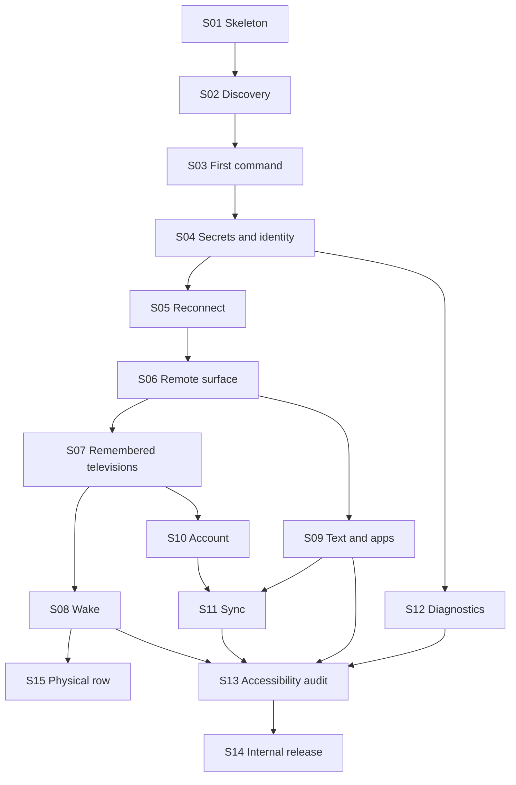

# Implementation slice map

Architecture output only. Do not open implementation issues from this file until the map is accepted. Then dispatch one slice at a time. Each slice is vertical: a user or tester can observe the outcome, and CI proves it, without waiting for a later layer to make it real.

Cloud and polish slices start only after the local-control path is proven. Physical acceptance can run as soon as wake exists, in parallel with account work.

Every slice that adds a control gives that control a content description and a target of at least 48dp. S13 audits the whole path, including one-handed reach of everyday controls.

Not in this route: iOS, a second television ecosystem, IR, casting, mirroring, voice, advertising, a paid tier, a diagnostic upload service, and a public compatibility page.

External gates, not slices: Samsung vendor-terms review before public production, and human confirmation of the source license before public production. Internal testing does not wait on those gates.

## Definition of V1-ready

V1-ready for public production means S01 through S15 are accepted, the different-account holding behavior is still in force or a later slice has implemented the human decision, and the two external gates have been passed. S14 can put a build on the internal track before S15. Public promotion waits for S15.

## Sequence

S15 may start after S08 and run beside S09–S14. Public production promotion waits for S15. Internal-track upload does not.

## S01 — Walking skeleton

Observable outcome: a debug build installs and shows a welcome screen. Pull-request CI is green.

Seams: `:app` only. Compose, Navigation, Hilt application class, version catalog, repository restrictions, minSdk 29, targetSdk 36.

Depends on: none.

Acceptance: welcome route renders; CI assembles debug and runs unit tests; no extra Maven repository; no analytics dependency.

Verification: install the debug build; CI log shows the workflow, with actions pinned by commit SHA.

Not in this slice: `samsung`, Room, Firebase, discovery.

## S02 — Local-network explanation and bounded discovery

Observable outcome: after an ordinary-language explanation, the user sees friendly television cards and the scan ends. An unsupported Samsung fixture appears as not controllable. No address is shown. No command is sent.

Seams: permission gate in `app`; create `:samsung`; `discover` with real probes behind the internal discovery transport and a fake transport in tests. Read [discovery.md](discovery.md), [samsung-interface.md](samsung-interface.md), [protocol.md](protocol.md).

Depends on: S01.

Acceptance: explanation precedes any system prompt; the first scan starts as soon as the gate is granted, without a separate technical setup step; a rescan action starts a new `discover()`; API 33+ requests `NEARBY_WIFI_DEVICES` and does not request location; scan finishes at 10 seconds; soundbar fixture emits no card; unsupported fixture emits `Unsupported` and writes no key frame; cards contain no IP text; multicast lock released on cancel.

Verification: JVM contract tests for the fixture cases; Compose test for the card; a device or emulator walkthrough of the explanation. Physical discovery evidence may wait for S15.

Not in this slice: pairing, Room, Request Support export.

## S03 — Approve on the television and send one command

Observable outcome: user selects a controllable card, allows AppT on the television, presses volume or direction, and the command is accepted on an already open session.

Seams: `open`, approval state, one `Tap`, persistent socket. Read [connection.md](connection.md) and [protocol.md](protocol.md).

Depends on: S02.

Acceptance: fixture `tls-approval-then-volume` reaches `Ready` and records a volume write; `command` does not open a second socket; `:samsung` has no Firebase dependency; `cloudAbsenceDoesNotBlockCommand`; malformed fixture does not crash the caller; UI shows the approval meaning, not a port.

Verification: `samsung` contract tests; Compose test from card to `Accepted` using the fake; Gradle dependency check.

Not in this slice: process-death restore, full remote layout, account.

## S04 — Saved pairing and fail-closed identity

Observable outcome: after approval, force-stop and open the same television again without a new approval prompt. A television that presents a different security identity does not receive the token and asks for explicit re-pair.

Seams: secret store, pin compare, `confirmRepair`, `forget`. Read [data.md](data.md) and [connection.md](connection.md).

Depends on: S03.

Acceptance: `token-resume` fixture; `identityMismatchDoesNotSendToken`; `unauthorized-with-token` does not loop; instrumented Keystore round trip; secret file only under `noBackupFilesDir`; `forgetRemovesSecret`; backup rules exclude the secret directories; no plaintext token in Room (Room may not exist yet — the assertion is that the secret type is not written to DataStore or a database).

Verification: contract tests plus one instrumented test on a device or emulator.

Not in this slice: multi-television list, sync.

## S05 — Quiet reconnect and address change

Observable outcome: when the socket drops, the remote shows a lightweight Reconnecting status and control returns without a dialog loop. A changed address for the same identity is recovered without the user typing an address. Leaving the remote releases the socket after the grace period and keeps the secret.

Seams: supervised reconnect, internal rediscovery, `ActiveRemote` grace. Read [connection.md](connection.md).

Depends on: S04.

Acceptance: backoff fixture ends in `Unreachable` and stops; rediscovery fixture connects to the new address only when identity matches; UI test shows non-modal Reconnecting; grace test calls `close` at 15 seconds and not on rotation; commands during reconnect return `Unavailable` and are not replayed as a burst.

Verification: fake-clock contract tests; Compose test; unit test of the grace holder.

Not in this slice: wake, account.

## S06 — Capability-driven remote

Observable outcome: the remote is recognizable and phone-native. Standard controls work. A rejected key disappears. Haptics and phone volume buttons follow settings. Pointer appears only when demonstrated.

Seams: `TvCapabilities`, remote UI, DataStore preference keys, volume-key consumer. Read [commands.md](commands.md).

Depends on: S05.

Acceptance: UI binds only to `capabilities.keys`; everyday controls sit in reach for one-handed use; pointer toggle absent until the fixture probe accepts; haptics default on and can be disabled; volume buttons send volume taps only while the remote is started and the setting is on; 48dp targets and content descriptions on every control this slice adds; no `KEY_*` string in the Compose tree.

Verification: Compose tests with the fake adapter; a unit test that a rejected key is removed from the set.

Not in this slice: app shortcuts, account, sync of the new preferences (DataStore local is enough until S11).

## S07 — Remembered televisions

Observable outcome: the user can name more than one television, see them in a list, reopen the last-used one quietly, and forget one so that its secret is gone.

Seams: Room `TvProfile`, `TvList`, `lastOpenedAt`, startup `forget` reconciliation. Read [data.md](data.md).

Depends on: S04, S06.

Acceptance: two fixture televisions keep distinct ids; user edit sets `nameSource` USER and a later television name does not overwrite it; last-used id reopens without a scan UI; forget calls `forget` before the tombstone and the secret file is absent; schema export contains no forbidden column; destructive migration is not configured.

Verification: Room test; Compose flow for rename, reopen, and forget; instrumented or JVM schema assertion.

Not in this slice: Firestore, favourites.

## S08 — Wake and honest power

Observable outcome: power-on sends a wake burst when a MAC is known, then waits the wake window. After repeated failure, the power-on control is gone and the screen explains that the television cannot be turned on from the phone.

Seams: `wake`, `PowerOn`, wake-failure count. Read [commands.md](commands.md) and [connection.md](connection.md).

Depends on: S07.

Acceptance: fake wake sender records three bursts and no burst when the MAC is absent; `open` during the wake window does not give up at 5 seconds; the fourth distinct failure hides power-on; a later success clears the count; UI has no permanently dead power button.

Verification: contract tests with the fake wake sender; Compose test for the explanation state.

Not in this slice: SmartThings, IP Control, cloud power.

## S09 — Text, apps, and favourites

Observable outcome: the phone keyboard sends text only when text is available, and hides after rejection. App shortcuts appear only for apps the television returned. The user can favourite and reorder both those shortcuts and secondary controls.

Seams: `InsertText`, `LaunchableApp`, Room `Favourite`. Read [commands.md](commands.md) and [data.md](data.md).

Depends on: S06, S07.

Acceptance: over-long text sends nothing; rejected text clears `textInput` and is absent from diagnostics; an app id not in the list has no button; well-known hint does not invent a missing app; favourite id is stable for the same television and target for both `APP` and `CONTROL`; reorder persists in Room.

Verification: contract fixtures `text-rejected` and `app-list`; Room test; Compose test that a missing app is absent.

Not in this slice: sync of favourites (local until S11), DIAL launch.

## S10 — Account after first control

Observable outcome: the first successful command is not blocked on sign-in. The next entry requires a local Firebase user. Google and email/password both work. Sign-out keeps secrets and does not delete televisions. With a cached user and Firebase unreachable, a command still succeeds.

Seams: account gate, Credential Manager, Firebase Auth. Read [sync.md](sync.md).

Depends on: S03, S07.

Acceptance: Compose test reaches `Accepted` with `currentUser` null on the first session; second launch shows the account screen; no skip-forever control; sign-out then sign-in of the same test user restores the list without re-pairing; airplane-mode test with a cached user still commands on the LAN fixture; auth errors do not clear a cached user; password reset email can be sent.

Verification: Compose tests with fake auth where possible; one instrumented test against a Firebase test project or emulator for Google is not required if Credential Manager is covered by a fake and email/password is covered against the Auth emulator.

Not in this slice: Firestore writes, different-account product behavior beyond the holding screen if a second uid is injected.

## S11 — Sync non-secret data

Observable outcome: names, favourites, and the three preferences sync for one account. A second phone shows the synced name before it pairs and cannot command until it pairs locally. Airplane mode on the public internet does not stop a LAN command. A different uid hits the holding behavior and uploads nothing.

Seams: sync worker, `SyncRecord`, Security Rules, tombstones. Read [sync.md](sync.md) and [data.md](data.md).

Depends on: S10, S09.

Acceptance: Room write is visible before the worker runs; worker failure does not change session state; fresh-install pull does not push tombstones; tombstone does not resurrect; secret field write is denied by rules; cross-user read is denied; hard delete is denied; non-correlatable television is not uploaded; different-uid test uploads nothing and deletes no secret; Firestore persistence is off; no snapshot listener in source.

Verification: unit tests for merge and the apply algorithm; Firestore rules tests; one instrumented or emulator test of two clients; Gradle/source check for snapshot listeners.

Not in this slice: choosing the different-account product behavior. Holding behavior only.

## S12 — Crashes and redacted export

Observable outcome: release crash reporting uses Crashlytics and does not include Analytics. The user can preview and share a redacted report. Request Support on an unsupported card uses that share. Nothing is uploaded to an AppT diagnostic server.

Seams: Crashlytics wiring, redactor, share sheet. Read [diagnostics.md](diagnostics.md).

Depends on: S04, S02.

Acceptance: `firebase-analytics` absent; `AD_ID` absent; `setUserId` absent; planted token, IP, MAC, and text absent from the report; preview shown before share; unsupported card's support action shares that report; `samsung` does not depend on Crashlytics; a full diagnostic queue does not delay `command`.

Verification: unit redaction tests; manifest merge check; a Compose test of the preview; dependency check.

Not in this slice: a diagnostic backend.

## S13 — Accessibility of the whole path

Observable outcome: a screen-reader user can complete welcome, explanation, discovery card, approval, one command, and account gate. Text scales. Contrast and targets hold on the shipped screens.

Seams: Compose semantics across the routes S02–S12 created. Read [commands.md](commands.md) and `docs/PRODUCT.md` accessibility requirements.

Depends on: S06, S07, S08, S09, S10, S12.

Acceptance: every interactive control has a name and a role; targets are at least 48dp; text uses scalable styles; status such as Reconnecting is announced; no control is a color-only distinction.

Verification: Compose accessibility checks plus a TalkBack walkthrough recorded in the slice notes.

Not in this slice: a new visual brand.

## S14 — Internal release

Observable outcome: an App Bundle can be installed from the Play internal testing track. Supply-chain checks are green.

Seams: release workflow, Play App Signing, locking, verification, permission allowlist. Read [release.md](release.md).

Depends on: S13. Public production promotion also waits for S15 and the external gates in [release.md](release.md).

Acceptance: AAB built; internal track install succeeds; lockfile and verification metadata committed; permission allowlist matches [release.md](release.md); actions pinned by SHA; `main` workflow green; production promote workflow exists and is manual; public production is not started by this slice.

Verification: CI logs; Play internal testing install on a device.

Not in this slice: public rollout, license decision, vendor-terms decision.

## S15 — Physical acceptance row

Observable outcome: one real Samsung television completes pair, command, reconnect, and process-death resume on the TLS token path. Wake is attempted and recorded, including an honest failure. The matrix row has no address, MAC, or token.

Seams: physical matrix in [testing.md](testing.md). Uses the build from S08 or later.

Depends on: S08. May proceed in parallel with S09–S14. A debug or internal build is enough. Public production promotion waits for this row.

Acceptance: one matrix row with the required columns filled; pin-survived-reboot recorded as yes, no, or not tried; no year range added to the app as a support gate.

Verification: the matrix note in the slice record, plus the same contract tests still green.

Not in this slice: a public compatibility page, a second ecosystem, or a commitment that untested generations work.
