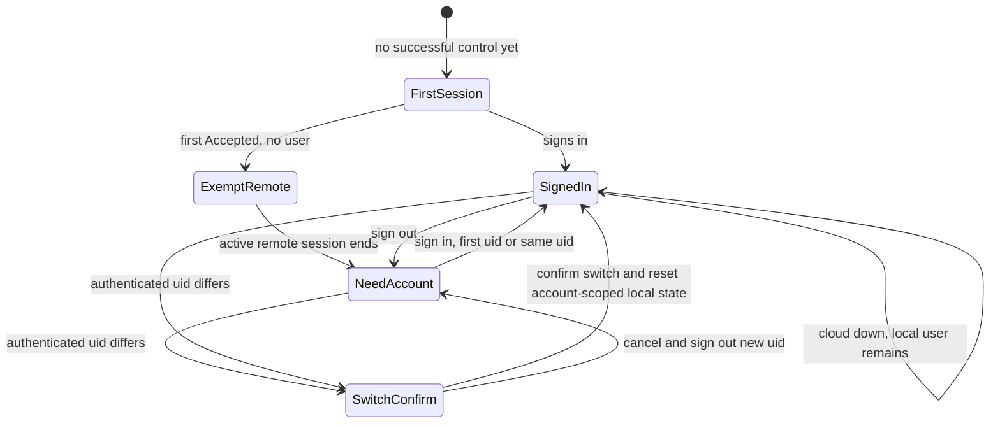
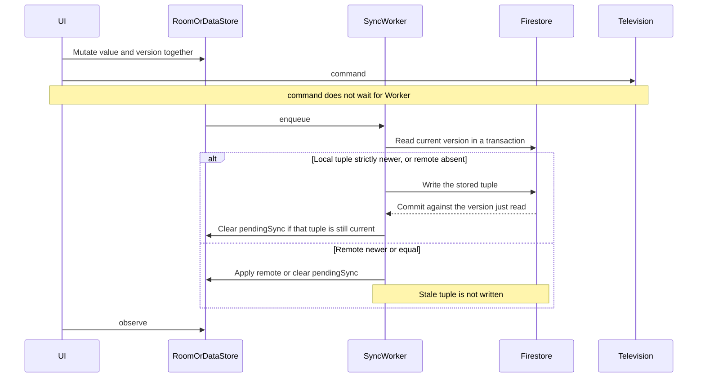

# Account and synchronization

Firebase Authentication and Cloud Firestore sync non-secret application data. They are not on the television-control path. Room and DataStore remain the stores screens read. Firestore persistence is disabled so the Firestore SDK cannot become a second local source of truth. V1 uses no Firestore snapshot listeners.

The sync worker reconciles in the background. Each record is compared with the current remote version before any write. There is no unconditional push, and no push-then-merge pass.

## Account switching

Pairing is device-local; synchronized personalization is account-scoped.

When a phone with a non-null `lastSyncedUid` authenticates a different Firebase uid, AppT does not merge the two accounts and does not silently switch synchronization context.

1. Pause synchronization before any read or write under the new uid.
2. Ask for explicit confirmation to switch accounts.
3. If the user cancels, sign out the newly authenticated uid and leave the existing account-scoped local state and all pairing material unchanged.
4. If the user confirms:
   - preserve Samsung pairing secrets, saved security identity, samsung-private device records, `lastOpenedTvId`, the permission-explanation state, `firstControlAchieved`, and the install `originDeviceId`;
   - remove the previous account's local `TvProfile`/favourite sync state, tombstones, and pending sync work **without emitting tombstones or writes to the new account**;
   - reset the three synchronized preferences to their product defaults without marking those resets pending;
   - set `lastSyncedUid` to the new uid;
   - perform a pull/reconcile for the new account before uploading any newly created account-scoped mutation.
5. The old account's friendly names, favourites, preference values, tombstones, and other synchronized metadata are never copied into the new account.

An account switch never calls `SamsungTvs.forget` and never deletes device-local pairing material.

A remembered locally paired television may therefore exist with no live `TvProfile` in the new account. It remains controllable. Until that account supplies metadata or the user creates new metadata, the UI uses a neutral `Samsung TV` label or a freshly discovered television-reported name. It must not display the previous account's custom friendly name or favourites.

If the cloud is unavailable after a confirmed switch, the new account context still applies locally and synchronization retries later. Previously paired local control remains independent of that retry.

## Cross-device deletion and local pairing

Pairing remains strictly local to each phone.

When the user explicitly forgets/removes a television on Phone A:

- Phone A records the synchronized non-secret television tombstone and removes related account-scoped favourites.
- Phone A explicitly calls `SamsungTvs.forget`, so Phone A's pairing material is deleted.
- The tombstone may synchronize to the user's other phones.

When that tombstone wins on Phone B:

- apply the non-secret deletion and remove/hide the deleted account-scoped friendly name and related favourites;
- do **not** call `forget`;
- do **not** delete Samsung pairing secrets, security identity, or samsung-private device records;
- Phone B remains capable of local control using its own independent pairing;
- if Phone B has pairing material but no live account metadata, show a neutral `Samsung TV` label or a freshly discovered television-reported name rather than the deleted friendly name.

Only an explicit local forget action on a phone removes that phone's pairing material. A cloud record cannot remotely unpair another phone.

If the user later creates account metadata again for that locally paired television, that is a new live record with a newer version tuple and follows the normal last-write-wins rules.

## Account gate

Sign-in methods: Google, via Android Credential Manager and Firebase `GoogleAuthProvider`, and email/password, including create, sign-in, and password-reset email. No other providers. No anonymous auth. No phone auth. Email verification is not an extra gate.

The gate reads the local Firebase user cache only. It does not wait for a network round trip before allowing control. Token refresh failure must not clear `currentUser` and must not sign the user out.

The first remote session has a specific account exemption.

When `app` enters the remote with `firstControlAchieved == false` and no Firebase user, the resulting `ActiveRemote` is the **first-session exemption**. The exemption belongs to that active remote session, not to the process or a navigation flag.

- The first `CommandResult.Accepted` sets `firstControlAchieved = true`.
- `Accepted` means the command was written to the live Samsung session. It does not mean the television visibly acted; the adopted channel does not acknowledge key execution. This is the architecture's observable proxy for the product's first successful local-control experience.
- Setting the flag does **not** interrupt the exempt remote session. The user may continue using that remote.
- Rotation, a share sheet, or another transient pause covered by the existing `ActiveRemote` grace window remains the same exempt session.
- When that `ActiveRemote` session closes, the exemption ends.
- The next attempt to enter/open a remote session requires a local Firebase user before `SamsungTvs.open` is called.
- A process death ends the active session; therefore the next remote entry after restart requires sign-in if `firstControlAchieved` is already true.
- There is no permanent skip.

| Condition | Effect |
|---|---|
| `firstControlAchieved` false and no user | Open the first-session-exempt remote. |
| Exempt remote has reached first `Accepted` | Keep that same remote usable until its `ActiveRemote` session ends. |
| Exempt session ended, `firstControlAchieved` true, `currentUser` null | Route to account; do not call `SamsungTvs.open`. |
| `currentUser` non-null, cloud unreachable | Allow remote entry. Sync may fail; local control does not wait. |
| Explicit sign-out | Do not destroy pairing material. A new remote entry requires sign-in; an already-open Samsung session is not made dependent on a cloud round trip. |
| Authenticated uid differs from `lastSyncedUid` | Run the explicit account-switch confirmation flow above before synchronization under that uid. |

The gate lives in `app`. `SamsungTvs.open` never checks Auth. This keeps account policy outside the deep Samsung module and keeps a Firebase outage out of the command path.

## Sync whitelist

The worker serializes `SyncRecord` only.

```kotlin
sealed interface SyncRecord {
    data class Tv(
        val tvId: String,
        val friendlyName: String,
        val correlatable: Boolean,
        val nameSource: String,
        val updatedAt: Long,
        val revision: Long,
        val deletedAt: Long?,
        val originDeviceId: String,
        val schema: Int,
    ) : SyncRecord

    data class Favourite(
        val id: String,
        val tvId: String,
        val kind: String,
        val target: String,
        val sortOrder: Int,
        val updatedAt: Long,
        val revision: Long,
        val deletedAt: Long?,
        val originDeviceId: String,
        val schema: Int,
    ) : SyncRecord

    data class Preference(
        val key: PreferenceKey,
        val value: PreferenceValue,
        val updatedAt: Long,
        val revision: Long,
        val deletedAt: Long?,
        val originDeviceId: String,
        val schema: Int,
    ) : SyncRecord
}

enum class PreferenceKey { HapticsEnabled, VolumeButtonsControlTv, NavigationMode }
```

`schema` is 1. A pulled record with any other schema is not applied. Local data is left as it is. A redacted diagnostic `sync.unknownSchema` is recorded.

Non-correlatable television rows are not uploaded and not created from a remote record the phone cannot match. Preferences and favourites for a television the phone does not have remain in Room but are hidden until that television is known locally, so a pull cannot invent a controllable card. Hiding those unsynced-until-known favourites is not the cross-device unpair decision.

`TvId` derived from the protocol UUID is the correlation key inside the user's private Firestore. It is how a friendly name attaches to the same television on another phone. It is not shown in the UI and is excluded from Crashlytics and export. MAC and IP are not the correlation key.

## Firestore shape

```text
users/{uid}/tvs/{tvId}
users/{uid}/favourites/{favouriteId}
users/{uid}/preferences/{preferenceKey}
```

No other collections. Hard delete is denied. Deletion is `deletedAt`. V1 does not garbage-collect tombstones; household volume is small. A purge job would be a later decision.

Clients write `updatedAt`, `revision`, and `deletedAt` as integers (millis, or null for `deletedAt`). They do not write Firestore `Timestamp` values. The worker, the merge comparison, and Security Rules share that representation.

Path versus fields: `tvId`, favourite `id`, and preference `key` are document paths. They are not duplicated as fields. `lastOpenedAt`, `pendingSync`, and `localUnpairPending` are not cloud fields. The worker maps between `SyncRecord` and that document shape.

## Conflict and deletion

Last committed write wins per small record. The whole record is replaced. Fields are not merged. Merging fields would resurrect a cleared name or a removed favourite.

The winning write is the strictly newer version tuple, not whichever client happens to push first. An unconditional push, or a push followed by a merge, is not this policy: a stale client would commit an older tuple and could overwrite a newer live record or resurrect a newer tombstone. Comparison happens before the write.

```text
higher updatedAt wins
higher revision wins ties
higher originDeviceId wins remaining ties
```

`originDeviceId` is a canonical lowercase UUID. Kotlin `compareTo` and Firestore rules string `>` agree on that alphabet. A tie on all three fields is equal, not a win for either side.

`updatedAt` is client millis taken when the user mutated the record, matching the accepted last-write-wins policy. Clock skew is a residual of that policy, not a reason to switch to a server-authoritative clock in this map. The worker must not replace that stored millis with a fresh timestamp at push time. Restamping would launder a stale mutation into a newer tuple.

Absence is not deletion. A fresh install must not push tombstones for ids it has never stored. Only an explicit local delete sets `deletedAt`, and that tuple is written with the delete, not invented later by the worker.

A tombstone does not outrank the tuple. A newer tombstone wins over an older live record. A newer live record wins over an older tombstone, which is the accepted rule if the user adds the television again. An older live record must not be able to commit over a newer tombstone.

### Compare before write

One Firestore transaction per record. Do not batch the whitelist. A batch has no per-document precondition, so a stale record could commit beside a fresh one.

```text
if lastSyncedUid != null and lastSyncedUid != current uid:
    stop synchronization and require the explicit account-switch flow
    // no cloud read/write occurs until the switch is confirmed or cancelled

for each stored whitelist record with pendingSync:
    compare-before-write that record

one-shot get of the three collections, not a snapshot listener:
    for each remote document:
        if local still has an unsettled pending tuple for that id:
            leave it for the next pass
        else if local row is absent or remote tuple is strictly newer:
            apply the remote non-secret record
            if it is a television tombstone:
                remove account-scoped TV metadata/favourites
                preserve device-local pairing and do not call forget

if the uid context is valid for this pass:
    store lastSyncedUid = current uid
```

A failed record write does not block `lastSyncedUid`. The uid is not in conflict. The record stays `pendingSync` and retries.

`compare-before-write` for one record:

```text
local = the persisted tuple
        // updatedAt, revision, originDeviceId, deletedAt, and payload
        // never stamped inside this function

transaction:
    remote = get(document)
    if the local record must not be uploaded:
        write nothing
    else if remote is absent:
        set(local tuple)                 // create
    else if local tuple is strictly newer:
        set(local tuple)                 // update
    else:
        write nothing                    // remote newer or equal

if the transaction retries because the document changed:
    compare again against the new remote version
    do not replay a tuple that lost

if rules deny the write:
    do not restamp
    re-read remote
    apply it only when it is strictly newer than the persisted local tuple
```

After the transaction:

- Re-read the local row.
- If a newer local mutation landed, leave `pendingSync` set and enqueue again. Do not clear it, and do not apply the remote tuple over that newer mutation.
- If the local tuple is still the one just compared and the local write committed, or the remote tuple won, or the tuples were equal: clear `pendingSync`.
- If the remote tuple won, apply that non-secret record in the same local transaction that clears `pendingSync`. A television tombstone removes account-scoped metadata but never deletes this phone's pairing material.

Records that must not be uploaded: a non-correlatable television. Clear its `pendingSync` without a cloud write so the worker does not retry it forever. Do not create a remote document for it.

A local tombstone is uploaded only when this client has that stored record and the compare says the local tuple may be written. A missing remote document is a create of the stored tuple, not a scan that turns every cloud id this phone lacks into a tombstone.

Security Rules repeat the same order. `allow update` requires the incoming tuple to be strictly newer than the committed remote tuple. A stale client that skips the transaction still cannot overwrite a newer live record or resurrect a newer tombstone. `allow create` applies only when the document is absent. Equal tuples are not updates.

## Worker

WorkManager unique work `appt-sync`, network connected, not expedited. Policy `KEEP`. The worker runs the compare-before-write pass, re-queries once before exit, and runs again if a mutation landed mid-flight. `app` enqueues it after a local whitelist mutation, after sign-in, and on foreground if signed in. Periodic unique work `appt-sync-periodic` every 6 hours while signed in, for the same reconciliation. Sign-out cancels both.

The worker does not run on the command path and does not take a session lock. Failure retries with WorkManager backoff. The remote UI does not show a sync error dialog. V1 has no sync-status surface.

The worker is not the author of a local mutation's version tuple. Room and DataStore write that tuple with the mutation. See [data.md](data.md). After a successful reconcile the worker may clear `pendingSync`, or replace a record with a winning remote tuple. It must not invent `updatedAt`, `revision`, or `originDeviceId` for a mutation it is uploading.

Firebase App Check with Play Integrity is required for production Firestore access. Debug builds use the debug provider. App Check failure is a sync failure. It is not a television failure.

## Security Rules

Implement this ruleset. It is the V1 contract. `strictlyNewer` is the same order as the worker: higher `updatedAt`, then higher `revision`, then higher `originDeviceId`.

```text
rules_version = '2';
service cloud.firestore {
  match /databases/{database}/documents {
    function owns(uid) {
      return request.auth != null && request.auth.uid == uid;
    }
    function noSecrets() {
      return !request.resource.data.keys().hasAny([
        'token', 'pairingToken', 'secret', 'pin', 'password', 'certificate',
        'spki', 'mac', 'wifiMac', 'ip', 'address', 'host', 'ssid', 'wifi',
        'command', 'commandText', 'text'
      ]);
    }
    function metaOk() {
      return request.resource.data.schema == 1
        && request.resource.data.updatedAt is int
        && request.resource.data.revision is int
        && request.resource.data.originDeviceId is string
        && request.resource.data.originDeviceId.matches('^[0-9a-f]{8}-[0-9a-f]{4}-[0-9a-f]{4}-[0-9a-f]{4}-[0-9a-f]{12}$')
        && (request.resource.data.deletedAt == null
            || request.resource.data.deletedAt is int);
    }
    function strictlyNewer() {
      return request.resource.data.updatedAt > resource.data.updatedAt
        || (request.resource.data.updatedAt == resource.data.updatedAt
            && request.resource.data.revision > resource.data.revision)
        || (request.resource.data.updatedAt == resource.data.updatedAt
            && request.resource.data.revision == resource.data.revision
            && request.resource.data.originDeviceId > resource.data.originDeviceId);
    }
    function tvFields() {
      return request.resource.data.keys().hasOnly([
          'friendlyName', 'correlatable', 'nameSource', 'updatedAt', 'revision',
          'deletedAt', 'originDeviceId', 'schema'
        ])
        && request.resource.data.friendlyName is string
        && request.resource.data.friendlyName.size() > 0
        && request.resource.data.friendlyName.size() <= 40
        && request.resource.data.correlatable is bool
        && request.resource.data.nameSource in ['USER', 'TV'];
    }
    function favouriteFields() {
      return request.resource.data.keys().hasOnly([
          'tvId', 'kind', 'target', 'sortOrder', 'updatedAt', 'revision',
          'deletedAt', 'originDeviceId', 'schema'
        ])
        && request.resource.data.tvId is string
        && request.resource.data.kind in ['APP', 'CONTROL']
        && request.resource.data.target is string
        && request.resource.data.target.size() > 0
        && request.resource.data.target.size() <= 128
        && request.resource.data.sortOrder is int;
    }
    function preferenceFields(key) {
      return key in ['HapticsEnabled', 'VolumeButtonsControlTv', 'NavigationMode']
        && request.resource.data.keys().hasOnly([
          'value', 'updatedAt', 'revision', 'deletedAt', 'originDeviceId', 'schema'
        ])
        && (
          (key in ['HapticsEnabled', 'VolumeButtonsControlTv']
            && request.resource.data.value is bool)
          || (key == 'NavigationMode'
            && request.resource.data.value in ['Directional', 'Pointer'])
        );
    }
    match /users/{uid}/tvs/{tvId} {
      allow read: if owns(uid);
      allow create: if owns(uid) && noSecrets() && metaOk() && tvFields();
      allow update: if owns(uid) && noSecrets() && metaOk() && tvFields()
        && strictlyNewer();
      allow delete: if false;
    }
    match /users/{uid}/favourites/{id} {
      allow read: if owns(uid);
      allow create: if owns(uid) && noSecrets() && metaOk() && favouriteFields();
      allow update: if owns(uid) && noSecrets() && metaOk() && favouriteFields()
        && strictlyNewer();
      allow delete: if false;
    }
    match /users/{uid}/preferences/{key} {
      allow read: if owns(uid);
      allow create: if owns(uid) && noSecrets() && metaOk() && preferenceFields(key);
      allow update: if owns(uid) && noSecrets() && metaOk() && preferenceFields(key)
        && strictlyNewer();
      allow delete: if false;
    }
    match /{document=**} {
      allow read, write: if false;
    }
  }
}
```

Rules tests are part of the sync slice. A write containing `token` is denied. A cross-user read is denied. A hard delete is denied. An update that is not strictly newer is denied, including an older live record against a newer tombstone and an older tombstone against a newer live record. A create of an absent document is allowed. A non-UUID `originDeviceId` is denied. Those tests use the Firestore rules emulator. They are the contract for `strictlyNewer`, not a substitute for the worker tests.

## Multi-phone

Each phone stores its own pairing secret and opens its own session. Sync shares names, favourites, and the three preferences. Phone B can show "Lounge" before it has paired, and cannot command until local approval succeeds. The card state is needs-pairing, not a dead remote that still sends keys.

Phone A offline keeps commanding. Mutations stay in Room or DataStore with `pendingSync` and the tuple written at mutation time. When the network returns, the worker compares each pending record with the current remote version before writing. Firestore downtime does not close Phone A's session.

A delete on Phone A tombstones the non-secret record and may locally unpair Phone A when the user chose the explicit local forget action. Phone B stores the winning tombstone, removes the account-scoped name/favourites, and retains its own pairing secret. Phone B can continue local control under a neutral or freshly discovered name until new account metadata is created.

## Account and sync lifecycle



`ExemptRemote` is the first remote session after the first `Accepted`. It remains usable until that active session ends. `NeedAccount` is enforced on the next remote entry. Account switching never merges the previous account's synchronized metadata into the new account.



## Client configuration

Commit the Firebase Android client config. Treat the API key as a restricted client key (package name and signing certificate), not as a service-account secret. Service-account private keys and Play upload keys stay in the CI secret store, not in git. See [release.md](release.md).
