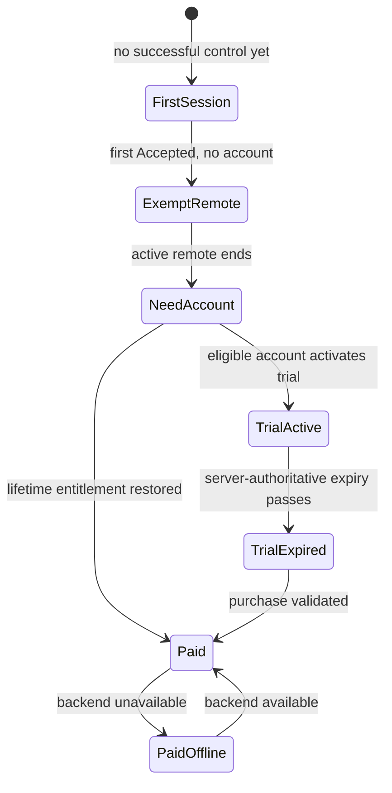

# Account, trial, and entitlement

This file replaces the previous TV-personalization sync design.

AppT does **not** synchronize televisions, favourites, remote layouts, preferences, last-used television, pairing state, pairing secrets, diagnostics, or usage history through the customer account.

The customer-account/backend purpose is deliberately narrow: authenticate the customer, hold the chosen username, determine seven-day trial eligibility/expiry, and prove the lifetime AppT license.

## Product separation

Three kinds of state must not be conflated:

| State | Owner | Cloud? |
|---|---|---|
| Customer identity, username, trial state, lifetime entitlement | AppT customer account | Yes, minimum necessary |
| TV pairing/security identity | This phone | Never |
| TV names, favourites, remote arrangement, preferences, last-used TV | This phone | Never |

Signing out, switching accounts, deleting an account, restoring a license on another phone, or losing backend connectivity does not merge, upload, replace, or delete the phone's local TV state.

## Authentication

Primary path: Google sign-in through Android Credential Manager and Firebase Authentication.

Fallback: email/password. The fallback email must be verified before the account can activate a free trial.

Google sign-in creates or signs into the AppT customer identity without a separate registration form. A Google display name may be offered as the initial username, but the username is editable and need not be globally unique. It is display data only, not a login identifier or public handle. AppT does not copy profile photos, contacts, birthday, or unrelated Google profile fields into its account data.

## First control and account gate

The first successful local-control session is available without an AppT account.

`firstControlAchieved` becomes true on the first `CommandResult.Accepted`. `Accepted` remains a socket-write proxy; it is not a TV acknowledgement.

That first success does not interrupt the active remote session.

When that `ActiveRemote` session ends, the next remote entry requires an AppT account.

If the account is trial-eligible, activating the account begins the seven-day trial. If the customer already has a lifetime entitlement, the account restores it instead.

## Seven-day trial

The trial duration is seven days from a server-authoritative start timestamp.

A trial customer's local remote may continue offline while the locally known trial expiry is still in the future.

When the known trial expiry has passed:

- do not interrupt a remote session that is already active;
- the next remote entry requires an online entitlement check;
- if no lifetime entitlement exists, present the one-time purchase path;
- a backend outage must not be misrepresented as a TV failure.

Creating another account or reinstalling AppT does not grant another trial when the same verified email identity or recognized Android device has already consumed one. One recognized Android device receives one AppT trial total unless support explicitly clears the pseudonymous abuse marker for a legitimate exceptional case such as a second-hand device. V1 does not require Play Integrity Device Recall.

## Trial anti-abuse and privacy

Trial-abuse prevention is entitlement infrastructure, not analytics.

The entitlement backend may use pseudonymous eligibility markers derived with a server-side keyed transform from:

- normalized verified email identity;
- Android `ANDROID_ID` for this app/device context;
- a random AppT install identifier.

Do not use television identifiers, LAN addresses, TV names, remote commands, favourites, preferences, or behavioral event history for trial eligibility.

Do not expose raw anti-abuse source identifiers as general profile fields.

Play Integrity may be evaluated at trial activation and purchase/restore validation to establish app/device authenticity and abuse risk. It is not a tracking identifier and is not retained as behavioral history.

Pseudonymous email/device trial-used markers may survive ordinary account deletion for as long as the free-trial program exists. They must not contain username, raw email, television data, personalization, diagnostics, or behavioral history. Key rotation and the exact backend record shape remain technical architecture work.

## Lifetime entitlement

Android V1 uses a Google Play one-time non-consumable product.

A purchase does not become a lifetime AppT entitlement merely because the client reports success. Authoritative purchase validation is required before granting the account entitlement.

Once a lifetime entitlement has been validated and cached on the phone:

- paired-TV control remains available offline indefinitely;
- AppT does not require periodic server revalidation to keep paid local control functioning;
- signing out does not erase TV pairing or local personalization;
- signing back into the entitled account restores the account entitlement on another supported Android device.

Network failure never removes a previously validated entitlement. If the backend later obtains an explicit authoritative refunded/revoked purchase result while online, apply that revocation on the next remote entry; do not interrupt an already active remote.

V1 has no paid-device registry or fixed device cap. Any supported Android device legitimately signed into the entitled customer account may restore the entitlement.

The exact server validation service, durable entitlement record, local signed/cache representation, authoritative purchase-to-account binding, and environment/deployment topology remain unresolved technical architecture work. Do not delegate those choices to implementation.

Future iOS may map a platform purchase to the same conceptual lifetime entitlement, but Android purchase portability to iOS is not promised by V1.

## Account switching

Changing the signed-in AppT account changes only account identity, username, trial/license state, and entitlement UI.

It does not clear or replace Room TV data, DataStore remote preferences, Samsung-private device records, or pairing secrets.

There is no account-data merge because television/personalization data does not belong to either account.

## Account deletion

Deleting the AppT account permanently removes ordinary account-held username/trial/license profile records, subject to transaction/legal retention requirements that must be documented in the backend/privacy architecture. The minimum pseudonymous trial-used markers may remain under the trial-abuse rule above.

Device-local TV pairing and local personalization remain on the phone.

The user may separately choose **Forget this TV** to remove one phone's local pairing, or clear AppT's local storage through platform/app controls.

If account deletion occurs while a local remote session is already active, do not make the command path depend on the deletion network request. After that active session ends, normal account/trial/license gating applies.

Deleting an AppT account does not erase a Google Play purchase. A legitimate purchaser may later use Restore Purchase after recreating/signing into the appropriate AppT identity, subject to authoritative purchase validation.

## Multi-phone behavior

A second phone signed into the same account receives only the account identity/username and license entitlement.

It does not receive:

- remembered TVs;
- friendly TV names;
- favourites;
- remote arrangement;
- remote preferences;
- last-used TV;
- pairing/security material.

That phone discovers, pairs, names, and customizes TVs independently.

## Account and entitlement lifecycle

`PaidOffline` is not a degraded TV-control state. It means account infrastructure is unavailable while the already validated lifetime entitlement continues to permit local control.

## Architecture work still open

Before this map is implementation-ready, resolve and record:

- entitlement backend/service and datastore shape;
- authoritative Google Play purchase validation and restore flow;
- local offline entitlement representation and tamper model;
- purchase-to-account binding and restore identity after account deletion;
- anti-abuse keyed-identifier rotation;
- dev/test/production backend and Firebase/Play environment separation;
- account deletion retention requirements;
- threat model and trust boundaries for account/licensing infrastructure;
- presentation state/navigation for account, trial countdown/expiry, purchase, restore, offline paid use, and backend failure.

No implementation slice may recreate the removed TV-personalization sync model.
