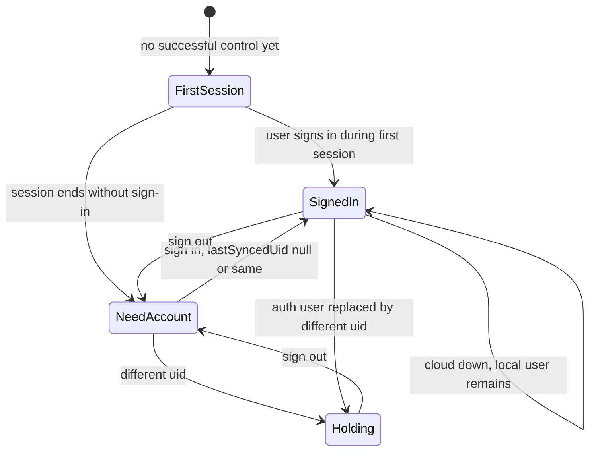
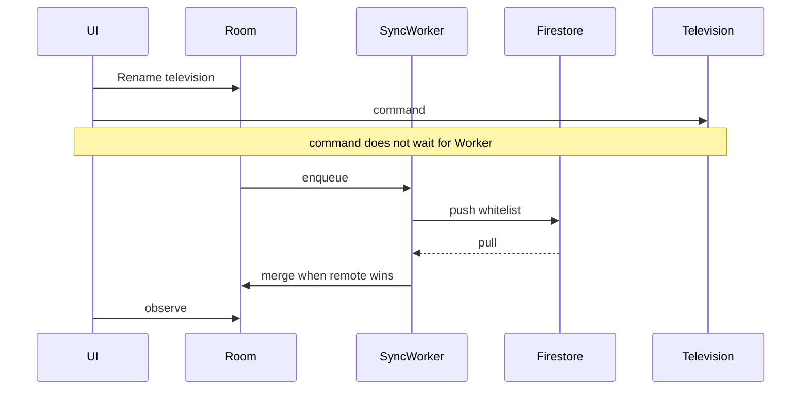

# Account and synchronization

Firebase Authentication and Cloud Firestore sync non-secret application data. They are not on the television-control path. Room and DataStore remain the stores screens read. Firestore persistence is disabled so the Firestore SDK cannot become a second local source of truth. V1 uses no Firestore snapshot listeners. Pull and push happen in the sync worker.

## Unresolved decision — different account

This is a material product decision. This map does not choose it.

**Decision needed:** When this phone already has a `lastSyncedUid`, and the user authenticates a Firebase uid that is different, what should happen to local television names, favourites, preferences, and device-local pairing material?

Do not assume merge into the new account, replace local data with the new account's cloud data, two profiles on one phone, wipe of non-secret data, or wipe of pairing secrets.

**Holding behavior until that decision exists:**

- Do not upload local records to the new uid.
- Do not download that uid's records over local data.
- Do not delete pairing secrets.
- Do not offer a merge or replace action.
- A session already open may finish. Do not drop it because a conflicting sign-in started.
- If the user is at the account gate, show a holding screen whose meaning is that switching accounts is not available and nothing was changed. The only account action on that screen is sign-out, so the user is not trapped.
- Stop further account-switch work.

Same-uid sign-in and first sign-in (`lastSyncedUid` null) are specified below and are not blocked.

## Account gate

Sign-in methods: Google, via Android Credential Manager and Firebase `GoogleAuthProvider`, and email/password, including create, sign-in, and password-reset email. No other providers. No anonymous auth. No phone auth. Email verification is not an extra gate.

The gate reads the local Firebase user cache only. It does not wait for a network round trip before allowing control. Token refresh failure must not clear `currentUser` and must not sign the user out.

| Condition | Remote |
|---|---|
| `firstControlAchieved` is false | Allowed. This is the first session. |
| First session already in progress, sign-in not finished | Allowed until that session ends. No permanent skip. |
| Next entry after first success, `currentUser` null | Blocked on the account screen. Secrets remain. |
| `currentUser` non-null, cloud unreachable | Allowed. Sync may fail. Session does not wait. |
| Explicit sign-out | Account screen again. Secrets and Room remain so sign-in restores control without re-pairing. |
| Different uid from `lastSyncedUid` | Holding behavior above. |

"Not now" exists only inside the first successful session. The next cold start requires sign-in. There is no control that permanently dismisses the account requirement.

The gate lives in `app`. `SamsungTvs.open` does not check Auth. That split is what keeps a Firebase outage from being enforceable inside the television module. `app` simply does not call `open` when the gate is closed, except for the first session.

`firstControlAchieved` becomes true when a command first returns `Accepted`.

## Sync whitelist

The worker serializes `SyncRecord` only.

```kotlin
sealed interface SyncRecord {
    data class Tv(
        val tvId: String,
        val friendlyName: String,
        val correlatable: Boolean,
        val nameSource: String,
        val updatedAt: Long,
        val revision: Long,
        val deletedAt: Long?,
        val originDeviceId: String,
        val schema: Int,
    ) : SyncRecord

    data class Favourite(
        val id: String,
        val tvId: String,
        val kind: String,
        val target: String,
        val sortOrder: Int,
        val updatedAt: Long,
        val revision: Long,
        val deletedAt: Long?,
        val originDeviceId: String,
        val schema: Int,
    ) : SyncRecord

    data class Preference(
        val key: PreferenceKey,
        val value: PreferenceValue,
        val updatedAt: Long,
        val revision: Long,
        val deletedAt: Long?,
        val originDeviceId: String,
        val schema: Int,
    ) : SyncRecord
}

enum class PreferenceKey { HapticsEnabled, VolumeButtonsControlTv, NavigationMode }
```

`schema` is 1. A pulled record with any other schema is not applied. Local data is left as it is. A redacted diagnostic `sync.unknownSchema` is recorded.

Non-correlatable television rows are not uploaded and not created from a remote record the phone cannot match. Preferences and favourites for a television the phone does not have remain in Room but are hidden until that television is known locally, so a pull cannot invent a controllable card.

`TvId` derived from the protocol UUID is the correlation key inside the user's private Firestore. It is how a friendly name attaches to the same television on another phone. It is not shown in the UI and is excluded from Crashlytics and export. MAC and IP are not the correlation key.

## Firestore shape

```text
users/{uid}/tvs/{tvId}
users/{uid}/favourites/{favouriteId}
users/{uid}/preferences/{preferenceKey}
```

No other collections. Hard delete is denied. Deletion is `deletedAt`. V1 does not garbage-collect tombstones; household volume is small. A purge job would be a later decision.

Clients write `updatedAt`, `revision`, and `deletedAt` as integers (millis, or null for `deletedAt`). They do not write Firestore `Timestamp` values. Merge and rules then share one representation.

Path versus fields: `tvId`, favourite `id`, and preference `key` are document paths. They are not duplicated as fields. `lastOpenedAt` and `pendingSync` are not cloud fields. The worker maps between `SyncRecord` and that document shape.

## Conflict and deletion

Last committed write wins per small record. The whole record is replaced. Fields are not merged. Merging fields would resurrect a cleared name or a removed favourite.

```text
remote.updatedAt > local.updatedAt -> remote
remote.updatedAt < local.updatedAt -> local
higher revision wins ties
higher originDeviceId lexicographically wins remaining ties
```

`updatedAt` is client millis, matching the accepted last-write-wins policy. Clock skew is a residual of that policy, not a reason to switch to a server-authoritative clock in this map.

Absence is not deletion. A fresh install must not push tombstones for ids it has never stored. Only an explicit local delete sets `deletedAt`.

Apply algorithm:

```text
if lastSyncedUid == null and local whitelist is empty:
    pull only, then store lastSyncedUid
else if lastSyncedUid == null and local whitelist has records:
    push local, pull, merge, store lastSyncedUid
else if lastSyncedUid == current uid:
    push pending, pull, merge
else:
    holding behavior, stop
```

Empty means no television, favourite, or preference records, including tombstones.

When a remote television tombstone wins, `app` calls `forget(tvId)` so the paired phone does not keep a secret for a television the account deleted. The other phone's secrets are its own and are untouched, because they were never in Firestore. That phone drops the name on its next pull and `forget`s its own secret when the tombstone wins there.

A deleted record must not be recreated by an older snapshot. Tombstone wins over an older live record. A newer live record wins over an older tombstone, which is the accepted last-write-wins rule if the user adds the television again.

## Worker

WorkManager unique work `appt-sync`, network connected, not expedited. Policy `KEEP`. The worker drains every `pendingSync` row, re-queries once before exit, and runs again if a mutation landed mid-flight. `app` enqueues it after a local whitelist mutation, after sign-in, and on foreground if signed in. Periodic unique work `appt-sync-periodic` every 6 hours while signed in, for reconciliation. Sign-out cancels both.

The worker does not run on the command path and does not take a session lock. Failure retries with WorkManager backoff. The remote UI does not show a sync error dialog. V1 has no sync-status surface.

Firebase App Check with Play Integrity is required for production Firestore access. Debug builds use the debug provider. App Check failure is a sync failure. It is not a television failure.

## Security Rules

Implement this ruleset. It is the V1 contract.

```text
rules_version = '2';
service cloud.firestore {
  match /databases/{database}/documents {
    function owns(uid) {
      return request.auth != null && request.auth.uid == uid;
    }
    function noSecrets() {
      return !request.resource.data.keys().hasAny([
        'token', 'pairingToken', 'secret', 'pin', 'password', 'certificate',
        'spki', 'mac', 'wifiMac', 'ip', 'address', 'host', 'ssid', 'wifi',
        'command', 'commandText', 'text'
      ]);
    }
    function metaOk() {
      return request.resource.data.schema == 1
        && request.resource.data.updatedAt is int
        && request.resource.data.revision is int
        && request.resource.data.originDeviceId is string
        && request.resource.data.originDeviceId.size() > 0
        && request.resource.data.originDeviceId.size() <= 80
        && (request.resource.data.deletedAt == null
            || request.resource.data.deletedAt is int);
    }
    match /users/{uid}/tvs/{tvId} {
      allow read: if owns(uid);
      allow create, update: if owns(uid)
        && noSecrets()
        && metaOk()
        && request.resource.data.keys().hasOnly([
          'friendlyName', 'correlatable', 'nameSource', 'updatedAt', 'revision',
          'deletedAt', 'originDeviceId', 'schema'
        ])
        && request.resource.data.friendlyName is string
        && request.resource.data.friendlyName.size() > 0
        && request.resource.data.friendlyName.size() <= 40
        && request.resource.data.correlatable is bool
        && request.resource.data.nameSource in ['USER', 'TV'];
      allow delete: if false;
    }
    match /users/{uid}/favourites/{id} {
      allow read: if owns(uid);
      allow create, update: if owns(uid)
        && noSecrets()
        && metaOk()
        && request.resource.data.keys().hasOnly([
          'tvId', 'kind', 'target', 'sortOrder', 'updatedAt', 'revision',
          'deletedAt', 'originDeviceId', 'schema'
        ])
        && request.resource.data.tvId is string
        && request.resource.data.kind in ['APP', 'CONTROL']
        && request.resource.data.target is string
        && request.resource.data.target.size() > 0
        && request.resource.data.target.size() <= 128
        && request.resource.data.sortOrder is int;
      allow delete: if false;
    }
    match /users/{uid}/preferences/{key} {
      allow read: if owns(uid);
      allow create, update: if owns(uid)
        && noSecrets()
        && metaOk()
        && key in ['HapticsEnabled', 'VolumeButtonsControlTv', 'NavigationMode']
        && request.resource.data.keys().hasOnly([
          'value', 'updatedAt', 'revision', 'deletedAt', 'originDeviceId', 'schema'
        ])
        && (
          (key in ['HapticsEnabled', 'VolumeButtonsControlTv']
            && request.resource.data.value is bool)
          || (key == 'NavigationMode'
            && request.resource.data.value in ['Directional', 'Pointer'])
        );
      allow delete: if false;
    }
    match /{document=**} {
      allow read, write: if false;
    }
  }
}
```

Rules tests are part of the sync slice. A write containing `token` is denied. A cross-user read is denied. A hard delete is denied.

## Multi-phone

Each phone stores its own pairing secret and opens its own session. Sync shares names, favourites, and the three preferences. Phone B can show "Lounge" before it has paired, and cannot command until local approval succeeds. The card state is needs-pairing, not a dead remote that still sends keys.

Phone A offline keeps commanding. Mutations stay in Room with `pendingSync`. When the network returns, the worker drains them. Firestore downtime does not close Phone A's session.

## Account and sync lifecycle





## Client configuration

Commit the Firebase Android client config. Treat the API key as a restricted client key (package name and signing certificate), not as a service-account secret. Service-account private keys and Play upload keys stay in the CI secret store, not in git. See [release.md](release.md).
