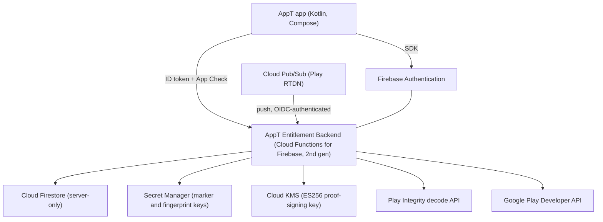
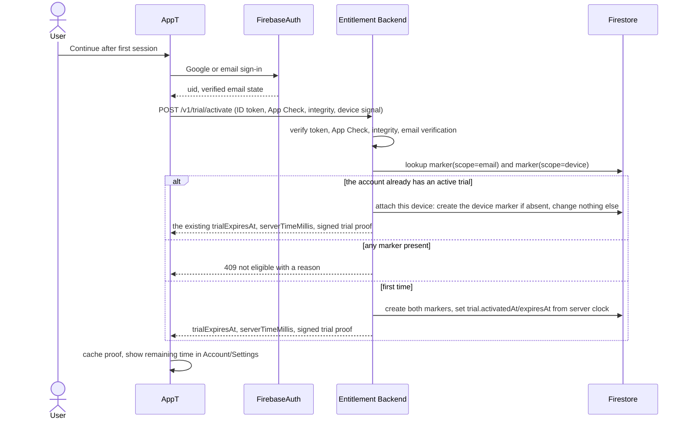
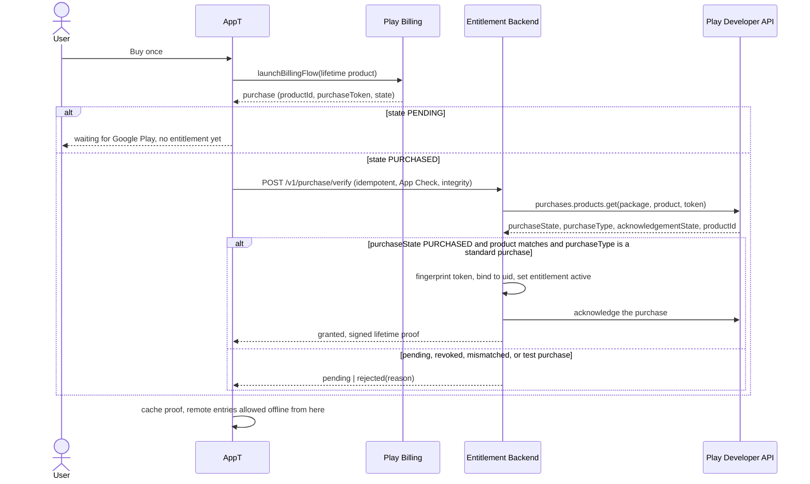
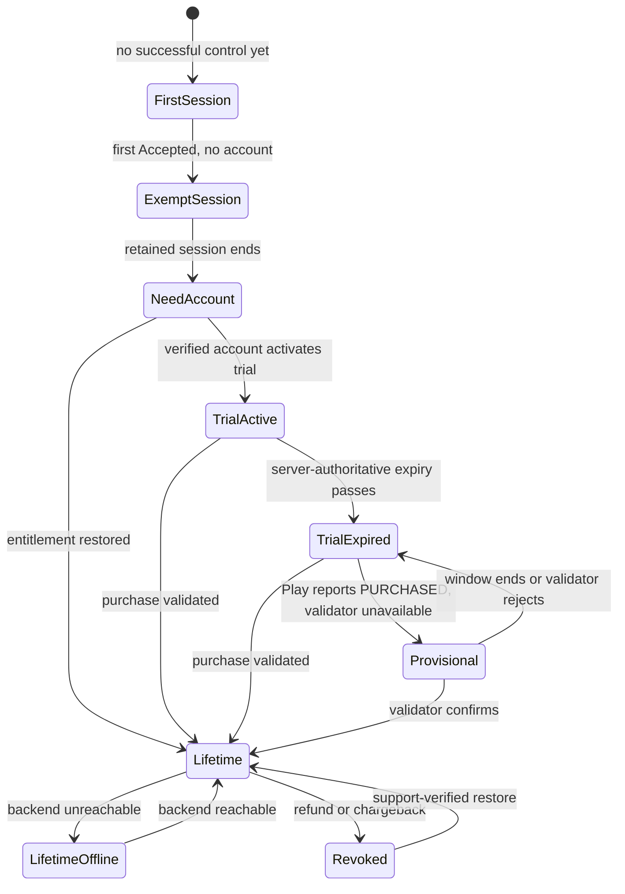

# Customer account, trial, and entitlement

This file owns the technical architecture for the Customer Account, the seven-day Trial, the Google Play lifetime unlock, and the Lifetime Entitlement.

**File name is historical.** It once owned a Firestore TV-personalization sync design. That design is superseded and removed. The name is kept so links, review history, and the Issue's verification steps stay valid; the content is account and licensing only.

AppT does **not** synchronize televisions, favourites, remote layouts, preferences, last-used television, pairing state, pairing secrets, diagnostics, or usage history through the customer account. There is no AppT cloud synchronization of television data at all.

## State separation

| State | Owner | Cloud? |
|---|---|---|
| Customer identity, Username, Trial state, Lifetime Entitlement | AppT Customer Account | Yes, minimum necessary |
| TV pairing and security identity | This phone (`samsung`) | Never |
| TV names, favourites, remote arrangement, Interaction Preferences, last-used TV | This phone | Never |
| Play transaction ownership | Google Play | Google's, not AppT's |

Signing out, switching accounts, deleting an account, restoring a licence on another phone, or losing connectivity never merges, uploads, replaces, or deletes the phone's local TV state.

## Authentication

- **Firebase Authentication** is the identity provider. `AccountAuth` is the app-level seam; `FirebaseAuth` never appears in a ViewModel.
- **Google sign-in** through Android Credential Manager is primary. Credential Manager returns an ID token; Firebase Auth exchanges it. The provider-verified email and display name are the only identity facts AppT reads.
- **Email/password** is the fallback. The account must complete email verification before it can activate a trial or receive a Trial proof.
- **Username** is an editable, non-unique display name, 1–32 characters after trimming, stored server-side, and writable only through the backend. It is not a login identifier, not a public handle, and not indexed for lookup.
- AppT copies no profile photos, contacts, birthday, or unrelated Google profile fields.
- Auth errors never silently clear a cached identity. A revoked or expired token triggers a refresh; a failed refresh leaves the cached identity in place and marks backend status unreachable.

## Backend topology

Chosen inside the already-accepted Firebase direction, with the data-minimizing shape the privacy model requires:



| Component | Role | Notes |
|---|---|---|
| Firebase Authentication | Identity, email verification, account deletion | Holds the raw email. The backend stores no second copy |
| Cloud Functions for Firebase, 2nd gen | The entire entitlement API | Stateless functions; each request authenticated and authorized |
| Cloud Firestore | Durable account, marker, and purchase-binding records | **Server-only.** Client SDK is not in the Android dependency graph; security rules deny all client reads and writes |
| Secret Manager | HMAC keys for eligibility markers and purchase fingerprints | Versioned; never leaves the backend |
| Cloud KMS | Non-exportable ES256 key that signs entitlement proofs | Public keys exposed through `GET /v1/keys` for offline verification |
| Play Integrity decode API | Server-side verdicts for trial and purchase decisions | Provider fact; see needs validation |
| Scheduled reconciliation | Daily Cloud Scheduler job that finalises deletions which stopped after the Auth user was removed, releasing frozen bindings only once Firebase Auth confirms the user is gone | Backend-only; the Android client never triggers or observes it directly |
| Google Play Developer API | Authoritative purchase verification and acknowledgement | Service account with the narrow publisher scope |
| Cloud Pub/Sub + RTDN | Refund, chargeback, and cancellation signals | One Play-managed topic per Play app; at-least-once, unordered |

Deliberate consequences:

- The Android client has no Firestore dependency, so there is no client-side path to read or write account or TV data. Removing the client SDK also removes the temptation the removed sync design created.
- All account writes go through validated endpoints, so a modified client cannot set trial dates, entitlement state, or another user's fields.
- The backend never holds a television identity, name, favourite, layout, preference, diagnostic, or usage record, and never has a field for one.

## Client seams

`app` owns the licensing modules. `samsung` never reads Auth, billing, trial, or entitlement state, and the command path never touches the backend.

```kotlin
interface AccountAuth {
    val identity: StateFlow<AccountIdentity?>          // uid plus verified-email state; no email exposed to UI beyond the account surface
    suspend fun signInWithGoogle(credential: GoogleCredential): SignInResult
    suspend fun signInWithEmail(email: String, password: String): SignInResult
    suspend fun registerWithEmail(email: String, password: String): SignInResult
    suspend fun verifyEmailReload(): Boolean
    suspend fun sendPasswordReset(email: String): Result<Unit>
    suspend fun signOut()
    suspend fun freshIdToken(): String?
}

interface Licensing {
    val state: StateFlow<LicensingSnapshot>
    suspend fun onSignedIn()                             // fetch entitlement, cache proof
    suspend fun activateTrial(): TrialActivation
    suspend fun verifyPurchase(purchase: PlayPurchase): PurchaseOutcome
    suspend fun restorePurchase(): PurchaseOutcome
    suspend fun refresh(): RefreshOutcome
    suspend fun username(newValue: String): Result<Unit>
    suspend fun deleteAccount(): DeleteOutcome
}

interface EntitlementBackend {                           // HTTPS + OkHttp + kotlinx-serialization
    suspend fun activateTrial(request: TrialRequest): TrialResponse
    suspend fun refresh(request: RefreshRequest): RefreshResponse
    suspend fun verifyPurchase(request: VerifyRequest): VerifyResponse
    suspend fun putUsername(value: String): Unit
    suspend fun deleteAccount(): DeleteResponse
    suspend fun keys(): KeySetResponse
}

interface PlayBilling {                                  // Play Billing library
    suspend fun buyLifetime(): PlayPurchaseOutcome
    suspend fun unacknowledgedPurchases(): List<PlayPurchase>
    suspend fun acknowledge(purchase: PlayPurchase): Boolean
}

interface IntegrityProvider {                            // Play Integrity + App Check tokens
    suspend fun requestToken(nonce: String): IntegrityTokenOutcome
}
```

`Licensing` is the only module `AccountGate` and the account surfaces talk to. It owns the local entitlement cache, the proof verifier, the time model, the provisional record, retry policy, and the backend client. `EntitlementBackend`, `PlayBilling`, and `IntegrityProvider` are internal seams used by tests, not caller-facing APIs for screens.

`Licensing` exposes presentation-ready state so no surface re-derives entitlement meaning:

```kotlin
data class LicensingSnapshot(
    val account: AccountIdentity?,
    val access: AccessState,                 // Unknown | TrialActive(expiresAt) | TrialExpired | Lifetime | Provisional(expiresAt) | Revoked
    val trial: TrialPresentation?,           // exact remaining time, for low-pressure display only
    val purchase: PurchaseUiState,           // Idle | Pending | Verifying | Failed(reason)
    val backend: BackendStatus,              // Checking | Fresh(at) | Stale(at) | Unreachable(reason)
)
```

## Backend API surface

All endpoints require a Firebase ID token. All require an App Check token. The uid always comes from the verified token, never from a body field. App Check tokens are minted by the registration that matches the build's signing certificate, which is why production, internal, and debug builds are registered separately in [release.md](release.md#signing-identity-and-distribution-channel); the backend side of enforcement is identical in `internal` and `production`.

| Endpoint | Purpose | Request | Success response | Failure responses |
|---|---|---|---|---|
| `POST /v1/trial/activate` | Server-authoritative trial start and eligibility | `{playIntegrityToken, deviceSignal, appVersion}` | `{eligible:true, trialExpiresAt, serverTimeMillis, proof}` | `409 {eligible:false, reason: email_marker \| device_marker \| unverified_email}`, `403 integrity`, `503 unavailable` |
| `POST /v1/entitlement/refresh` | Current access state plus a fresh proof, and idempotent trial participation marking | `{deviceSignal, appVersion}` | `{access:{kind:none\|trial\|lifetime, expiresAt, revokedAt}, trialAttached:bool, proof, serverTimeMillis}` | `401`, `403`, `503` |
| `POST /v1/purchase/verify` | Authoritative purchase verification, binding, and restore | `{packageName, productId, purchaseToken, playIntegrityToken, source: "app"\|"restore"}` | `{result:"granted", proof, serverTimeMillis}` | `{result:"pending"}`, `{result:"bound_elsewhere"}`, `409 {result:"rejected", reason: not_purchased\|test_purchase\|already_revoked\|package_mismatch\|product_mismatch}`, `503` |
| `POST /v1/username` | Set or change the Username | `{username}` | `{username, updatedAt}` | `400 invalid_username` |
| `POST /v1/account/delete` | Resumable account deletion: freeze bindings, delete the Auth user, release bindings, report what was retained | — | `{state:"completed", retained:[trial_marker, purchase_binding]}` or `{state:"auth_delete_pending", retryable:true}` | `401`, `503` |
| `GET /v1/keys` | Public key set for offline proof verification | — | JWKS-shaped `{keys:[{kid, kty, crv, x, y, alg:ES256, use:sig}]}` | `503` |

Rules that hold for every endpoint:

- Validation happens before any write: package name, product id, field shapes, lengths, and enum membership.
- Requests are idempotent by construction: trial activation returns the existing trial, entitlement refresh re-attaches an already-marked device without changing anything, purchase verification returns the existing binding, and account deletion resumes from whichever phase it reached and is a no-op when already deleted.
- Responses never echo a raw purchase token, an email, a device signal, or another user's data.
- Errors are typed and non-enumerating: they never reveal whether a given email or device has an AppT account.
- No endpoint accepts a television, preference, diagnostic, or usage field. Unknown body fields are rejected rather than ignored.

## Backend source architecture

| Aspect | Decision |
|---|---|
| Runtime | Cloud Functions for Firebase, 2nd gen, on the Node.js LTS runtime |
| Language | TypeScript, compiled at deploy; one language for the whole service |
| Location | `backend/` at the repository root, sibling to the Android modules and outside both |
| Package layout | `backend/src/handlers/` (one file per endpoint), `backend/src/domain/` (trial, binding, deletion, proof rules with no provider types), `backend/src/adapters/` (Play Developer API, integrity decoder, marker keys, KMS signer, Firestore access), `backend/src/http/` (auth, App Check, validation, error mapping) |
| Rules and indexes | `backend/firestore.rules` and `backend/firestore.indexes.json`, deployed as versioned artifacts |
| Toolchain ownership | `backend/package.json` plus a committed `package-lock.json`; ESLint and Prettier configuration in `backend/`; `npm ci --prefix backend` only, never an unlocked install |
| Commands | Always package-prefixed and run from the repository root: `npm ci --prefix backend`, `npm run typecheck --prefix backend`, `npm run lint --prefix backend`, `npm test --prefix backend`, `npm run test:emulator --prefix backend`, `npm run deploy --prefix backend`. The Firebase CLI is a `backend/` devDependency, so the emulator and deploy scripts are invoked through that package |
| Test organization | `backend/test/` for unit tests of domain rules with fake adapters, `backend/test/fixtures/` for the JSON request/response and RTDN fixtures, and emulator-suite tests for handler behaviour, rules, and idempotency |
| CI | [release.md](release.md#pull-request-checks) runs typecheck, lint, unit tests, and emulator tests for every change that touches `backend/`, using the prefixed commands above from the repository root |

The seam to the app is the HTTPS API below and nothing else. Dependencies are ordinary npm dependencies, pinned by the lockfile and reviewed like Android dependencies; the backend never imports Android code and the app never imports backend code.

## Backend record shapes

```text
accounts/{uid}
  schemaVersion     int
  status            "active" | "deleting" | "deleted"
  createdAt         int (server millis)
  updatedAt         int
  deletedAt         int | null
  deletionStartedAt int | null
  deletionId        string | null          // random, deletion-scoped; set with "deleting", cleared at "deleted"
  username          string | null          // 1..32 after trim, non-unique
  usernameUpdatedAt int | null
  trial             { state: "none"|"active"|"expired", activatedAt: int|null, expiresAt: int|null }
  entitlement       { state: "none"|"active"|"revoked", grantedAt: int|null, revokedAt: int|null,
                      purchaseFingerprint: string|null }

trialMarkers/{scope}.{keyVersion}.{hmacHex}
  scope             "email" | "device"
  keyVersion        string
  createdAt         int
  trialActivatedAt  int
  clearedAt         int | null
  clearedBy         string | null          // operator reference for a support reset
  clearReason       string | null

purchaseBindings/{purchaseFingerprint}
  purchaseFingerprint     string           // HMAC of packageName + purchaseToken
  packageName             string
  productId               string
  state                   "bound" | "frozen" | "released"
  boundUid                string | null    // present only while "bound"; dropped when frozen
  boundAt                 int
  deletionId              string | null    // set at freeze to the owning account's deletion-scoped id; cleared at release
  frozenAt                int | null       // set when the owning account starts deleting
  authRemovalConfirmedAt  int | null       // proof that the Firebase Auth user is gone; required before an "accountDeleted" release, kept after it
  releasedAt              int | null
  releaseReason           "accountDeleted" | "support" | null
  revokedAt               int | null
  revokeReason            "refund" | "chargeback" | "policy" | null
  lastVerifiedAt          int
  keyVersion              string

supportActions/{actionId}
  at                int
  operator          string                 // audited operator reference
  action            "clearTrialMarker" | "releasePurchaseBinding"
  markerId          string | null
  purchaseFingerprint string | null
  reason            string
```

### Forbidden fields

The backend has no field, no index, and no query for any of:

```text
tvId, televisionId, duid, udn, mac, address, host, ip, ssid, wifi, model, firmware,
friendlyName, nameSource, favourite, appId, sortOrder, layout, remoteKey, preference,
hapticsEnabled, volumeButtonsControlTv, navigationMode, lastOpenedTv, lastUsed,
command, commandText, text, session, connection, usage, history, diagnostics, crashId,
deviceModel, installId, advertisingId, playAccountId, rawPurchaseToken, email (outside Firebase Auth)
```

Structural guarantees that keep it true:

1. No request DTO has a field for any of those names; unknown fields are rejected.
2. Marker documents store only an HMAC value; the raw email and the device signal exist only in memory during the request.
3. No raw purchase token is persisted; only its HMAC fingerprint.
4. No endpoint exposes a television or personalization concept to the client.
5. A schema test fails on any forbidden field name appearing in the backend source or Firestore rules.

## Trial

### Activation



- `expiresAt` is exactly seven days after the server activation timestamp.
- The trial follows the account: signing in on another phone returns the same `trialExpiresAt` with no new window, and that phone is marked as trial-consumed.
- A device that participates in a trial is marked through the `device` marker, so it cannot later obtain a second trial through a different account.
- A Lifetime Entitlement does not mark a device as trial-consumed; only trial participation does.

### Attaching a phone to a trial that already exists

A trial belongs to the account, but participation has to be recorded per device, so the two operations are separate:

| Operation | Endpoint | When it applies | Effect |
|---|---|---|---|
| Activate | `POST /v1/trial/activate` | The account has never had a trial, and neither marker exists | Creates the email and device markers, sets the seven-day window |
| Attach | `POST /v1/entitlement/refresh` | The account already has an active trial and this phone signs in | Returns the original expiry and creates this phone's device marker if it is absent |

The refresh call always carries `deviceSignal`. It is the client's normal sign-in and periodic refresh path, so a second phone is marked the first time it signs in, without a separate user action. Attaching is idempotent: the same device signal hashes to the same marker, so a repeat call changes nothing, and the marker is only written while the trial is still active. Attaching never extends, restarts, or re-grants the window, and it never grants a new trial to a phone that already consumed one.

### Eligibility rules

| Situation | Result |
|---|---|
| Verified email, no email or device marker | Trial granted, both markers created |
| Account already has an active trial, this device unmarked | Attached: original expiry returned, device marker created |
| Account already has an active trial, this device marked | Attached: original expiry returned, nothing written |
| Any matching email marker | `email_marker`, no trial |
| Any matching device marker | `device_marker`, no trial |
| Email/password account whose email is not verified | `unverified_email`, told to verify and retry |
| Google identity | Provider-verified; no separate verification step |
| Lifetime Entitlement already active on the account | Trial activation is not needed; entitlement is returned |

One Android device receives one AppT trial total. There is no paid-device roster, no device cap, and no device registry anywhere in the system.

### Marker keying and rotation

- `hmacHex = HMAC-SHA256(keyVersion, scope + ":" + normalizedValue)`.
- Email normalization: trim and lowercase the Firebase-verified email. Provider aliasing (`+` tags, provider dot handling) is **not** normalized in V1; that gap is recorded in [security.md](security.md) and [README.md](README.md#needs-validation).
- Device normalization: the app-scoped Android ID string, used only inside the request. It is never logged, never stored raw, and never sent anywhere except this eligibility call.
- Keys live in Secret Manager with explicit versions. New markers use the active version. Eligibility checks compute the HMAC for every retained key version and look up each; a match under any retained version denies a new trial.
- Rotation limits **new** linkability; it cannot re-key existing markers, because that would require storing the raw values. Keeping keys while their markers exist is the honest design. When the trial program ends, markers and their keys are deleted together as a documented data-lifecycle action.
- There is no AppT install identifier. A random per-install id was part of the removed sync design; nothing in this architecture needs one, so it does not exist.

### Support reset path

A legitimate exceptional case (for example a second-hand device) is resolved by an audited support action, never by a public endpoint:

1. Support verifies the case outside AppT.
2. An operator runs the restricted `clearTrialMarker` script with Workload Identity Federation credentials.
3. The action sets `clearedAt`, `clearedBy`, and `clearReason` on the specific device marker and appends a `supportActions` record.
4. No raw email or device value is ever available to the operator; only the marker id.
5. Email markers are not cleared by this path; a second-hand-device reset is a device-scope action.

## Purchase, binding, and restore

### Verification



Verification rules:

- Grant only on an authoritative response whose package, product, and token match the request and whose state is purchased.
- Acknowledge within Google's three-day window from the backend so an unacknowledged purchase cannot be auto-refunded by client failure.
- `purchaseType` (test, promo, rewarded) never grants a durable production Lifetime Entitlement. Such a purchase is recorded for diagnostics and is reported as rejected to the client with an internal reason.
- The fingerprint is `HMAC-SHA256(keyVersion, packageName + ":" + purchaseToken)`. Product id is stored on the binding record but not inside the fingerprint, so a voided-purchase notification (which carries no product id) still resolves.
- The raw purchase token lives only in memory during the verification call.

### Binding

- The first authoritative verification binds the purchase to exactly one Customer Account (`boundUid` set, `state: bound`).
- While the binding is live, verification from a different live account returns `bound_elsewhere`. The purchase is not freely transferable between unrelated accounts.
- Restore on another supported Android device signed into the same account succeeds with no device roster and no cap.
- A binding moves `bound → frozen → released`. `frozen` exists only for the delete path and is never a usable state. Freezing drops `boundUid` and writes a random, deletion-scoped `deletionId` on the binding and on the account record in the same transaction, so the deletion that froze the binding stays identifiable. A retained raw uid would be an identifier outliving the deletion, and a keyed uid hash would add marker-key rotation surface for the same correlation, so the link is an opaque token that exists only while the deletion does: it is cleared from the binding at release and from the account at finish.
- Only a `released` binding can be bound again. The next authoritative verification of that same Play purchase may bind it to a newly created account, which preserves "a legitimate purchaser may restore after recreating their identity" without allowing transfer between two live accounts.
- An audited `releasePurchaseBinding` support action exists for genuine ownership disputes. It moves a `bound` binding to `released` and records the operator reference in `supportActions`.

### Binding rules the deletion path must not break

| Rule | Consequence |
|---|---|
| Exactly one live account holds a `bound` or `frozen` binding at any moment | Two accounts can never claim the same purchase |
| A binding owned by an account that can still authenticate is never re-bindable | A partial deletion cannot hand the purchase to a new account while the old one is still usable |
| Every state change is idempotent and recorded with a timestamp | Re-running deletion or a retry loop converges instead of duplicating work |
| A `frozen` binding is invisible to entitlement decisions as a grant and visible as a denial reason `deletion_pending` | Neither the deleting account nor anyone else gets access through it |
| A `frozen` binding always names the deletion that froze it, and that account record names the same `deletionId` | Reconciliation has a defined lookup key, so an interrupted deletion can never leave a permanently orphaned binding |
| An `accountDeleted` release requires a non-null `authRemovalConfirmedAt` | No path can return a purchase to the bindable pool before Firebase Auth confirms the previous identity is gone |

### Refunds, chargebacks, and revocation

- Play RTDN delivers one-time product events and voided purchase events to a Pub/Sub topic that pushes to the Entitlement Backend with an OIDC-authenticated subscription.
- Handlers are idempotent and tolerate duplicates and out-of-order delivery. A voided or canceled event marks the binding revoked and the account entitlement `revoked`.
- The entitlement endpoint re-checks stored state on every refresh, so a missed notification self-heals on the next online contact.
- Revocation applies on the next remote entry and never interrupts an active remote session.
- `restorePurchase` on a revoked purchase returns `already_revoked`; the client surface explains that the purchase was refunded or withdrawn.

### Provisional entitlement

When Play reports `PURCHASED` but the AppT validator is unavailable (its own outage, Developer API failure, or no network):

- The client may write a **provisional record**: `{provisionalKey, productId, grantedAtAdjustedMillis, expiresAtAdjustedMillis, state: "active" | "exhausted"}`.
- `provisionalKey` is computed **on the phone** as `SHA-256("appt-provisional:v1:" + productId + ":" + purchaseToken)`. The server-keyed `purchaseFingerprint` cannot be built offline, so it is deliberately not used here; the raw purchase token is never stored, only this non-reversible local key.
- Non-renewability is local and literal: a key whose window has ended becomes `exhausted` and stays in a bounded list (the eight most recent keys) on this install, and no new window is ever granted for a key already in that list. Because a new provisional window can only be created from a Play-reported `PURCHASED` transaction, an exhausted key cannot be laundered into a new window without Play reporting the same transaction again.
- It is unsigned by design, because the backend that would sign is the component that is unavailable. It is therefore device-confidence only and is treated as best-effort, not as a signed proof. Root access can clear it; that is acceptable because the window is short, it is never the basis of a durable grant, and every authoritative result replaces it.
- It is capped at 24 hours (architecture target), is non-renewable, and cannot be re-granted for the same purchase token.
- A validator rejection, or any authoritative paid result, replaces it immediately on the next online contact.
- It never grants access when the Play-reported transaction is absent. It cannot be created from a client-side success alone.
- The Account surface shows it as temporary, with the remaining time, and never as a completed purchase.

## Local entitlement cache

Location: `noBackupFilesDir/entitlement/v1/entitlement.bin`, Keystore-encrypted AES-GCM with the alias `appt.entitlement.v1` (StrongBox where available). Format version and magic in the header, atomic write (temporary file, fsync, rename). It is a different type and directory from Samsung pairing secrets, so entitlement material and television secrets cannot be confused.

Plaintext payload inside the encryption:

```text
formatVersion            1
proof                    JWS compact string | null         // signed by Cloud KMS
provisional              { provisionalKey, productId, grantedAtAdjustedMillis, expiresAtAdjustedMillis, state } | null
provisionalExhausted     [provisionalKey]  // bounded to the eight most recent
keySet                   JWKS-shaped key set from GET /v1/keys, with fetchedAtServerMillis
time                     { serverOffsetMillis, monotonicFloorAdjustedMillis }
lastServerContactMillis  int
```

### Proof format

`{ header: {alg: ES256, kid}, payload: {v:1, kind:"trial"|"lifetime", sub:uid, iat, exp?, purchaseFingerprint?, jti} }`

- `exp` is present for a trial proof and absent for a lifetime proof.
- The client verifies the signature against the cached key set before granting anything. A proof whose `sub` does not match the currently signed-in uid is ignored.
- A lifetime proof has no expiry, which is exactly why paid local control works offline indefinitely.

### Time and tamper model

- Server time is authoritative. The client retains a server offset and a **monotonic adjusted-time floor**: `adjustedNow = max(deviceClock + serverOffsetMillis, monotonicFloorAdjustedMillis)`, and the floor advances on every evaluation.
- Moving the device clock backwards therefore cannot move entitlement time backwards, so it cannot extend a trial or a provisional window.
- Moving the clock forwards can only make access expire sooner. The next successful online contact restores the correct offset.
- A rooted device can still patch the app, disable signature checks, or mint a local provisional record. That is accepted and documented: sales integrity depends on Play ownership plus the paid-offline promise, and AppT does not ship an anti-tamper arms race in V1.
- Corrupt, undecryptable, or Keystore-invalidated cache state is treated as "no cached proof": the next remote entry requires an online check, an already active session continues, and no television state is touched. There is no plaintext fallback and no silent "trust everything" mode.

### Sign-out versus offline

| Situation | Behavior |
|---|---|
| Explicit sign-out | Requires sign-in again before the next new remote entry, even when a lifetime proof is cached. The cached proof, key set, and television state are **not** deleted. An active session finishes normally |
| Signed out and offline | New remote entries are impossible until sign-in succeeds, because Firebase Auth needs the network. The Remote surface explains that honestly |
| Signed in and offline | Cached proof decides access. Trial runs to its known expiry; lifetime keeps working; provisional runs to its window end |
| Account deleted on another device | The next refresh finds no account. The next remote entry routes to Account. Local televisions remain |
| Auth token refresh failure | Identity stays cached; backend status becomes unreachable; nothing local is cleared |

## Integrity proportionality

Play Integrity is used to protect trials and new purchases, not to confiscate paid access.

| Decision | Integrity use |
|---|---|
| Trial activation | App integrity `PLAY_RECOGNIZED` required; a device verdict that fails basic integrity may deny the trial |
| New purchase verification | App integrity required; the handler may ask for a stricter device verdict before binding an unbindable purchase |
| Restore by the account that already owns the binding | Authoritative purchase evidence is the deciding factor. A weak device verdict alone never blocks a legitimate restore |
| An already validated Lifetime Entitlement | Never revoked, downgraded, or blocked solely because of a device-integrity verdict. Offline paid control does not depend on integrity at all |
| A signed-in device that simply fails a device verdict | Retains cached access; the failure may raise suspicion on the next trial or purchase decision and nothing more |

Integrity tokens are evaluated per decision and are never stored, hashed into markers, or used as identifiers or behavioral history.

## Remote-entry gate

`AccountGate.decide(tvId)` is the single licensing decision point. It runs only when `ActiveRemoteHost.enter()` is called.

```kotlin
sealed interface RemoteEntryDecision {
    data object Allow : RemoteEntryDecision
    data object RequireSignIn : RemoteEntryDecision
    data class RequireEntitlement(
        val reason: EntitlementBlockReason,   // TrialExpired, Revoked, NoCachedAccess, BackendUnreachable
        val retryable: Boolean,
    ) : RemoteEntryDecision
}
```

| Situation | Decision | Presentation |
|---|---|---|
| No account, `firstControlAchieved` false | `Allow` (the exempt first session) | Straight to Remote |
| No account, `firstControlAchieved` true | `RequireSignIn` | Account continuation surface |
| Signed in, valid cached lifetime proof for this uid | `Allow` | Straight to Remote |
| Signed in, valid trial proof, not expired | `Allow` | Straight to Remote |
| Signed in, valid provisional record | `Allow` | Remote, with temporary status in Account only |
| Signed in, trial expired, no lifetime, backend reachable | `RequireEntitlement` | Entitlement surface |
| Signed in, trial expired, no lifetime, backend unreachable | `RequireEntitlement(retryable)` | Entitlement surface with an explicit not-a-TV-problem message |
| Signed in, revocation recorded | `RequireEntitlement(revoked)` | Entitlement surface, Restore purchase |
| Signed in, account marked `deleting` (an earlier deletion did not finish) | `RequireEntitlement(deletionPending)` | Account surface explains the unfinished deletion and offers Retry deletion. The purchase is frozen and grants nothing |
| Signed in, no cached proof, backend reachable | Fetch, then `Allow` or `RequireEntitlement` | Depends on the answer |
| Signed in, no cached proof, backend unreachable | `RequireEntitlement(retryable)` | Honest retry surface. Sign-in normally fetches a proof immediately, so this window is short |
| An active session is already retained | Not a gate decision | Never interrupted |

The Samsung command path stays `app → samsung → television`. `samsung` has no Firebase, billing, or entitlement dependency, and a CI check fails if one appears.

## Multi-phone behavior

A second phone signed into the same account receives only the account identity, Username, trial state, and Lifetime Entitlement. It receives no remembered televisions, names, favourites, arrangement, preferences, last-used television, or pairing material. That phone discovers, pairs, names, and customizes its own televisions.

The trial follows the account with its original expiry. Signing in on the second phone calls `POST /v1/entitlement/refresh` with that phone's device signal, which returns the original expiry and attaches the phone by creating its device marker once. That is what makes "one trial per account, one trial per device" hold without a separate user action.

## Account deletion and retention

Deleting an account is one resumable backend operation, ordered so that the purchase can never become re-bindable while the deleted identity still works:

```text
1. mark      accounts/{uid}.status = "deleting", deletionStartedAt = now,
             deletionId = a fresh random identifier
             every endpoint except delete-retry and a status read now rejects this account
2. freeze    every purchaseBindings record with boundUid = uid, each in one transaction with the
             account record:
             -> state = "frozen", frozenAt = now, boundUid dropped, deletionId = the account's id
             the purchase is neither usable nor bindable by anyone
3. delete    Firebase Auth user
             if this fails: stop with status still "deleting" and the binding still "frozen",
             return { state: "auth_delete_pending", retryable: true }, and change nothing else
4. release   only after Auth removal is proven, per binding:
             authRemovalConfirmedAt = now (first write wins, never overwritten),
             state = "released", releasedAt = now, releaseReason = "accountDeleted",
             deletionId cleared
5. finish    accounts/{uid}.status = "deleted", deletedAt = now; deletionId, Username, trial dates,
             and entitlement state are removed from the record
```

Retry behaviour:

- The endpoint is idempotent and re-entrant. A retry resumes from the recorded phase instead of starting over, so a partially completed deletion completes on the next attempt.
- Freezing happens **before** the Auth user is deleted, so there is no window in which the old account can still authenticate while the purchase is bindable elsewhere.
- If the client disappears after phase 3, the daily reconciliation function finishes phases 4 and 5. It queries `accounts` where `status == "deleting"`, and for each one whose `deletionId` names frozen bindings it confirms the Firebase Auth user is gone, then releases those bindings and finishes the account. This is the only automated `frozen → released` path.
- The reconciliation never deletes a Firebase Auth user and never releases a binding whose identity can still authenticate. When the Auth read still returns the user, the account stays `deleting` and its binding stays `frozen`, both records keep their `deletionId`, and the deletion resumes when the user retries from the Account surface (the gate offers Retry deletion) or when an audited support action completes it. That state denies use and denies re-binding, and an operator alert fires once an account has been `deleting` for more than seven days.
- A frozen binding whose `deletionId` is null or names no `deleting` account is a corruption signal. The job releases nothing, it raises an operator alert, and an audited support action resolves it. No automated path can release a binding without the Auth-removal proof.
- The reconciliation query uses equality on `status` plus a range on `deletionStartedAt`, so the composite index it needs is declared in `backend/firestore.indexes.json` like every other index.
- A frozen binding denies the previous account's own requests with `deletion_pending`, so a half-deleted account cannot use the purchase either.
- Nothing in this sequence touches device-local television state, and the client clears nothing locally beyond its own cached entitlement for the deleted identity.

After a completed deletion the backend retains only:

- pseudonymous `trialMarkers` for as long as the free-trial program operates;
- the `released` `purchaseBindings` record, so the purchase stays non-transferable between live accounts while remaining restorable by its legitimate Play owner. After release it carries no uid, no `deletionId`, no television or personalization field, and no Username; `authRemovalConfirmedAt` stays as the audit trail that the release followed a verified Auth removal;
- `supportActions` audit entries.

Retained records contain no Username, no raw email, no television, no personalization, no diagnostics, and no usage history. Device-local televisions and personalization stay on the phone; the user may separately use **Forget this TV** or clear app data.

Deleting an AppT account does not destroy the Google Play purchase. A legitimate purchaser may later use Restore Purchase after recreating an account, subject to authoritative verification.

## Entitlement lifecycle



`LifetimeOffline` is not a degraded television state. It means account infrastructure is unreachable while the validated entitlement continues to permit local control.

## Environment and deployment

Environment separation, secret handling, backend deploy/rollback, and Play track configuration are owned by [release.md](release.md#environments). This file owns record shapes and provider interactions; it does not duplicate the deployment map.

## Needs validation

Provider facts this architecture relies on are listed once in [README.md](README.md#needs-validation) and detailed in [security.md](security.md#needs-validation). The ones that would change this file if wrong: the current Play Developer API method for one-time product state, `purchaseType` behaviour, RTDN one-time and voided notification shapes, Play Integrity verdict vocabulary, app-scoped Android ID stability, and Cloud KMS/JWKS rotation procedure.

No implementation slice may recreate the removed TV-personalization sync model.

## Tests this file implies

| Test | Assertion |
|---|---|
| `accountlessFirstSessionIsExemptOnce` | The first session opens without an account; after it ends, the next entry requires sign-in |
| `entitlementRequiresVerifiedEmail` | An unverified email/password account cannot activate a trial |
| `deviceMarkerDeniesSecondTrial` | A second account on the same device signal is not trial-eligible |
| `trialFollowsAccountAcrossPhones` | A second phone receives the original expiry and creates no new window |
| `trialMarkerKeyRotationResolvesOldMarkers` | A marker written under a previous key version still denies a new trial |
| `testPurchaseDoesNotGrantLifetime` | A `purchaseType` test purchase is rejected for a durable Lifetime Entitlement in every environment |
| `trialAttachIsIdempotent` | Refreshing from a second phone returns the original expiry and writes the device marker exactly once |
| `deletionFreezesBeforeAuthDelete` | The binding is `frozen` before the Auth user is removed, and `deletion_pending` denies use meanwhile |
| `frozenBindingRetainsOwnerCorrelation` | Freezing writes one deletion-scoped `deletionId` across the binding and the account, so the reconciliation lookups are defined |
| `releaseRequiresAuthRemovalProof` | An `accountDeleted` release fails unless `authRemovalConfirmedAt` is already set |
| `deletionRetryConverges` | A retry after any phase completes the deletion exactly once |
| `reconciliationRequiresAuthRemoval` | A frozen binding whose Auth user still exists is left frozen, with an alert, and is never released |
| `reconciliationReleasesOrphanedBindings` | A frozen binding whose `deletionId` names a `deleting` account whose Auth user is gone is released by the scheduled job alone |
| `provisionalUsesLocalKey` | The provisional record never contains a server fingerprint or a raw purchase token |
| `onePurchaseBindsToOneLiveAccount` | Verification from a different live account returns `bound_elsewhere` |
| `restoreAfterAccountDeletionSucceeds` | After deletion, the same Play purchase binds to the recreated account |
| `revocationAppliesOnNextEntry` | A revoked binding denies the next entry and does not interrupt an active session |
| `proofSignatureTamperDenied` | A modified proof payload is rejected |
| `proofForAnotherUidIgnored` | A valid proof for a different uid grants nothing |
| `clockRollbackDoesNotExtendEntitlement` | Adjusted time never moves backwards |
| `paidOfflineControlSurvivesOutage` | A lifetime proof permits entries while the backend is unreachable |
| `noBackendCallOnCommandPath` | No entitlement call occurs between a key press and a socket write |
| `signOutKeepsLocalStateAndCachedProof` | Sign-out clears neither television state nor the cached proof, and blocks a new entry |
| `backendRejectsClientSuppliedUid` | A request body containing a uid field is rejected |
| `clientFirestoreAccessDenied` | Rules deny direct client reads and writes |

Full contracts live in [testing.md](testing.md).
